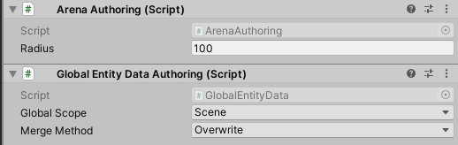

# Global Entities

Global entities are entities automatically created by the world for the purposes
of attaching “global” components to centralized entities.

## SceneGlobalTag and WorldGlobalTag

Every world maintains two global entities.

-   The `sceneGlobalEntity` has the `SceneGlobalTag` component attached.

-   The `worldGlobalEntity` has the `WorldGlobalTag` component attached.

While it is possible to add or remove these components, doing so is not advised.
Like-wise instantiating and deleting these entities could also cause serious
problems. Please allow these entities and their associated tag components to be
handled by the framework.

You may however find it advantageous to use these tags in queries like in the
following example:

```csharp
var matchingCard = sceneGlobalEntity.GetComponentData<Card>();

Entities.WithNone<SceneGlobalTag>().ForEach((Entity entity, int entityInQueryIndex, in Card card) =>
{
    if (card == matchingCard)
    {
        ecb.DestroyEntity(entityInQueryIndex, entity);
    }
}).ScheduleParallel();
```

## ManagedEntity

`ManagedEntity` is a struct type which holds an `Entity` and an
`EntityManager`. The struct provides convenient methods for operating directly
on the entity as well as an implicit cast to the `Entity` type. The
`EntityManager` is private, so you can pass a `ManagedEntity` to a function
without access to an `EntityManager` and expect that the function will only
ever be able to modify the `ManagedEntity` and no other entity.

You can access `sceneGlobalEntity` and `worldGlobalEntity` properties on the
following types:

-   LatiosWorld

-   SubSystem

-   SuperSystem

## Global Entity Lifetimes

The `worldGlobalEntity`’s lifetime is tied to the LatiosWorld that created it.

In contrast, the `sceneGlobalEntity`’s lifetime is tied to the active scene in
the [Scene Management System](Scene%20Management.md).

*Note: You may observe multiple entities named “SceneGlobalEntity” in the Entity
Debugger. Only one of these entities should have the `SceneGlobalTag`
attached. The rest are likely entities with System State types waiting to be
cleaned up.*

## Authoring Global Entities

You can author global entities using the `GlobalEntityData` component or its
authoring equivalent:



In the `LatiosInitializationSystemGroup`, the `MergeGlobalsSystem` will
iterate through each entity with the `GlobalEntityData` component and copy the
entity’s other components to one of the global entities based on the following
settings:

-   Global Scope – The target entity to copy the components to

    -   Scene – Copy the components to the `sceneGlobalEntity`

    -   World – Copy the components to the `worldGlobalEntity`

-   Merge Method – The logic to apply for each component shared by both the
    source and target global entity

    -   Overwrite – The source entity’s component value will replace the global
        entity’s component value

    -   Keep Existing – The global entity’s component value will be left
        unchanged

    -   ErrorOnConflict – If a component is shared by both entities, an
        exception will be thrown

Some additional rules exist regardless of the settings:

-   Any components attached exclusively to the global entity will remain
    attached

-   Any components attached exclusively to the source entity will be added to
    the global entity with matching values with the exception of
    `ICollectionComponent` and `IManagedComponent` which will always be
    ignored

-   The source entity will always be destroyed

-   Disabled and Prefab entities with the `GlobalEntityData` component will be
    ignored, allowing you to enable or instantiate these entities at runtime to
    alter the global entities
