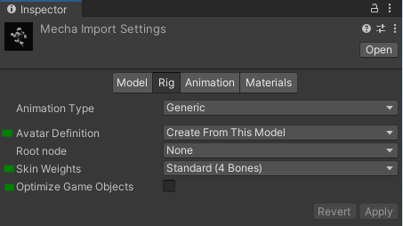
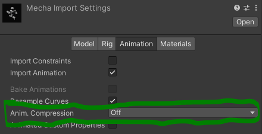
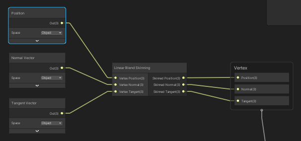
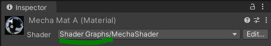
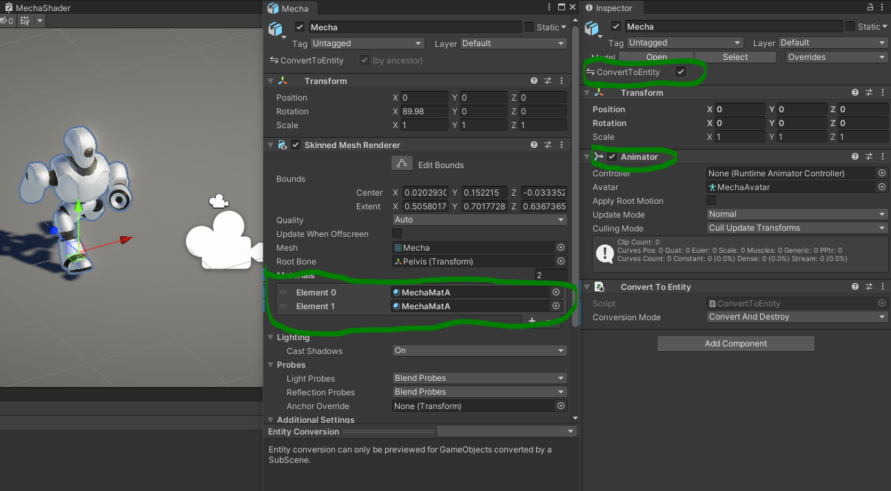
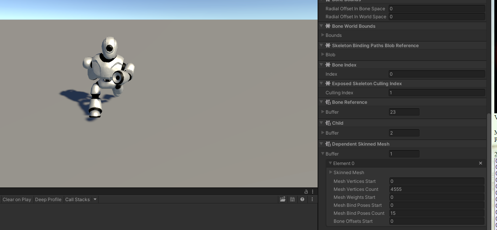
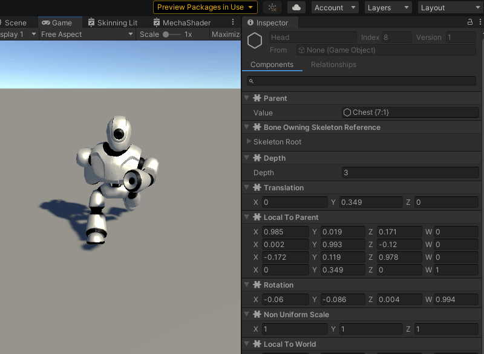

# Getting Started with Kinemation – Part 2

In this part, we’ll bake a Skinned Mesh Renderer into an entity and use an
exposed skeleton. No code will be required.

If you haven’t already done so, create a new DOTS project and add the Latios
Framework as a package. Then, create one of the Standard Bootstraps.

## Importing a Character

When importing a character, in the rig tab, the most important settings are
highlighted in this image:

The *Animation Type* can be set to whatever type your animation clips work with.
The *Avatar Definition* must be set to *Create From This Model* (for this
example only). *Skin Weights* is dependent on which skinning algorithm you plan
to use. If you use *Linear Blend Skinning*, you must set it to *Standard (4
Bones)* as shown above. For *Compute Deform*, you can change it to custom with a
max weights set up to 128. Leave *Optimize Game Objects* unchecked (for this
example only).

Lastly, turn **off** compression of animation clips.

*Q: Why did we turn animation compression off?*

*A: Kinemation uses its own high-quality lossy compression algorithm during
baking. If it reads from Unity’s lossy-compressed clips, quality will be
significantly reduced without any benefit.*

## Making the Shader Graph and Materials

Kinemation has the same requirements as Entities Graphics in that skinned meshes
must use a shader that supports one of the two skinning algorithms. You can
easily create such a shader using *Shader Graph*. Only the *Vertex* block
matters for skinning. Here’s what such a graph looks like using *Linear Blend
Skinning*:

And here’s what it looks like using *Compute Deform*:

Once you’ve done that, you will need to create materials using your new shaders.

## Baking the Entity

Now, drag your character into a subscene. Assign it the new materials, and make
sure it has an *Animator* component attached. The *Animator* doesn’t need to be
configured with anything. It just serves as a marker so Kinemation converts it
to a skeleton.

*Ignore the “Convert To Entity” in this image.*

Now press Play. If everything went right, the character should still be posed,
but now using Kinemation. I included some of the components on the skeleton in
the screenshot on the right so that you can really see this is being driven by
Kinemation. But I encourage you to explore the components yourself!

You can even mess with the transform components!

## On to Part 3

And there ends our code-free part of our tour. Next up, we will need to write
some code to play some animation. If you aren’t familiar with writing DOTS code,
you may want to stop here.

[Continue to Part 3](Getting%20Started%20-%20Part%203.md)
