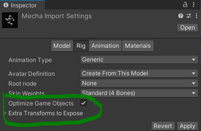
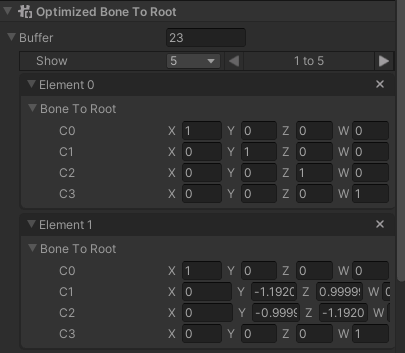

# Getting Started with Kinemation – Part 4

Optimized skeletons. They are fast. But their `OptimizedBoneToRoot` buffers can
be quite raw. In this part, we’ll write some code to work with them.

## Making an Optimized Skeleton via Import

Before we write any code though, we need to change our skeleton to be optimized.
We can do so by checking this box.



Of course, if we wanted to have additional exported bones to attach weapons or
accessories, we could do that with the dropdown below it.

## Sampling an Entire Pose the Easy Way

Unlike with exposed skeletons, optimized skeletons don’t have a transform system
to automatically update their hierarchy. Instead, they have a buffer of
root-relative matrices called `OptimizedBoneToRoot`. They also typically store
their hierarchy information in `OptimizedSkeletonHierarchyBlobReference`.

Calculating the matrices using the blob asset and individual local space sampled
bones can be quite tricky. But if you just want to sample a single clip and have
it update the entire buffer, then all you need to do is call `SamplePose()` and
pass in the relevant arguments. It looks like this:

```csharp
Entities.ForEach((ref DynamicBuffer<OptimizedBoneToRoot> btrBuffer, in OptimizedSkeletonHierarchyBlobReference hierarchyRef, in SingleClip singleClip) =>
{
    ref var clip     = ref singleClip.blob.Value.clips[0];
    var     clipTime = clip.LoopToClipTime(t);

    clip.SamplePose(btrBuffer, hierarchyRef.blob, clipTime);
}).ScheduleParallel();
```

Not only does this handle the entire hierarchy for you, it also uses a special
fast-path making this the most performant way to play an animation.

However, if you need more control over the bone transforms, such as animation
blending, you will need to sample bones individually which is discussed in the
next section.

## Writing to OptimizedBoneToRoot without ParentScaleInverse

We’re going to assume our character does not use `ParentScaleInverse`, as that
complicates the code quite a bit in Kinemation’s current state.

Fortunately, conversion defaults to generating skeletons without it. But if you
are ever unsure, there is a flag in `OptimizedSkeletonHierarchyBlob` called
`hasAnyParentScaleInverseBone` which you can check.

We’ll start by removing `SamplePose()`:

```csharp
Entities.ForEach((ref DynamicBuffer<OptimizedBoneToRoot> btrBuffer, in OptimizedSkeletonHierarchyBlobReference hierarchyRef, in SingleClip singleClip) =>
{
    ref var clip     = ref singleClip.blob.Value.clips[0];
    var     clipTime = clip.LoopToClipTime(t);

                
}).ScheduleParallel();
```

With optimized skeletons, we don’t have to worry about modifying the world-space
transforms anymore. We still need to watch out for root motion animation, but if
we don’t have that, we can start our loop at 0. However, there’s no point since
the first matrix should always be the identity matrix, which conversion kindly
set for us. Don’t believe me? Well let’s temporarily remove our Single Clip
Authoring and look at the buffer in the inspector.



And now you have probably seen that even optimized characters keep their pose
during conversion. So go ahead and explore the rest of the components.

Alright, before we write our loop, let’s convert our buffer into its underlying
type so it is easier to work with:

```csharp
var bones = btrBuffer.Reinterpret<float4x4>().AsNativeArray();

for (int i = 1; i < bones.Length; i++)
{
    var boneTransform = clip.SampleBone(i, clipTime);


}
```

Next, we need to convert our `boneTransform` into a matrix. We can do that using
the `TRS()` method.

```csharp
var mat = float4x4.TRS(boneTransform.translation, boneTransform.rotation, boneTransform.scale);
```

Finally, we need to get the matrix into the skeleton’s coordinate space. To do
that, we need to multiply the matrix by the bone’s parent matrix, and then by
that bone’s parent matrix, and then by that bone’s parent matrix, all the way up
to the root.

But there’s a trick. If the parent has a fully computed `OptimizedBoneToRoot`
matrix, we only need to multiply our matrix with that. And if we iterated
through our buffer from start to end, that will always be the case. Kinemation
conversion orders the bones such that each parent is always before its children.
That means we just have to do this:

```csharp
var parentIndex = hierarchyRef.blob.Value.parentIndices[i];
bones[i]        = math.mul(bones[parentIndex], mat);
```

Here’s what it looks like in its final form:

```csharp
using Latios;
using Latios.Kinemation;
using Unity.Entities;
using Unity.Jobs;
using Unity.Mathematics;
using Unity.Transforms;

namespace Dragons
{
    [UpdateBefore(typeof(TransformSystemGroup))]
    public partial class SingleClipPlayerSystem : SubSystem
    {
        protected override void OnUpdate()
        {
            float t = (float)Time.ElapsedTime;

            Entities.ForEach((ref DynamicBuffer<OptimizedBoneToRoot> btrBuffer, in OptimizedSkeletonHierarchyBlobReference hierarchyRef, in SingleClip singleClip) =>
            {
                ref var clip     = ref singleClip.blob.Value.clips[0];
                var     clipTime = clip.LoopToClipTime(t);

                var bones = btrBuffer.Reinterpret<float4x4>().AsNativeArray();

                for (int i = 1; i < bones.Length; i++)
                {
                    var boneTransform = clip.SampleBone(i, clipTime);

                    var mat         = float4x4.TRS(boneTransform.translation, boneTransform.rotation, boneTransform.scale);
                    var parentIndex = hierarchyRef.blob.Value.parentIndices[i];
                    bones[i]        = math.mul(bones[parentIndex], mat);
                }
            }).ScheduleParallel();
        }
    }
}
```

## What’s Next

Kinemation is new, and its potential is still being explored. Let me know what
you would like to see showcased next!
