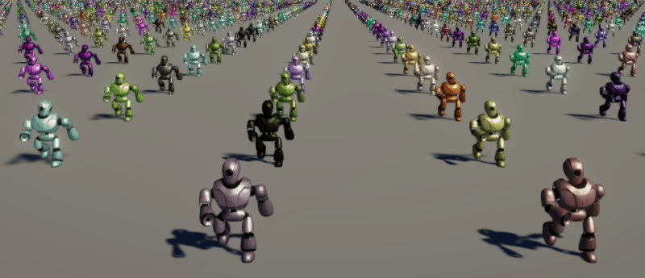

# 

# Kinemation Animation and Rendering

Kinemation is an animation and rendering solution for Entities which aims to
tightly integrate gameplay and animation for large-scale worlds. Kinemation is
still under active development, and it has only laid down the foundations
towards what it aims to achieve. Yet those foundations are already usable in
projects. As of Unity DOTS 1.0 experimental, no official Entities-based
animation solution exists.

Check out the [Getting Started](Getting%20Started%20-%20Part%201.md) page!

## Features

### Out-of-the-Box Deformations

When you import a Game Object character prefab into your scene, that character
shows up with the pose it was exported with. If you then rotate the Game
Objects, the character deforms.

Well guess what?

When you bake that Game Object to an entity, it remains posed. And when you
rotate the baked entities, the character deforms. It works just like Game
Objects, except way faster!

But there’s more.

With Game Objects you can optimize the hierarchy. Not only can Kinemation bake
these hierarchies, but it will also bake them to its own optimized hierarchy
using the same exported bone settings. But there’s one big difference.
Kinemation provides direct access to the optimized hierarchy buffer, so that you
can always remain in complete control.

Kinemation is even smart enough to figure out what skinning algorithm your
shaders use. Whether you use Linear Blend Skinning, Compute Deform, or even
both, Kinemation will automatically use the correct algorithms to fulfill your
shaders’ needs.

And if you think all of that sounds amazing, this next one deserves its own
section!

### Vertex-Accurate Animation-Independent Culling

Classical Unity uses baked animation data of a character to figure out if it is
on screen. But when you start procedurally stretching bones outside the confines
of the baked animations, Unity might think your character is out of view when
its stretched out arms are right in front of the camera.

Kinemation doesn’t care how your character’s bones got where they are. It will
find a bounding box around all your character’s vertices and not much else. It
does this using a special precomputation step during baking which maps
relationships between vertices and bones. From this, it only needs the bone
positions and a small table to find a suitable bounding box.

You don’t need to do anything. It works automatically using the full potential
of jobs and Burst.

### A Better Entities Graphics

A large amount of Entities Graphics has been rewritten to better take advantage
of culling and to support far more characters in open worlds. Now, chunks of
entities that aren’t visible won’t upload data to the GPU. And the skinning
dispatcher will only allocate skinning buffers for the visible entities,
drastically reducing VRAM usage. Compute deform skinning now benefits from LODs.

Both classical Unity and the unaltered Entities Graphics perform skinning
mesh-by-mesh (the Hybrid Renderer at least processes all instances of a mesh at
once). Kinemation handles all meshes for all skeletons at once using a special
compute shader. This removes resource stalls and allows the GPU to use all
available cores to perform skinning as fast as possible and move on to
rendering.

Because of this, Kinemation handles modular characters composed of multiple
meshes and materials incredibly well. Combining meshes is no longer much of an
optimization. Instead, focus on sharing the same base materials and shaders to
improve batching, and check that your skinned mesh chunk occupancy is good.

A rewritten Entities Graphics might sound really scary, but Kinemation takes
great care to preserve existing workflows and behaviors where they make sense.
It is compatible with all existing shaders written for Entities Graphics, and
material instance properties still work as expected.

But now, the culling process is completely open as public API. You can add your
own culling systems to alter the visibilities of entities without structural
changes or hacks. Or you can react to existing visibility information for
gameplay purposes. You can even mimic what Kinemation does and reserve some
heavy compute shader dispatches for only the entities that will be rendered.

Kinemation’s culling algorithm is also much more aggressive, using an ECS-based
filtering order that removes many computationally expensive checks early in the
pipeline, all while preserving fancy culling features like shadow map splits,
picking, and highlighting.

### Linear Blend Skinning

Entities Graphics removed support for the Linear Blend Skinning node, which was
a strange decision, because this mode of skinning is much faster. Sure, it is
limited to only four bones per vertex and won’t work with blend shapes, but for
lower LODs, the drastic decrease in memory usage and bandwidth make it quite
viable.

Kinemation still supports Linear Blend Skinning, and intends to support the
feature as long as possible.

### Easy Binding System

Character customization and weapon switching are common use cases that Unity’s
experimental DOTS animation package made extremely difficult. But Kinemation was
designed with these use cases in mind.

No longer do you have to copy magical bone arrays between Skinned Mesh
Renderers. Kinemation bakes transform hierarchy information as strings into Blob
Assets for skeletons and skinned meshes separately. Then at runtime, an
algorithm matches up the skeleton with the mesh to create the binding. This
usually just works without intervention, even for optimized hierarchies. But in
case you have trouble with naming conflicts, you can customize the mapping
strings yourself via optional authoring components.

Otherwise, all you have to do is point the mesh to the skeleton, bone of the
skeleton, or another mesh already bound to the skeleton. The rest happens
automatically in a reactive system.

### Immediate Low-Level (But Still Easy) Animation API

While Kinemation’s rendering stack mimic’s Myri’s philosophy where stuff just
works without code, animation takes the approach of Psyshock where nothing
happens except your code.

During baking, you request which clips to bake and which Animator to bake them
for. You then get a blob asset containing that collection of clips. At runtime
from any thread, with or without the skeleton at hand, you can sample the clip.
You can get the local transform of all bones, or just a single bone. And what
you do with that sampled transform is completely up to you. You can blend it,
discard it, perform some physics analysis on it, or you know, write it to the
bone entity’s transform components.

You remain in complete control over animation, and can fully customize it for
your project’s needs. KISS animation is trivial. And if you want to build an
advanced state machine or graph solution, Kinemation provides a great
foundational API and comes with the support of someone all too eager to answer
any questions you may have!

### AAA Animation Compression

Unity’s animation compression algorithm is not great. Usually, small sizes come
with great loss of accuracy to the original animation. That was never going to
work for my high-fidelity ambitions. And so, I went about researching possible
alternatives…

And I [found one](https://www.youtube.com/watch?v=85uOa2m_kBc).

Meet [ACL](https://github.com/nfrechette/acl), a solution to animation
compression used by dozens of AAA titles and counting. The entire library is
written with a data-oriented mindset and API and takes full advantage of SIMD
hardware. It was trivial to [wrap a small part of this
library](https://github.com/Dreaming381/AclUnity) and call into it directly from
Burst.

ACL allows for specifying hard limits to quality loss, so that compression
artifacts are imperceptible. Those controls are now within your power whenever
you request an animation clip to be baked into a blob asset. And if you choose
to use the defaults, you’ll get significantly higher quality than Unity’s
defaults, with even smaller compressed sizes.

Now if only Myri had something this good…

### Native Squash and Stretch

Squash and Stretch is one of the fundamental principles of animation. The most
natural way to express this using skeletal animation is to non-uniformly scale
bones. But that doesn’t work in game engines. The issue game engines have is
that the scaling causes child transforms to shear in undesirable ways.

*Native Support for Squash and Stretch was a key feature in Latios Frameowrk
0.5, but has been temporarily removed in 0.6. It is being redesigned to work
out-of-the-box in 0.7 with the new Transform system which will be available in
that version.*

## Known Issues

-   Kinemation only supports desktop platforms. While the ACLUnity native plugin
    is expected to work across all platforms, I do not have the capability to
    compile and test for other platforms. If you would like to see Kinemation
    support your target platform, please reach out to me!
-   Kinemation supports a max hierarchy count of 341. It can go a little higher
    depending on which meshes are bound. Higher amounts should be possible in a
    future release.
-   Occlusion Culling is not supported. Support should be possible in a future
    release.
-   Entities Graphics stats don’t work. Kinemation will provide its own solution
    for this in a future release which will be more extensible and customizable.
-   Skeletons are uploaded to the GPU multiple times in a frame if different
    LODs are used in different culling passes.
-   GPU uploads are done in a way that prevent the processors from going into an
    idle state.
-   `AddMissingMaskSystem` queries for the wrong component types. This will be
    fixed in a patch release.

## Near-Term Roadmap

-   Procedural Mesh Baking
-   Native Squash and Stretch
-   Skinned Motion Vectors
-   Animation Aspects
-   Forced Optimized Skeletons Mode from Exposed Game Objects
-   Pose sampling for exposed skeletons
    -   Significantly faster
    -   May require local allocator
-   Blend Shapes
-   Dual Quaternion Skinning
-   Support for larger hierarchies
-   Stats and Troubleshooting Diagnostics
-   IK Utilities
