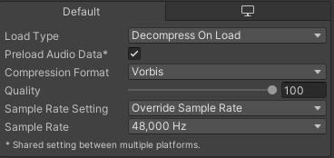

# Getting Started with Myri Audio

This is the second preview version released publicly. It currently supports
simple use cases appropriate for game jams, experiments, and maybe even some
commercial projects. However, it likely lacks the necessary control features
required to deliver a final product. I unfortunately lack the expertise to
implement this, and so I will require the help of you and the community to take
Myri to that level.

With that said, I do believe that at the time of writing, Myri is the closest to
a production-ready ECS audio solution for Unity Engine proper (not Tiny). So I
hope you enjoy trying it out and feel free to send feedback!

## Installing Myri

If you are using the *Bootstrap – Injection Workflow*, you do not have to do
anything and can skip to the next section.

If you are using the *Bootstrap – Explicit Workflow*, you need to install the
`AudioSystem` yourself. To install it to the default location, simply add the
following line to your bootstrap:

```csharp
BootstrapTools.InjectUnitySystems(systems, world, simulationSystemGroup);
BootstrapTools.InjectRootSuperSystems(systems, world, simulationSystemGroup);
// Add the following line:
BootstrapTools.InjectSystem(typeof(Latios.Myri.Systems.AudioSystem), world);

initializationSystemGroup.SortSystems();
simulationSystemGroup.SortSystems();
presentationSystemGroup.SortSystems();
```

You can also install it into a custom location. The system can be installed in
most places, but you will likely want to install it right before a sync point.
`PreSyncPointGroup` or right before `EndSimulationEntityCommandBufferSystem`
after the `TransformSystemGroup` are both good candidates. The following is
sufficient:

```csharp
[UpdateInGroup(typeof(Latios.Systems.PreSyncPointGroup))]
public class MyriPreSyncRootSuperSystem : RootSuperSystem
{
    protected override void CreateSystems()
    {
        GetOrCreateAndAddSystem<Latios.Myri.Systems.AudioSystem>();
    }
}
```

Entities with Myri components that also have a Parent must ensure their
`LocalToWorld` is up-to-date (a queued-up job is sufficient) when the
`AudioSystem` executes.

## Authoring

Myri provides three components for authoring audio. They can all be found in
*Latios-\>Audio (Myri)* in the *Add Component Menu*.

### Audio Source

The *Audio Source* component provides all the settings available to an
audio-emitting entity. When the listener is inside the *Inner Range*, it will be
heard at max volume. Myri uses inverse-square falloff, so at twice the *Inner
Range*, the audio source will be heard at quarter volume. The *Range Fade
Margin* provides a range inside the *Outer Range* where the volume will
interpolate to zero.

For *Looping* sources, *Voices* is the number of unique audio sources that will
play with the same clip. Each unique source will be played with a unique offset.
The offsets are evenly distributed. All sources sharing the same clip will be
assigned one of these offsets, and sources sharing the same offset will be
combined. Voices are synchronized with the application time independent of when
the source was created. If you would like to play a source from the beginning
when it is created, check the *Play From Beginning At Spawn* checkbox. In this
case, the *Voices* parameter does nothing.

One-shot sources will be combined if they begin playing at the same time (the
same audio frame).

If *Use Cone* is checked, then the audio source receives an additional
directional attenuation factor. Listeners within the *Inner Angle* from the
source’s forward direction will not receive any attenuation. Listeners at the
*Outer Angle* will be attenuated by the *Outer Angle Volume*.

### Audio Listener

The *Audio Listener* component provides all the settings for an entity that is
able to receive and spatially process sounds before sending them to the mixed
output. The *Interaural Time Difference Resolution* (ITD resolution) specifies
the resolution for computing the time it takes for sound to reach one ear versus
the other assuming the speed of sound in Earth’s atmosphere. A higher resolution
may increase the amount of sampling performed when audio sources are merged.

The *Listener Response Profile* allows for providing a custom spatial profile
which describes the filters applied to the audio sources. Such profiles are
scriptable objects which derive from the abstract `AudioIldProfileBuilder`
class. If no custom profile is applied, a default profile which provides basic
horizontally-spatialized audio is used. More info on creating these profile
builders in code can be found further down this page.

### Audio Settings

The *Audio Settings* component allows for configuring system-level settings in
Myri. These settings must be applied to the *World Blackboard Entity* to have
any effect.

The mixing thread updates at a fixed interval independent of the application
framerate. In Myri’s world, these are referred to as “audio frames”. The audio
framerate is platform-dependent but is equivalent to: \`sampleBufferSize /
sampleRate\` in seconds. For a buffer size of 1024 sampled at 48 kHz, this
approximates to 20 milliseconds or 50 AFPS. Myri performs sampling synchronized
with the main thread rather than the mixing thread, and transmits the samples
over to the mixing thread with each update. If the main thread were to stall,
the mixing thread will eventually run out of samples and audio will cut out.

The *Safety Audio Frames* controls the number of extra audio frames Myri will
compute and send to the mixing thread per update. Higher values decrease the
chance of the mixing thread being starved but require more computational power.

*Log Warning If Buffers Are Starved* will instruct Myri to print a warning in
the console should the mixing thread run out of samples. The warnings will print
out info regarding the current audio frame and the audio frame last received.

Because the mixing thread updates independently of the main thread. It is
possible it may update while Myri is performing sampling. By the time Myri
finishes sampling, the new samples will be an audio frame old. If Myri has the
opportunity to update again before the mixing thread’s next update, it will
correct the issue. However, if the mixing thread updates again first, it will
skip ahead by a frame in the received sample set. This is usually fine, but a
problem arises when the received sample set contains the first samples of a new
one-shot. The first audio frame of that one-shot will be omitted. This is
significantly more likely to happen if the audio framerate is higher than the
main thread framerate.

In that case, *Audio Frames Per Update* can help mitigate this problem by
sending multiple audio frames in less frequent batches, effectively reducing the
audio framerate proportionally. This comes at a performance cost as well as less
“responsive” audio relative to the simulation, and some projects may prefer to
accept the occasional first audio frame drops and leave *Audio Subframes Per
Frame* at *1*.

For scenarios where the main thread framerate outpaces the audio framerate, but
sampling consumes a large amount of time, it may instead be preferred to begin
sampling an audio frame earlier than normal. Setting *Lookahead Audio Frames* to
a value of 1 or greater will accomplish this.

### Optimizing Clips for Performance

Every audio clip has a sample rate, typically measured in kHz. Common sample
rates may be 44.1 kHz and 48 kHz. The audio output of the device may have a
different sample rate than the audio clip. When this happens, Myri needs to
“resample” the clip to compensate at runtime, which may have a measurable
performance impact for complex audio workloads. Therefore, it is recommended to
convert the clips sample rates to the target device’s sample rate if performance
is a concern. This can be done using the import settings for the audio clip. The
following image shows an audio clip with a sample rate of 44.1 kHz being
converted to 48 kHz.



## IComponentData

Myri’s entire API is exposed as Burst-friendly `IComponentData` that can be
interacted with inside jobs.

### AudioSourceLooped and AudioSourceOneShot

Looped and one-shot audio sources are handled separately in Myri. However, they
expose identical properties publicly. The `clip`, `volume`, `innerRange`,
`outerRange`, and `rangeFadeMargin` can all be configured freely.

These components also contain internal playback state. Copying a component will
copy its playback state. For looped sources, this means copying the unique
offset value. For one-shots, the actual playhead position will be copied. In
some cases this behavior is desirable, such as when working with component
arrays you may want to only modify the `volume`. Other times you may want to
reset the playback state. You can use the `ResetPlaybackState()` method to do
so. Changing the `clip` will also reset the state, but only if the new value is
different from the previous value.

A reset state will not be initialized until the next `AudioSystem` update, so
you do not have to call `ResetPlaybackState()` after copying instances that have
already been reset, instances that came from prefabs, or instances newly
constructed through code.

To mute an audio source, set the volume to zero. This will trigger a fast-path
that avoids sampling the source.

### AudioClipBlob

The clip fields in the above components come in the form of a
`BlobAssetReference<AudioClipBlob>`. The most useful field for you is likely the
name, which is the original `name` of the clip asset when it was converted. The
`Length` of `loopedOffsets` is the number of unique voices for that clip when
played by looped sources.

### AudioListener

The `AudioListener` component is very simple, containing only three values. The
volume is the most useful. The `itdResolution` (inter-aural time difference
resolution) will be clamped to [0, 15]. The value measures the number of steps
from center to either side. The `ildProfile` (inter-aural level difference
profile) contains the metadata used to describe the spatialization filtering.

Unlike audio sources, the internal listener state is stored in
`ISystemStateComponentData`. The structural change commands are sent to
`SyncPointPlaybackSystem`. You typically do not have to worry about these
components.

### AudioSettings

The `AudioSettings` component exposes identical settings to its authoring
counterpart which can be modified and tuned at runtime. The component should
always exist on the `worldBlackboardEntity`. **Do not remove it!** Like all the
other Myri components, this component is read asynchronously from jobs.

## Creating a Custom Listener Response Profile

To create a custom profile, you must subclass `AudioIldProfileBuilder` and
implement the `BuildProfile()` method. This is a `ScriptableObject`, so you can
expose settings and create custom editors for it if you wish.

When building a profile, you create *channels*. A channel is a rectangular area
on a unit sphere which contains a unique set of volume controls and filters.
Each ear has its own set of channels. When an audio source is heard by the
listener, the direction from the listener to the source is computed. If that
direction lies within the channel’s rectangular area, that source will be
processed by the channel. If a direction does not lie within a channel, it will
distribute the source’s audio signal to multiple channels using a weighting
function. With the right filters and volumes, this dynamic distribution can
create dynamic and responsive listening experiences.

*Weighting function details: The weighting function scans horizontally and
vertically around the unit circle until it finds a channel in each of the four
directions or fully wraps around. This creates a search rectangle, where all
channels inside or touching this rectangle receive weights proportional to their
distance from the direction vector. This approach, while moderately fast, has
some shortcomings. If no channel is detected in the horizontal and vertical
searches, then all channels will be evaluated rather than the nearest. I’m not
100% confident this is the best model, and would appreciate feedback.*

### Adding a Channel

To create a channel, call `AddChannel()`. This returns a `ChannelHandle` which
can be used for adding filters to the channel.

The first argument `minMaxHorizontalAngleInRadiansCounterClockwiseFromRight`
specifies the range of the channel horizontally in radians, measured from the
right ear counter-clockwise looking from above. Values from -2π to 2π are
accepted, but the max value should always be greater than the min.

The second argument `minMaxVerticalAngleInRadians` specifies the range of the
channel vertically in radians, measured from the nose counter-clockwise looking
from the right ear. Much like the horizontal arguments, values from -2π to 2π
are accepted, but the max value should always be greater than the min.

The third argument `passthroughFraction` dictates the amount of the signal that
should bypass filters. Each channel has a filter route and a bypass route which
get mixed together in the final output. Each of these routes can have a custom
volume factor applied using `filterVolume` and `passthroughVolume` arguments
respectively.

The last argument specifies which ear the channel should be associated with. Use
`true` for the right ear, and `false` for the left ear.

You can add up to 127 channels to a profile. There is no restriction as to how
these channels are distributed to the left and right ears.

### Adding a Filter

You can specify a filter using the `FrequencyFilter` struct type. The filter
types available are low pass, high pass, band pass, notch, low shelf, high
shelf, and bell. Each of these filters can be specified with a `cutoff`
frequency, a quality `q`, and a `gainInDecibels`.

Once you have described the filter, you can add it to a channel by calling
`AddFilterToChannel()`. The filters will be chained in the order you add them to
that specific channel.

*Filter details: The filters provided are based off the filters provided in the
DSPGraph samples. These filters share a unified state-variable filter (SVF)
kernel. The code has been slightly modified from the samples to improve the
flexibility of the code and remove unnecessary allocations. However, the actual
filtering logic remains unchanged.*
