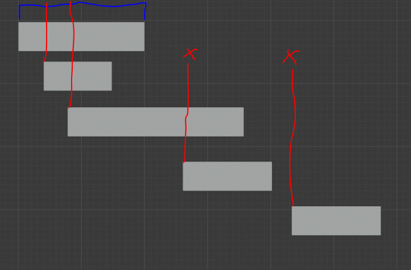
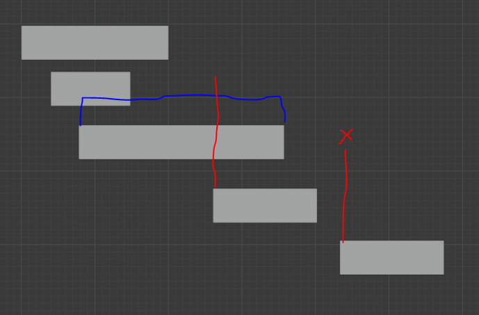

# Optimization Adventures: Part 1 - Find Pairs 1

Hello there!

I can tell you have decided to dig around the random documents inside a git
repository published by a random person on the internet. Psychic powers are
amazing, aren’t they?

I do need to give real credit where credit is due. A lot of what I am going to
be discussing has been covered in quite a bit of depth by Pierre Terdiman
[here.](http://www.codercorner.com/blog/?page_id=1632) In that series, he
aggressively optimizes the algorithm in question in C++. A variant of this work
likely exists in the PhysX codebase, though I haven’t checked. His series is
very technical and might be a little hard to follow without a strong low-level
C++ and x86 assembly background or a proper understanding of the algorithm in
question. But if you are intrigued and would like to see where many of the ideas
I present are coming from, definitely give his series a read. I will be
referencing his work often.

There are two main differences between Pierre’s series and this one. The first
is that Pierre is targeting C++ while I am targeting Unity with C\# using the
Burst compiler. The second is that Pierre’s article is targeting a technical C++
audience, whereas I am targeting a Unity audience with C\#. No offense, but C\#
people are typically noobs when it comes to low-level optimizations at the
assembly level. The performance computing that Burst brings is a bit of a
culture shock. I’m going to try to make this a little bit easier to swallow. But
be warned, there’s still a lot to swallow!

## Why FindPairs?

You might be asking: *Why FindPairs? It is just the broadphase of the physics
engine. The narrow phase and the simulation are the expensive parts. You don’t
even use simulation much anyways. Why?*

Or after reading those questions, you might be asking: *What’s a broadphase?*

Let’s start with that second question.

In a typical physics simulation, you need to find all the collision-capable
objects (colliders) that are overlapping each other. The naïve way to do that is
with this kind of algorithm:

```csharp
for (int i = 0; i < colliders.length; i++)
    for (int j = i + 1; j < colliders.length; j++)
        if (Physics.AreColliding(colliders[i], colliders[j]))
            collisionEventList.Add(i, j);
```

There are two big problems with this approach. The first is that this is a
O(n\^2) solution. You can tell by both the outer and inner loops iterating over
the colliders array. But the second issue is that the Physics.AreColliding
function is going to be really expensive. Think about it. This function has to
account for all the oddball shapes the artists dream up and use geometric math
calculations to figure out if there’s an intersection in virtual 3D space. For
very simple scenes, that’s probably ok. But for large open worlds, uh no.

Physics engine architects quickly realized that most pairs of colliders are so
far apart that it is totally obvious that they are not colliding. If they could
not call the expensive AreColliding function on these pairs, they might have a
chance at (at least partially) fulfilling the artists fantasies. They do this
using a cheap conservative approximation of the collider geometry. Now the
algorithm looks like this:

```csharp
for (int i = 0; i < colliders.length; i++)
    for (int j = i + 1; j < colliders.length; j++)
        if (Physics.AreMaybeColliding(colliders[i], colliders[j]))
            if (Physics.AreColliding(colliders[i], colliders[j]))
                collisionEventList.Add(i, j);
```

The works, until the simulation gets more complicated and wants to reference the
results of AreMaybeColliding multiple times. So what usually happens is the
algorithm gets split up like this:

```csharp
//Broadphase
for (int i = 0; i < colliders.length; i++)
    for (int j = i + 1; j < colliders.length; j++)
        if (Physics.AreMaybeColliding(colliders[i], colliders[j]))
            maybeCollidingList.Add(i, j);

//Narrow Phase
for (int i = 0; i < maybeCollidingList.length; i++)
    if (Physics.AreColliding(colliders[i], colliders[j]))
        collisionEventList.Add(i, j);
```

So now it is easy to see what a broadphase is, and also why it is called a
broadphase. It looks at the broad range of possible collider pairs, and throws
out the ones that it knows are not colliding. A good broadphase satisfies 3
rules:

-   It is fast – otherwise why do it?
-   It must remove most non-colliding pairs – again, otherwise why do it?
-   If it is wrong about a pair, it can only be wrong in that it suspects a pair
    may be colliding when it is not. In other words, it can only produce false
    positives, not false negatives.

The broadphase presented in the above snippet is still very naïve. While the
AreMaybeColliding check might be quite a bit cheaper, it is still an O(n\^2)
algorithm. We can do a lot better.

So back to the question as to why I am performing low level optimizations on the
broadphase. After all, premature optimization is sometimes considered the 8th
deadly sin, and I’m not the person looking to do crazy physics simulations that
require a broadphase anyways.

Well, have you ever played a top down strategy game or watched a boids
simulation? Often times, the developers behind those experiences use some sort
of grid or hexagonal tiles to group nearby objects together. Agents (AI
characters) require some knowledge about what is around them to interact with
the world. But searching through the entire world is expensive, so they only
search their current grid cell and maybe the adjacent cells. This search is
still an O(n\^2) algorithm, but just on a smaller subset at a time. A lot of
games do this. You can find lots of developers on the Unity forums talking about
these types of systems.

But what if we represented an agent’s search area as a cheap collider
approximation shape? We could use the broadphase algorithm to handle our spatial
awareness logic of our agents! Why would we want to do that? Here’s a few
reasons:

-   Broadphase algorithms are designed to handle complicated cases with both
    very large and very small objects in the same world. This is something that
    fixed-sized grids have trouble with and makes those solutions not as
    reusable.
-   Broadphase algorithms are heavily studied and have become quite optimized.
-   Broadphase algorithms allow for a unique search area per object.

So when I am trying to figure out which lasers hit which space ships, or whether
an enemy should show on the radar, or if an ally should gain health because
he/she is close enough to my health bubble, I can use the same exact broadphase
algorithm. And I’m going to, because I do these types of mechanics a lot. That
means this algorithm’s code path is hot! Eyes, wings, machs, feathers, the
works!

But jokes aside, this code accounts for a large amount of my game logic. So I
want it to be FAST! That’s why I am optimizing it.

## How FindPairs Works

Before we can go into the details of making this algorithm fast, let’s take some
time to explain how the algorithm works conceptually.

FindPairs as of writing uses an algorithm that goes by several names. Most
people call it a Sweep and Prune (SAP). Some people call it Sort and Sweep.
Pierre calls this specific variant Box Pruning. And really, all of those names
are kinda accurate.

The fundamental idea behind the algorithm is that by sorting the colliders along
a specific axis, the colliders that are potentially colliding have to be near
each other index-wise in the sorted array. And since sorting can be done a lot
faster than O(n\^2), we can beat the naïve brute force method.

We do this by creating a non-rotated box (a world axis-aligned bounding box or
AABB) around our collider, and then sort by the minimum x value of the box.
Excuse my terrible mouse drawings.


Then for each box, we “sweep” along the subsequent boxes whose min x value lies
between our current box’s min and max x values. All of those “swept” boxes are
considered overlapping with the current box along the x axis.






Now we could repeat this Sort and Sweep step for the y and z axes and then
somehow collect all pairs using some hashmap mechanism, but for this particular
implementation, we are just going to look at the x axis, and then manually test
the y and z axes on the spot using simple comparison operations (Prune step). So
thus, we can call this algorithm a Single-Axis Sort, Sweep, and Prune algorithm.

There’s also a variant of this algorithm called the *Bipartite* version that
compares two independently sorted lists of AABBs, and finds the pairs between
them. The key difference is that the first group’s AABBs sweep across the second
group. And because the sweep is unidirectional, we have to repeat the process
with the roles of the two switched.

Now, the actual FindPairs implementation uses Multiboxing, which means that the
world is divided up into smaller grids that each run this algorithm on. The edge
cases where colliders straddle the grid lines can be handled with some clever
use of the bipartite version. So really, the FindPairs algorithm is a
Single-Axis Multibox Sort, Sweep, and Prune algorithm, or SAMBSSaP. As my boss
always tells me: Naming is hard!

## Analysis

Alright, now that we understand what we are trying to do, it is time to dive in
and see how we can make this FindPairs find pairs faster!

But for the sake of allowing me to get some sleep at some point, I’m going to
narrow our focus to the Sweep and Prune part of the algorithm and assume we
already have sorted colliders. In Latios Physics, the sorting is handled by the
BuildCollisionLayer routine anyways. So even the real FindPairs algorithm that
assumption also applies.

But also for the sake of sleep and sparing you of the complexities of the
multiboxing and callback shenanigans of the FindPairs algorithm, we are going to
use a simplified version instead.

```csharp
public struct AabbEntity : IComparable<AabbEntity>
{
    public Aabb   aabb;
    public Entity entity;

    public int CompareTo(AabbEntity other)
    {
        return aabb.min.x.CompareTo(other.aabb.min.x);
    }
}

[BurstCompile]
public struct NaiveSweep : IJob
{
    [ReadOnly] public NativeArray<AabbEntity> aabbs;
    public NativeList<EntityPair>             overlaps;

    public void Execute()
    {
        for (int i = 0; i < aabbs.Length - 1; i++)
        {
            AabbEntity current = aabbs[i];

            for (int j = i + 1; j < aabbs.Length && aabbs[j].aabb.min.x <= current.aabb.max.x; j++)
            {
                if (!(current.aabb.max.y < aabbs[j].aabb.min.y ||
                      current.aabb.min.y > aabbs[j].aabb.max.y ||
                      current.aabb.max.z < aabbs[j].aabb.min.z ||
                      current.aabb.min.z > aabbs[j].aabb.max.z))
                {
                    overlaps.Add(new EntityPair(current.entity, aabbs[j].entity));
                }
            }
        }
    }
}
```

Now as Pierre introduced in his series, let’s see if we can make this, say, an
order of magnitude faster!

Actually… let’s not.

You see, the initial version Pierre was starting from only used a sorted list of
indices into the otherwise unsorted AABBs. This meant that every access to the
array of AABBs was random. Most of you already know from the many Unity talks
and DOTS discussions why such an approach was bad for performance reasons. It
also just makes the code less readable, so I’m starting from this point instead.
That means our naïve implementation is already 2x-3x ahead of Pierre’s naïve
implementation, so we can probably only expect a 3x-5x increase in our
adventure. But still, that’s a lot for how much this code is going to be used.

Actually, just this code alone puts us extremely far ahead in classical Unity
standards. I encourage you to compare the performance of this algorithm to a
version without Burst as well as the brute force O(n\^2) solution.

I’m ready to go. As soon as you are ready, open up the Burst inspector and find
our NaiveSweep job. I’m using Burst 1.2.0 Preview 11 as of writing this. Let’s
break it down:

Burst actually restructures our outer loop as a do-while loop with a
precondition that only runs once to possibly skip the loop.

This is the first condition of our inner loop. It is a simple array length check
and increment:

```asm
mov        rdx, r14
inc        r14
cmp        eax, r14d
jle        .LBB0_11
```

For those of you brand new to x86 assembly, rdx, eax, and r14 are registers.
Registers are the memory cells that the CPU can directly operate on. Actually,
on x86, one of the two operands can be to main memory using brackets.

As for the instructions:

-   mov is a copy instruction between registers and main memory.
-   inc is an increment, j++
-   cmp is a compare
-   jle is jump if less or equal. The .LBB0_11 is a constant instruction address
    to the evaluation of the outer loop. If length is less than or equal to j,
    jump out of the inner loop.

This is the second condition:

```asm
mov        rcx, qword ptr [rsi]
shl        rdx, 5
movss      xmm6, dword ptr [rcx + rdx + 12]
mov        rbx, rbp
shl        rbx, 5
ucomiss    xmm6, dword ptr [rcx + rbx]
jb        .LBB0_11
```

-   shl is shift left. This is effectively multiplying our index value by 32
    which happens to be the size of our AabbEntity struct in bytes.
-   xmm6 is an SSE register. It is 128 bits wide and can store 4 floating point
    numbers at once. We’ll get to SSE registers later. Right now we are only
    storing a single float in here.
-   movss is a move instruction for SSE registers. The first ‘s’ means single,
    as in move only one. The second ‘s’ stands for single precision, or floating
    point.
-   ucomiss is a floating point compare. The ‘s’s mean the same thing as above.
-   jb is jump if below. It is going to the same outer loop point.

Next, in our inner loop, we load up the current AABB. Yes, Burst reloads it in
the inner loop rather than once in the outer loop. It also loads the entity
because it is going to forget the address of the current box by the time it
needs the entity.

```asm
movss        xmm9, dword ptr [rcx + rdx + 4]   #current.aabb.min.y
movss        xmm8, dword ptr [rcx + rdx + 8]   #current.aabb.min.z
movss        xmm7, dword ptr [rcx + rdx + 16]  #current.aabb.max.y
movss        xmm10, dword ptr [rcx + rdx + 20] #current.aabb.max.z
mov          r9d, dword ptr [rcx + rdx + 24]   #current.entity part 1
mov          r10d, dword ptr [rcx + rdx + 28]  #current.entity part 2
```

Then we have our if statement evaluation:

```asm
movss          xmm0, dword ptr [rcx + rdi + 36] #swept min y
ucomiss        xmm0, xmm7
ja             .LBB0_9

ucomiss        xmm9, dword ptr [rcx + rdi + 48] #swept max y
ja             .LBB0_9

movss          xmm0, dword ptr [rcx + rdi + 40] #swept min z
ucomiss        xmm0, xmm10
ja             .LBB0_9

ucomiss        xmm8, dword ptr [rcx + rdi + 52] #swept max z
ja             .LBB0_9
```

LBB0_9 takes us to the end of the loop. Everything before that from this point
is the NativeList operation. Wait, seriously? Yuck! That’s nearly 100 lines of
code! At least it is still better than std::vector. But it is not great, and I
may have to revisit that in the future. Believe it or not, its not our biggest
bottleneck.

## Branch Prediction Madness

Our first bottleneck is the if statement. Currently, it is generating four
branches. Each branch invokes a branch prediction. If the processor guesses
wrong, it has to flush its pipeline and redo some stuff. And that process is a
lot more expensive than doing 4 comparisons (which are really just
subtractions). And with 4 branches, the probability of the processor being
completely right is abysmal. Ideally, we would only have the processor guess
once, which would give it a 50% chance of not having to flush the pipeline.

Pierre gets around it on the C++ compiler using something like this:

```csharp
bool x      = current.aabb.max.y < aabbs[j].aabb.min.y;
bool y      = current.aabb.min.y > aabbs[j].aabb.max.y;
bool z      = current.aabb.max.z < aabbs[j].aabb.min.z;
bool w      = current.aabb.min.z > aabbs[j].aabb.max.z;
bool result = x | y | z | w;
if (!result)
{
    overlaps.Add(new EntityPair(current.entity, aabbs[j].entity));
}
```

The idea is that by forcing all conditions to be evaluated by bitwise OR-ing the
bools will remove the unnecessary branches. Except, that optimization doesn’t
work in Unity. I don’t know if this is a C\# thing or just the C\# to IL
compiler throwing Burst off. But getting a similar result to Pierre proved a bit
challenging. I had to try a few different things. This was what got me the best
result:

```csharp
int invalidatedx = math.select(0, 1, current.aabb.max.y < aabbs[j].aabb.min.y);
int invalidatedy = math.select(0, 2, current.aabb.min.y > aabbs[j].aabb.max.y);
int invalidatedz = math.select(0, 4, current.aabb.max.z < aabbs[j].aabb.min.z);
int invalidatedw = math.select(0, 8, current.aabb.min.z > aabbs[j].aabb.max.z);
if (0 == (invalidatedx | invalidatedy | invalidatedz | invalidatedw))
{
    overlaps.Add(new EntityPair(current.entity, aabbs[j].entity));
}

movss          xmm0, dword ptr [rax + rdi + 36] #
movss          xmm1, dword ptr [rax + rdi + 40] #
xor            edx, edx
ucomiss        xmm0, xmm10
seta           dl
xor            ebp, ebp
ucomiss        xmm8, dword ptr [rax + rdi + 48]
seta           bpl
xor            ebx, ebx
ucomiss        xmm1, xmm7
seta           bl
xor            esi, esi
ucomiss        xmm9, dword ptr [rax + rdi + 52]
seta           sil
shl            esi, 3
lea            edx, [rdx + 2*rbp]
lea            edx, [rdx + 4*rbx]
or             edx, esi
jne            .LBB0_6
```

Here, we are using seta to capture the comparison, and some exclusive-OR (XOR)
operations to combine it all together. I still have no idea why we have the two
lea instructions back to back writing to the same register. Maybe the compiler
knows something I don’t?

Either way, let’s run some benchmarks with it:

In my performance test code, I set my warmup count to 0. This might sound like a
bad idea, but when I am running tests, since I have a bunch of test inputs for
the same test, I run the smallest test manually until the time it records is in
milliseconds, and then I run the full batch. Otherwise I end up with a large job
running without Burst, which takes an eon to finish.

So the naïve implementation takes 0.49 and 51 ms for 1000 and 10000 AABBs
respectively in my test. Meanwhile, our new approach takes 0.27 and 27
milleseconds respectively. That’s about a 1.8x speedup! Not bad!

## Strange xmm shenanigans

So where do we go next? Well, sometimes when it comes to optimizing with Burst,
you have to play around with stuff. While I was trying to get rid of the
branches, I tried this:

```csharp
bool invalidatedx = current.aabb.max.y < aabbs[j].aabb.min.y;
bool invalidatedy = current.aabb.min.y > aabbs[j].aabb.max.y;
bool invalidatedz = current.aabb.max.z < aabbs[j].aabb.min.z;
bool invalidatedw = current.aabb.min.z > aabbs[j].aabb.max.z;
bool xy           = invalidatedx | invalidatedy;
bool zw           = invalidatedz | invalidatedw;
if (!(xy | zw))
```

Which gave me this:

```asm
movsd           xmm0, qword ptr [rcx + rdi + 36] # xmm0 = mem[0],zero
movsd           xmm1, qword ptr [rcx + rdi + 48] # xmm1 = mem[0],zero
movaps          xmm2, xmm7
cmpltps         xmm2, xmm0
pmovzxdq        xmm2, xmm2      # xmm2 = xmm2[0],zero,xmm2[1],zero
cmpltps         xmm1, xmm8
pmovsxdq        xmm0, xmm1
por             xmm0, xmm2
pextrb          edx, xmm0, 0
test            dl, 1
jne             .LBB0_6

pextrb          edx, xmm0, 8
test            dl, 1
jne             .LBB0_6
```

I laughed out loud when I saw this. Burst tried so hard to make this code fast
when the IL had just enough exposed for it to run. First off, we have the movsd
commands. That means we are moving double precision floats. Wait, what?

Actually, this is Burst being clever and moving two adjacent single precision
floats into an xmm register using a single instruction.

We have a movaps, which reads as – move aligned packed singles. This is a full
128 bit xmm register copy.

We have a cmpltps, which reads as – compare less than packed singles. This
instruction can compare four floats against four other floats. This sounds
ideal, because we ultimately have 8 floats in our if statement. But we got two
of these cmpltps instructions. Turns out, it broke the problem in half using two
yz versus yz comparisons. It then does some shuffling using zero and sign
extensions (pmovzxdq and pmovsxdq) inside the xmm registers before eventually
extracting the xy and zw bools from the C\# code and branching on each. Wait, it
did all that to still branch twice? Dang it! This code was showing some real
potential!

It gets 0.29 and 30 milliseconds in the 1000 and 10000 AABB tests. So it is
pretty close to our best solution. It has a really low instruction count, which
makes it worth paying attention to.

And that brings us to our next step. It is clear that packing our data into xmm
registers and doing comparisons across more data in less instructions has some
real promise. This is what Unity is talking about when they talk about
“vectorized code”.

## SIMD is Hard

So ultimately, we want to make use of the xmm registers and the special SSE
instructions known generally as Single Instruction Multiple Data (SIMD).
Fortunately, Unity provides us some math types to help us out. In particular, we
are going to use float4 and bool4.

Looking at our comparisons, we want to express our logic as a single comparison
between two float4s, which actually gives us a bool4 with a bool per component
of our comparison. But that means we need the comparison direction to be going
the same way. Well, fortunately, a \< b is the same as b \> a, so we can think
of our problem as “lessers” and “greaters” with each group being collected by
reading downward through our comparisons in a zigzag pattern. We then pack these
values into float4s.

```csharp
float4 less = new float4(current.aabb.max.y, aabbs[j].aabb.max.y, current.aabb.max.z, aabbs[j].aabb.max.z);
float4 more = new float4(aabbs[j].aabb.min.y, current.aabb.min.y, aabbs[j].aabb.min.z, current.aabb.min.z);
```

Next, we need to do our comparison. But this gives us a bool4 when really we
want a single bool for our if condition (remember, we still want to keep down to
one branch). This line gives us what we want:

```csharp
if (!math.any(less < more))
```

And when we run it?

0.27 and 27 milliseconds respectively. Exactly the same as our completely
non-SIMD result. I’ve profiled this in different scenarios on different
machines, and which is faster seems to be more correlated by whether the day of
the month is even or odd over anything else. Why? I have no clue. Probably fairy
magic. I have mixed feelings about them.

Anyways, let’s look at the assembly and see what happened.

```asm
movaps       xmm0, xmm7
insertps     xmm0, dword ptr [rcx + rdi + 48], 16 # xmm0 = xmm0[0],mem[0],xmm0[2,3]
insertps     xmm0, xmm10, 32 # xmm0 = xmm0[0,1],xmm10[0],xmm0[3]
insertps     xmm0, dword ptr [rcx + rdi + 52], 48 # xmm0 = xmm0[0,1,2],mem[0]
movss        xmm1, dword ptr [rcx + rdi + 36] # xmm1 = mem[0],zero,zero,zero
insertps     xmm1, xmm8, 16  # xmm1 = xmm1[0],xmm8[0],xmm1[2,3]
insertps     xmm1, dword ptr [rcx + rdi + 40], 32 # xmm1 = xmm1[0,1],mem[0],xmm1[3]
insertps     xmm1, xmm9, 48  # xmm1 = xmm1[0,1,2],xmm9[0]
cmpltps      xmm0, xmm1
pshufd       xmm1, xmm0, 78          # xmm1 = xmm0[2,3,0,1]
por          xmm1, xmm0
pshufd       xmm0, xmm1, 229         # xmm0 = xmm1[1,1,2,3]
por          xmm0, xmm1
pextrb       edx, xmm0, 0
test         dl, 1
jne          .LBB0_6
```

Alright. So we have 16 instructions. That’s three less than our scalar (non-SIMD
fast) code, but two more than the goofy little bugger that lead us down this
path. Even though we are a little slimmer than the non-SIMD instruction-wise and
have the same branch count, SIMD instructions are a little heavier and we now
have a lot of them. It is a little harder for the CPU to schedule these
instructions internally. So that brings up an interesting lesson. Just because
you make something SIMD doesn’t make it faster. Sometimes the compiler makes the
CPU jump through too many hoops to do SIMD that it isn’t worth it.

Unless you can get rid of the hoops of course!

## Kill it with Fire!

If you look at our code, we have 8 loads, a compare, 5 instructions to compress
our 4 bools into 1, and then two instructions for our branch. Wait, it takes 5
instructions to compress 4 bools into 1? In non-SIMD, that would be 3 OR
instructions!

To give credit where credit is due, in a previous version of Burst that used to
be 6 instructions…

No! We need to kill that thing with fire!

You see, one of the ways I tried to fix the branching problem was by using
bool4. That generated this mess:

```asm
movd        xmm0, dword ptr [rcx + rdi + 36] # xmm0 = mem[0],zero,zero,zero
movss       xmm1, dword ptr [rcx + rdi + 40] # xmm1 = mem[0],zero,zero,zero
xor         edx, edx
ucomiss     xmm0, xmm12
seta        dl
xor         ebp, ebp
ucomiss     xmm10, dword ptr [rcx + rdi + 48]
seta        bpl
xor         ebx, ebx
ucomiss     xmm1, xmm7
seta        bl
xor         esi, esi
ucomiss     xmm11, dword ptr [rcx + rdi + 52]
seta        sil
pxor        xmm0, xmm0
pinsrb      xmm0, edx, 0
pinsrb      xmm0, ebp, 4
pinsrb      xmm0, ebx, 8
pinsrb      xmm0, esi, 12
pcmpeqd     xmm0, xmm8
pxor        xmm0, xmm9
pshufd      xmm1, xmm0, 78          # xmm1 = xmm0[2,3,0,1]
por         xmm1, xmm0
pshufd      xmm0, xmm1, 229         # xmm0 = xmm1[1,1,2,3]
por         xmm0, xmm1
pextrb      edx, xmm0, 0
test        dl, 1
jne        .LBB0_6
```

28 instructions! And performance was not great either. It only performed
marginally better than our naïve branchy version, at 0.39 and 40 ms for 1000 and
10000 count respectively. The fact that it did perform better than the branchy
version is a testament for how bad branches can be…

Kill it with fire!

There is an instruction that takes the 4 results of a cmpltps and converts it
into an integer mask in a single register that we can test against. It is
movmskps, pronounced move mask packed singles. So how do we get Burst to use
that instruction? Well, it turns out that in Mathematics 1.1, a bitmask function
was added that converts bool4 into a 4 bit bitmask. In our case, we want to jump
into the list-adding logic if all 4 bools are false. That becomes this:

```csharp
if (math.bitmask(less < more) == 0)
```

Which gives us this:

```asm
movaps        xmm0, xmm7
insertps      xmm0, dword ptr [rbp + rdi + 48], 16 # xmm0 = xmm0[0],mem[0],xmm0[2,3]
insertps      xmm0, xmm10, 32 # xmm0 = xmm0[0,1],xmm10[0],xmm0[3]
insertps      xmm0, dword ptr [rbp + rdi + 52], 48 # xmm0 = xmm0[0,1,2],mem[0]
movss         xmm1, dword ptr [rbp + rdi + 36] # xmm1 = mem[0],zero,zero,zero
insertps      xmm1, xmm8, 16  # xmm1 = xmm1[0],xmm8[0],xmm1[2,3]
insertps      xmm1, dword ptr [rbp + rdi + 40], 32 # xmm1 = xmm1[0,1],mem[0],xmm1[3]
insertps      xmm1, xmm9, 48  # xmm1 = xmm1[0,1,2],xmm9[0]
cmpltps       xmm0, xmm1
movmskps      edx, xmm0
test          dl, dl
jne           .LBB0_6
```

12 instructions! That’s an all-time low! That’s 20% of the instructions cut out
of the inner loop. Does that mean we get a 20% performance boost?

YES!

Actually, a little better even. We now have 0.20 and 21 milliseconds
respectively.

And that means we broke the 2X mark! To put this in perspective, our 60 FPS game
is now running at 144 FPS.

As for those 8 load instructions, we could try to add a second compare and a
shuffle and cut that number in half, saving two instructions. However, the
reason they exist is because my little simplified data structure sucks. The
layout is terrible. If we want to push this algorithm further, we are going to
have to start working with the real deal.

But that’s for next time. Maybe…

Let me know where you would like to see my optimization options take me next!

And thanks for reaching all the way to the end of the page. Not everyone does. I
don’t blame them.

## Try It Yourself!

You can find the code samples for this Optimization Adventure inside the
Optimization Adventures directory in this package. It includes performance tests
you can run in the Test Runner window. Please note that the performance
characteristics and Burst output will likely be different if using a different
Burst version.
