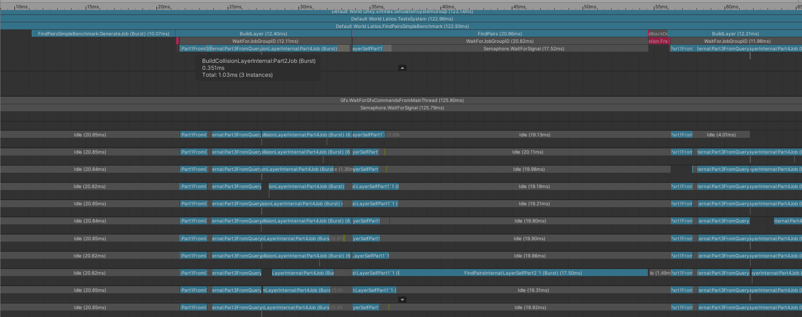
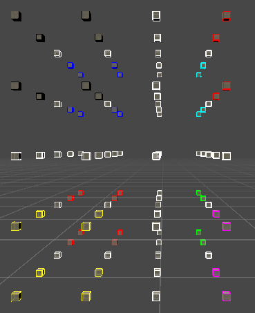

# Optimization Adventures: Part 2 – Build Collision Layer 1

Welcome back!

Glad you liked the first article. How do I know you liked it? Psychic powers may
or may not have given me some insight.

Once again, I need to thank Pierre Terdiman for his explanations on multibox
algorithms. The algorithms I have developed rely on these concepts. However,
besides SOA in Part 9c and the multibox info in Part 17, most of the algorithms
and optimizations in this article are actually my own inventions. That’s not me
trying to brag. That’s me warning you to not go look for C++ equivalents for
these algorithms.

I also need to thank Unity’s Burst team. At the time of writing this, I am using
Burst 1.3.0 preview 3. This version comes with lots of cool improvements,
including AVX instrinsics. However, there are two features that did not receive
much fanfare by the team that I would especially like to highlight. First, C\#
source lines were added back to the inspector along with the internal hints.
This couldn’t have come at a better time, as the algorithms we are going to be
optimizing are a lot more complicated. Being able to navigate the Burst assembly
quickly is extremely helpful. The other feature is actually a bugfix. Remember
how in the last article switching the math.any expression to math.bitmask
resulted in a significant speedup? Well I had reported this on the forums and
got this response back from the one of the Burst developers, Neil Henning who
goes by “sheredon” online:

“This was still annoying me so I looked further - turns out one of the reasons
the codegen wasn't perfect was we were using an ordered not-equal compare (EG.
special handling for NaNs), whereas we should have been using an unordered
not-equal compare (which is what C\# actually does).

So I'm fixing this in a future release of Burst - thanks for nitpicking on this
performance issue because it unveiled an underlying bug between Burst and C\#!”

That “future release” is 1.3. And that fix had a lot bigger impact than I
expected. Now the math.any variant generates the exact same assembly as the
math.bitmask variant. I also got that movmskps instruction to show up in a
couple of my other simplified FindPairs experiments, including one case that
didn’t even use math.any. This means that the relative timings of the different
attempts from last time are all different with Burst 1.3, but I will leave it up
to you to figure out what that order is. The naïve approach still sucked, and it
would be cool if a future version of Burst could solve it, but an improvement is
an improvement, and our code can be a little more readable without sacrificing
performance (I’m still keeping the bitmask variant until I need to touch that
code again).

## Profiling Discoveries

The biggest focus for Latios.Physics v0.2.0 was BuildCollisionLayer. I not only
cleaned up the API, but also introduced more scheduling options for it. After
that massive refactor, I wrote up a test system to benchmark it as well as
FindPairs to get feel for how cheap or expensive it was in the grand scheme of
things. This test uses what I expect will be a fairly typical
IFindPairsProcessor. It performs a DistanceBetween check and then if the
colliders are truly overlapping, it uses an EntityCommandBuffer to destroy them.
There’s a handy method for disabling the ECB playback so I can profile writing
to it without actually making the changes. Thanks DOTS team!

```csharp
using System.Diagnostics;
using Latios.PhysicsEngine;
using TMPro;
using Unity.Collections;
using Unity.Entities;
using Unity.Jobs;
using Unity.Mathematics;
using Unity.Transforms;

namespace Latios
{
    [AlwaysUpdateSystem]
    public class FindPairsSimpleBenchmark : SubSystem
    {
        private struct DestroyOnCollision : IFindPairsProcessor
        {
            public EntityCommandBuffer.ParallelWriter                     ecb;
            [NativeDisableParallelForRestriction] public NativeArray<int> collisionCount;

            public void Execute(FindPairsResult result)
            {
                if (Physics.DistanceBetween(result.bodyA.collider, result.bodyA.transform, result.bodyB.collider, result.bodyB.transform, 0f, out ColliderDistanceResult _))
                {
                    ecb.DestroyEntity(result.jobIndex, result.bodyA.entity);
                    ecb.DestroyEntity(result.jobIndex, result.bodyB.entity);
                    collisionCount[result.jobIndex * 16]++;
                }
            }
        }

        private EntityQuery m_query;
        private int         m_frameCount = 0;
        protected override void OnCreate()
        {
            m_query = Fluent.PatchQueryForBuildingCollisionLayer().Build();
        }

        public override bool ShouldUpdateSystem()
        {
            var currentScene = worldGlobalEntity.GetComponentData<CurrentScene>();
            return currentScene.current.Equals("FindPairsSimpleBenchmark");
        }

        protected override void OnUpdate()
        {
            Entities.ForEach((TextMeshPro tmp) =>
            {
                //if (m_frameCount == 0)
                if (m_frameCount <= 1)  //Due to a missing line below, I was actually profiling 200000 entities instead of 100000. This reproduces that behavior.
                {
                    var archetype = EntityManager.CreateArchetype(typeof(Translation), typeof(Rotation), typeof(Collider), typeof(LocalToWorld));
                    //EntityManager.CreateEntity(archetype, 10000, Allocator.Temp);
                    EntityManager.CreateEntity(archetype, 100000, Allocator.Temp);
                    var random = new Random(1123);
                    Entities.ForEach((ref Translation trans, ref Rotation rot, ref Collider col) =>
                    {
                        //trans.Value = random.NextFloat3(new float3(-1000f), new float3(1000f));
                        trans.Value = random.NextFloat3(new float3(-2000f), new float3(2000f));
                        rot.Value   = random.NextQuaternionRotation();
                        col         = new CapsuleCollider(random.NextFloat3(-10f, 10f), random.NextFloat3(-10f, 10f), random.NextFloat(0f, 10f));
                    }).Run();
                }

                var ecbSystem       = World.GetExistingSystem<BeginInitializationEntityCommandBufferSystem>();
                var ecbs            = ecbSystem.CreateCommandBuffer();
                ecbs.ShouldPlayback = false;
                var ecb             = ecbs.AsParallelWriter();

                var                    processor                   = new DestroyOnCollision { ecb = ecb };
                CollisionLayerSettings settings                                                   = new CollisionLayerSettings
                {
                    worldSubdivisionsPerAxis = new int3(1, 4, 4),
                    //worldAABB                = new AABB(-1000f, 1000f),
                    worldAABB = new Aabb(-2000f, 2000f),
                };

                tmp.text            = "FindPairsSimpleBenchmark\n\n\n";
                Stopwatch stopwatch = new Stopwatch();
                for (int i = 0; i < 3; i++)
                {
                    UnityEngine.Profiling.Profiler.BeginSample("BuildLayer");
                    stopwatch.Start();
                    //Physics.BuildCollisionLayer(m_query, this).WithSettings(settings).Run(out CollisionLayer layer, Allocator.TempJob);
                    Physics.BuildCollisionLayer(m_query, this).WithSettings(settings).ScheduleParallel(out CollisionLayer layer, Allocator.TempJob).Complete();
                    stopwatch.Stop();
                    UnityEngine.Profiling.Profiler.EndSample();
                    tmp.text += "Build Layer:\t" + stopwatch.Elapsed.Ticks + "\n\n";
                    stopwatch.Reset();

                    var counts               = new NativeArray<int>(layer.BucketCount * 32, Allocator.TempJob);
                    processor.collisionCount = counts;

                    UnityEngine.Profiling.Profiler.BeginSample("FindPairs");
                    stopwatch.Start();
                    //Physics.FindPairs(layer, processor).Run();
                    Physics.FindPairs(layer, processor).ScheduleParallel().Complete();
                    stopwatch.Stop();
                    UnityEngine.Profiling.Profiler.EndSample();
                    int sum = 0;
                    foreach (int c in counts)
                    {
                        sum += c;
                    }
                    tmp.text += "Find Pairs:\t" + stopwatch.Elapsed.Ticks + "\nCount:\t" + sum + "\n\n\n";
                    counts.Dispose();
                    stopwatch.Reset();
                    //PhysicsDebug.DrawFindPairs(layer);

                    layer.Dispose();
                }
            }).WithStructuralChanges().Run();
            m_frameCount++;  //This line was missing which caused me to measure 200,000 colliders instead of 100,000
        }
    }
}
```

The commented out lines were for a single-threaded test. However, this
multi-threaded variant had an interesting profiler capture:



So it is taking me 34 ms to process 200000 colliders in parallel. That’s not too
shabby. For reference, Unity.Physics takes 22 ms to process the broadphase in
their asteroid gravity demo with 100000 asteroids. Granted I believe that
simulation generates more collisions than this test, but at the same time, I am
also doing capsule vs capsule distance tests and ECB writes in my version, so
who knows? Maybe someday I will write a proper apples-to-apples comparison.
Also, some of you may be wondering why I am processing 200000 colliders and not
100000. That was a bug I discovered a week after doing all of this optimization
analysis. I forgot to increment m_frameCount. But it also gives me more
consistent performance numbers, so I am keeping it.

There are six jobs that make up the BuildCollisionLayer – FindPairs combo. The
first four belong to BuildCollisionLayer and the last two belong to FindPairs.

The first thing that surprised me is that last single-threaded job that is
taking up half the time. That job is not thread-safe to IFindPairsProcessor, so
parallelizing it will require deferring the callbacks. That’s something I will
likely tackle in a future release.

The second thing that surprised me was how long the generator took. 10 ms is a
lot! For comparison, a naïve frustum culling and quick sort algorithm I wrote
for a Job System tutorial took half the time to process 100000 elements. I’m
suspicious there are issues with Collider generation. That’s another area where
I have planned changes.

The third thing that surprised me was how well the first phase of FindPairs is
holding up. That is the majority of the work needed to be done. And I still
haven’t implemented all of the optimizations nor even looked at the new AVX
intrinsics for it yet.

The fourth thing that surprised me was how long BuildCollisionLayer took in
comparison. If I assume that I can parallelize that last FindPairs job, then
BuildCollisionLayer is taking longer than FindPairs. That would make sense if I
was using a BVH, but I’m not. I’m using a Sort and Sweep, and the “sweep” has
always been the slow part. So that means it is time to give this builder some
TLC in the way dragons do, by lighting it on fire!

## How Collision Layers Work

Before we deep-dive into optimization, allow me to explain what a CollisionLayer
is and how one gets built.

### Multiboxing

As I mentioned last time, the actual FindPairs algorithm uses a technique called
Multiboxing. The idea is that by dividing up the world into coarse grid cells,
you can assume that colliders in different cells can never collide with each
other. This assumption might not make a whole lot of sense looking at the
x-axis. The x-axis is sorted and we never test colliders far apart from each
other. But the y and z axes? We are just brute-forcing those. By excluding
colliders in different cells, we cut our work by a factor of the cells per axis
for each axis.

Grouping our colliders into different cells comes with another benefit. If we
assume that some EntityA in CellA can never collide with EntityB in CellB, we
can safely process EntityA and EntityB in parallel to each other. This holds
true for all entities in CellA vs all entities in CellB. That means we can run
our sweep algorithm on CellA at the same time we run the sweep algorithm on
CellB. And now our FindPairs algorithm can run in a parallel job!

But there is one edge case that causes us problems. What happens if a collider
overlaps multiple cells? Some solutions duplicate the collider. However, such
duplication breaks the parallel processing of the entities in the
IFindPairsProcessor. So this is not a good solution for me. Fortunately Pierre
Terdiman taught me an alternative approach. Instead of duplicating entities, put
all the entities that straddle boundaries into a totally separate virtual cell.
In the internals of my code, I call cells “buckets” so this particular cell gets
called the “Cross Bucket” which is also a name Pierre uses. The name has a
double meaning. Not only do the colliders in it “cross” cell boundaries, but
when you visualize the bucket, it forms a “cross” shape. The cross bucket is
always white when using PhysicsDebug.DrawLayer.



With the cross bucket, I am no longer duplicating entities. But entities in the
cross bucket could potentially be colliding with any entity in any other cell.
This means that the cross bucket needs to use a bipartite sweep against all of
the other cells. And because I have the rule that an entity can only ever be
processed on one thread at a time, this pass is done single-threaded after all
the cells perform the self-test (including the cross bucket).

In my profiling capture, I had a grid of 1 by 4 by 4 cells. Therefore, my first
pass job was an IJobParallelFor with 17 batches of self-sweeps. The second job
was an IJob that performed 16 bipartite-sweeps against the cross-bucket. By now
the performance issue with FindPairsInternal.LayerSelfPart2 captured in the
profiler should make a lot more sense. If not, turn on some lights, shoo away
the darkies, and try studying it again.

### Required Data

An element in the CollisionLayer consists of two pieces of data. The first is
the AABB, and the second is the ColliderBody. However, the AABB is actually
split up into three different pieces:

-   float xmin

-   float xmax

-   float4 ymin-zmin-ymax-zmax

I don’t plan to go into the details of this now. That’s for a future article on
FindPairs. But I will say it has to do with that data layout issue with the
simplified FindPairs in the previous article. Pierre talks about it in Part 9c
of his series if you are curious.

The ColliderBody is the opposite of the AABB. Instead of keeping data separated
in granular parts, I decided to pack three pieces of data together in array of
structs style. Is that the right decision? I’m not sure yet. But I consider it
the “cold” data in the FindPairs algorithm (it is only used by the
IFindPairsProcessors) so I packed it together for convenience. It consists of a
collider with optional runtime scaling applied, a world space transform, and the
entity it came from.

### Packing Arrays

So in a typical multibox implementation, the broadphase structure would likely
consist of an array of dynamic arrays, each representing a cell. There are two
problems with that approach. The first problem is that such a NativeContainer
does not exist in Unity.Collections. While it is possible to create one using
some combination of UnsafeUtility and UnsafeList, I’m not interested in doing
that and attempting to get the safety mechanisms correct. The second issue is
that dynamic arrays often require lots of reallocations.

Instead, we can make the observation that while we don’t know how many elements
are going to end up in each cell at the start, we do know the total number of
elements in the layer right from the beginning. Therefore, it should be possible
to pack all entities into a single array (well really a set of parallel arrays
because SoA) where array segments represent the different cells. We can use an
array of int2 to mark out each cell. The x represents the start and the y
represents the count. In addition, we can create a convenience data structure
that extracts the NativeSlices for a particular cell. This structure is called
BucketSlices.

So that makes our CollisionLayer composed of 4 packed arrays, a short array of
cell ranges, and the grid info.

This packed data structure is pretty cool as it doesn’t require custom
NativeContainers. But it is only cool if we can actually build it. So how do we
do that?

BuildCollisionLayer consists of four steps:

-   Cell binning

-   Cell allocation

-   Cell data population

-   Cell sorting

Let’s break it down step by step.

### Step 1 – Cell Binning

Part1FromQueryJob is an IJobChunk with access to Collider along with many
transform components. Its goal is to calculate which cell an entity belongs to.
The cell index gets written to a NativeArray\<int\> named layerIndices. This
layerIndices array gets reused and repurposed in other steps, hence its odd
name.

In order to calculate the cell the entity belongs to, the AABB is needed. This
has to be calculated using the Collider and the Transform. But we don’t have the
transform yet either, so that has to be calculated from the individual
TransformSystem components. Calculating the Transform requires accounting for
optional components, which is why this is an IJobChunk. Because we will
eventually need both the AABB and the Transform in the layer, we cache these out
to a NativeArray for a future step.

Once we have the AABB, determining the cell is relatively easy. We calculate the
cells that the min corner and max corner of the AABB fall into. Then if those
cells are one and the same, we write the cell index into the layerIndices. If
the cells are different, we write the CrossBucket index into layerIndices
instead.

For calculating the cell a corner falls into, we calculate a cell index per
axis. We assume an infinite number of cells along each axis with fixed spacing
described by the layer’s AABB and grid settings. The cell integer is calculated
relative to the layer’s AABB’s min value for that axis, so negative cell
integers are possible if the entity lies outside the layer’s AABB. However, the
integer gets clamped to the actual number of cells per axis. This means that an
entity outside the layer’s AABB gets assigned to the cell it is closest to. Or
to put it another way, the outermost cells of the grid stretch outward to
infinity to include entities outside the layer’s AABB. That means that the
layer’s AABB is more of a soft optimization guide and not a hard constraint.
Therefore if you had a simulation with densely pack entities near the center and
a couple of stranglers out in deep space, it is best to set the layer AABB
tightly wrapped around the densely packed entities and ignore the anomalies. The
anomalies will get picked up and processed just fine.

That all sounds really complicated, but the code for it is short:

```csharp
int3 minBucket = math.int3(math.floor((aabb.min - layer.worldMin) / layer.worldAxisStride));
int3 maxBucket = math.int3(math.floor((aabb.max - layer.worldMin) / layer.worldAxisStride));
minBucket      = math.clamp(minBucket, 0, layer.worldSubdivisionsPerAxis - 1);
maxBucket      = math.clamp(maxBucket, 0, layer.worldSubdivisionsPerAxis - 1);

if (math.all(minBucket == maxBucket))
{
    layerIndices[index] = (minBucket.x * layer.worldSubdivisionsPerAxis.y + minBucket.y) * layer.worldSubdivisionsPerAxis.z + minBucket.z;
}
else
{
    layerIndices[index] = layer.bucketStartsAndCounts.Length - 1;
}
```

### Step 2 – Cell Allocation

Now that we marked out which cell each entity belongs to in layerIndices, we
have all the information we need to calculate the size of our cells and allocate
their ranges in the packed arrays.

We first count the number of entities in each cell. We then allocate our ranges
by writing to the int2 arrays.

Before we finish though, we do one last pass through our layerIndices and
convert each cell index into an index in the packed array using an algorithm
similar to a counting sort. This effectively gives an entity a unique spot in
the packed array to go into such that it falls into the correct cell.

All of this is done single-threaded in an IJob, as it is not really
parallelizable.

### Step 3 – Cell Data Population

Step 3 looks like a lot of code, but it is really simple. We take the cached
Transform and AABB and write them out using the index from layerIndices we
calculated in the previous step. The AABB gets split up here. We also capture
the collider, optionally baking scale factors into it. And finally, we capture
the entity.

### Step 4 – Cell Sorting

The last step is to sort the entities within each cell by their xmin values.
This is a parallel job with a batch per cell. We are using a floating point
ranked radix sort. We first make backups of all our arrays. Then we extract four
byte keys from the float using some bit hacks and store them with the source
index. We do three passes of radix sorting of the ranks, and then for the MSB
byte key, we copy the actual arrays from their backup positions.

There’s a little extra logic for the use case where the user wants a remap
array. The remap array allows a user to sort extra data to align with the packed
arrays for use in IFindPairsProcessors. Or they can use it to look up data using
the original EntityQuery order.

## Choosing the Target

So now that we have toured our algorithm, we need to pick a spot to start
optimizing. It could be we optimize one job, or it could be we find a more
fundamental issue and apply a fix to multiple jobs. Either way, let’s dig in to
what is going on in each job.

### Job 1 – 1.8 ms

The first thing I notice when investigating the Burst Inspector is that
ArchetypeChunkData.cs and ArchetypeChunkArray.cs have scattered branches all
over the code. It is making parsing and identifying the hot loops pretty
difficult. I might have to rearrange the order I do all the conditional logic
just to clean that up, even if it has no impact on performance.

The extraction code is split off into a couple different functions. Honestly, I
don’t mind this. They are pretty heavy functions. There’s a lot going on to
extract the RigidTransform, and even more to figure out the collider type and
extract the AABB. However, this part of the code was packed with simd
instructions. While they are not the most optimal, they are there. I actually
imagined this to be the heaviest step in layer construction with all the
extraction logic, but this is actually the second-fastest. So I am going to put
this guy on hold for now.

### Job 2 – 0.4 ms

So when I wrote this algorithm, this was the job I was most worried about. The
logic in it is difficult to parallelize, and it loops twice over the full count
of entities. That’s two loops over 200000 elements. So for it to be so
negligible in the overarching algorithm is freaking awesome!

What is crazier is when looking at the Burst inspector, all the instructions are
scalar! There is very little if any simd here. However, there are only a few
instructions per loop, and the loops are iterating over memory linearly with the
exception of the small arrays with lengths equal to the cell count. It turns out
that with very predictable memory access, the CPU can crush through scalar
integer operations.

Had I not profiled the code, I would have freaked out when I saw the assembly
and tried to make it use simd. And that is why it is important to profile. I
don’t think I need to attempt to optimize this algorithm anytime soon.

### Job 3 – 3.4 ms

This job is the other IJobChunk. Its job is a lot less complicated. The only
real heavy math it has to do is scale colliders that have scale. This test does
not have colliders with scale, so all that’s left is repackaging the data and
sticking it into the packed arrays. So why is it so slow compared to Job 1? My
guess is because unlike Job 1, this job has to write to the packed arrays with
more random locations. So our cache hit ratios might be taking a hit. If that’s
the case, one thing we could do is switch to AoS for our data and split it up
again after the radix sort in Job 4. That would be an interesting optimization.

Looking at the assembly, there’s not a whole lot of simd here either. And
branching seems to be all over the place, again with the ArchtypeChunkData.cs
and ArchetypeChunkArray.cs code. There’s quite a few smells, but without really
digging deep, it is hard to tell if those smells are affecting the hot loops or
not.

### Job 4 – 6.3 ms

This job is half of our BuildCollisionLayer time. A little bit of that is due to
the coarser scheduling and work stealing capabilities since we only have 17
batches to split among 11 threads. I’m actually not surprised this is the
heaviest job. Sorting is pretty heavy, even with a O(kn) radix sort. But being
heavy also means that this job is open for some real optimizations. So while I
suspect that Job 3 has the most problems compared to what it could be, this job
is the one that is going to see the most gains. In addition, optimizing it might
give us some insight as to what might be wrong with Job 3.

Fortunately, this job also has the most readable assembly, other than Job 2
which was super short. At the beginning of the job, we see the IJobParallelFor
logic as well as the generation of the BucketSlices for the index in question.
Then eventually we see the comment BuildCollisionLayerInternal.cs(564, 14).
(This maps to BuildCollisionLayerP4.cs(506, 14) in the 0.2.0 release of
OptimizationAdventures.) This is the start of the radix sort algorithm. There’s
an early-out check, and then we jump into the allocation of all the temporary
arrays which manifest themselves as a bunch of call instructions. That follows
with calls to memcpy as we create our backup arrays.

Anyways, here’s our key extraction and counts algorithm:

```asm
#uint mask = (key & 0x80000000) > 0 ? 0xffffffff : 0x80000000;
        test       ecx, ecx
        mov        edx, -2147483648
        cmovs      edx, r9d
#key = mask ^ key;
        xor        edx, ecx
#//copy key twice in registers so there are 3 copies
        mov        ecx, edx
        mov        esi, edx
#//store key's lsb in a larger register with zero extend (this does the 0xff mask)
        movzx      ebx, dl
#//shift the three copies of key
        shr        edx, 8
        shr        ecx, 16
        shr        esi, 24
#//increment of count1
        inc        dword ptr [rdi + 4*rbx]
#//store key's second lsb in a larger register with zero extend
        movzx       edx, dl
#//increment of count2
        inc        dword ptr [rbp + 4*rdx]
#//store key's second msb in a larger register with zero extend
        movzx      ecx, cl
#//increment of count 3
        inc        dword ptr [r11 + 4*rcx]
#//increment of count 4 (no need to zero extend as we only had the msb after the shift
        inc        dword ptr [r8 + 4*rsi]
#//repack into bytes (facepalm)
        mov        byte ptr [r14 + 8*rax], bl
        mov        byte ptr [r14 + 8*rax + 1], dl
        mov        byte ptr [r14 + 8*rax + 2], cl
        mov        byte ptr [r14 + 8*rax + 3], sil
        mov        dword ptr [r14 + 8*rax + 4], eax
```

I was hoping that Burst would be a little bit smarter about the shifts and all,
but it chose to use scalar instructions instead. As it turns out, it is tricky
to get the bytes split up in different registers for incrementing the counts.
The repack is a little disappointing though. I wish it did a full 32bit copy of
the original uint32. Hopefully it doesn’t matter much, because as we saw
earlier, the CPU is pretty good at crushing integer operations.

And here’s the prefix sum assembly:

```asm
        mov        r9, qword ptr [rsp + 192] # 8-byte Reload
        mov        dword ptr [r9], 0
        xor        eax, eax
        mov        rcx, -1020
        mov        rdx, qword ptr [rsp + 136] # 8-byte Reload
        mov        r10, qword ptr [rsp + 208] # 8-byte Reload
        mov        rbp, qword ptr [rsp + 112] # 8-byte Reload
        .p2align        4, 0x90
.LBB0_37:                               # %BL.000f.i1244.i.i
                                        # =>    This Inner Loop Header: Depth=3
        add        eax, dword ptr [rdi + rcx + 1020]
        mov        dword ptr [r9 + rcx + 1024], eax
        add        rcx, 4
        jne        .LBB0_37
```

What is interesting here is that Burst changed the loop to go from -1020 to 0
incrementing by 4. Burst isn’t smart enough to apply simd to the prefix sum, but
given how fast integer instructions are, it might not think simd is worth it.
Either way, this is a really tight loop that gets repeated four times inlined.
The other three times have a few less loop setup instructions.

There are no surprises in the actual sorting phase. The first three loops use
simple integer instructions. That’s expected given the trends. And the fourth
phase is also surprisingly straight forward. It boils down to copies into
registers from some memory address and then a write from the register into
another. It uses simple registers for xmin and xmax, an xmm register for
xyminmax, and a whole group of xmm registers for the ColliderBody.

## Optimizing Job 4

We decided to optimize Job 4 as it is taking the longest. So now we need to
create a test scenario for it so we can compare versions of the algorithm.
Because I try to write my tests to be copy-and-paste-able into user projects
with arbitrary assemblies, this meant copying the entire CollisionLayer code as
well as much of the BuildCollisionLayerInternal code as a starting point. Our
actual test will run each step single-threaded a couple of times, making backups
of arrays and such when necessary.

### Comparing to Unity’s NativeSort

The first test is to compare to Unity’s NativeSort. Back when I originally wrote
this RadixSort algorithm, it was beating Unity’s NativeSort by about 2.5x.
However, since then, Unity beefed up their sort to use what I think is a segment
sort. Segment sorts are about as mysterious to me as the thoughts of the
darkies. (Actually, some time after initially writing this, they gave up and
just used a QuickSort, which is about as fast.) Anyways, because our data is SoA
with four arrays and Unity’s sorting algorithm works on a single array, we need
to use a ranked sort. It looks like this:

```csharp
//Parallel
//Sort buckets
[BurstCompile]
public struct Part4JobNew : IJobParallelFor
{
    [NativeDisableParallelForRestriction]
    public TestCollisionLayer layer;

    public void Execute(int index)
    {
        var tempArray  = new NativeArray<int>(0, Allocator.Temp, NativeArrayOptions.UninitializedMemory);
        var slices     = layer.GetBucketSlices(index);
        var startIndex = layer.bucketStartsAndCounts[index].x;
        UnitySortBucket(slices);
    }
}

#endregion

#region UnitySortBucket
private struct Ranker : System.IComparable<Ranker>
{
    public float key;
    public int   index;

    public int CompareTo(Ranker other)
    {
        return key.CompareTo(other.key);
    }
}

private static void UnitySortBucket(BucketSlices slices)
{
    var ranks = new NativeArray<Ranker>(slices.count, Allocator.Temp, NativeArrayOptions.UninitializedMemory);
    for (int i = 0; i < slices.count; i++)
    {
        ranks[i] = new Ranker
        {
            index = i,
            key   = slices.xmins[i]
        };
    }

    ranks.Sort();

    NativeArray<float>        xminBackup     = new NativeArray<float>(slices.count, Allocator.Temp, NativeArrayOptions.UninitializedMemory);
    NativeArray<float>        xmaxBackup     = new NativeArray<float>(slices.count, Allocator.Temp, NativeArrayOptions.UninitializedMemory);
    NativeArray<float4>       yzminmaxBackup = new NativeArray<float4>(slices.count, Allocator.Temp, NativeArrayOptions.UninitializedMemory);
    NativeArray<ColliderBody> bodyBackup     = new NativeArray<ColliderBody>(slices.count, Allocator.Temp, NativeArrayOptions.UninitializedMemory);

    slices.xmins.CopyTo(xminBackup);
    slices.xmaxs.CopyTo(xmaxBackup);
    slices.yzminmaxs.CopyTo(yzminmaxBackup);
    slices.bodies.CopyTo(bodyBackup);

    for (int i = 0; i < slices.count; i++)
    {
        int src             = ranks[i].index;
        slices.xmins[i]     = xminBackup[src];
        slices.xmaxs[i]     = xmaxBackup[src];
        slices.yzminmaxs[i] = yzminmaxBackup[src];
        slices.bodies[i]    = bodyBackup[src];
    }
}
```

The results? Well for small numbers of entities, Unity’s sort beats out the
radix sort. However, that changes once we get to about 1000 entities with a
1x2x2 grid. Radix sort beats out Unity’s sort by a couple of microseconds. Yes,
I said microseconds. 65 vs 68. So the gains in Unity’s sort are negligible.
Maybe I could branch and dispatch a different sorter for small buckets, but for
the situations where it matters, radix sort runs away with it.

…But not by 2.5x!

The difference is actually 20% at the extreme cases and 50% for 2000-5000.
That’s not bad for a comparison sort. Anyways, I need to keep investigating.

### Less Cache Thrashing of the SoA Data

I’m still suspicious that I am running into random access memory cache issues.
So the next thing I want to try is making either the src backup or the dst layer
arrays linearly accessed. I can do that by performing one extra step of the
radix sort and then looping over the destination.

```csharp
for (int i = 0; i < slices.count; i++)
{
	byte key         = backArray[i].key.byte4;
	int  dest        = prefixSum4[key];
	frontArray[dest] = backArray[i];
	prefixSum4[key]  = prefixSum4[key] + 1;
}

for (int i = 0; i < slices.count; i++)
{
	int src             = frontArray[i].index;
	slices.xmins[i]     = xminBackup[src];
	slices.xmaxs[i]     = xmaxBackup[src];
	slices.yzminmaxs[i] = yzminmaxBackup[src];
	slices.bodies[i]    = bodyBackup[src];
}
```

And that made a little difference. For 200000 entities, we dropped from 11.8 ms
to 11.1 ms. Hold on, 11.8 ms? That’s less than twice the time the parallel
algorithm took, and this is running single-threaded whereas the parallel
algorithm had 6 CPU cores to work with. Now I’m suspicious.

I checked the assembly of the two jobs in Meld to make sure I didn’t copy
something wrong. They are identical. So then I tried making the jobs run in
parallel in the test runner. I got a 2x speedup and less consistent results. It
seems this algorithm is a bit volatile to thread scheduling. I also suspect some
of that is related to the L2 cache. When I am running all the previous jobs on
the same thread, the L2 cache is warmed up with the CollisionLayer arrays from
Job3. When I then dispatch things onto a different thread, it seems those caches
are moot.

So the next thing I did was plug this variant back into Latios.Physics and ran
the test scene again. The result? Hardly a difference. If there is one, it isn’t
that measurable. And I still haven’t been able to get the BuildCollisionLayer
down below 11 milliseconds. So we need to dig deeper!

### The Fastest Code is No Code

To understand why my code is slow, I decided to understand which piece
specifically is slow. To do that, I cut out a bunch of code. This makes the
algorithm not give correct results anymore, but I don’t care. I want to see what
is actually slow. The challenge is that Burst may over-optimize, so I need to
make sure I cut off those options. I did some fancy summing of all the fields in
the indexers after creating them and then cut out the rest of the code. Burst
did an excellent job turning that summing into insanely complex (but fast) simd
while leaving most of the rest of the code intact.

Removing the prefix summing and radix sorting saved 2.5 ms. Removing the now
unused allocations and backups dropped execution another 2 ms, making our 6 ms
algorithm a 0.5 ms algorithm.

After further investigation of bringing back the allocations and then the backup
copies, it became clear that it was the backup copies that were causing
problems. Copying the ColliderBodies alone accounted for 1.5 ms, and yzminmax
also made a little dent. These are really expensive copies. I was wondering if
this was an aliasing issue, so I switched to using memcpy directly. But no,
copying ColliderBody is just really expensive. To further prove this, I disabled
all backups and copies except for xmin but otherwise ran the full radix sort. I
ended up with 1.5 ms.

## Rewrite It All!

What did we learn? We learned that memcpy on large structs, even with linear
memory, is super slow. So if we want to speed it up, we need to look at the
pipeline as a whole and see if we can reduce the number of copies.

Starting with Job 1, we have the extraction and copy of the AABB and the
Transform.

Job 2 doesn’t really copy much of anything.

Job 3 copies the AABB and the Transform along with the Entity and Collider. And
in some conditions, it applies some scaling. But otherwise, it is just doing
copying. And all the copying it performs doesn’t even generate final results. So
in that case, we might be able to get rid of it entirely!

And lastly, we are doing two copies of ColliderBody and AABB in Job 4 (the
backup and the final). Let’s try and cut our copies in half, and maybe we can
get a 2x increase!

And so that’s what I did.

Job 1 had the biggest rewrite. I had to merge scaling from Job 3 into it, which
complicated a lot of the transform code and I decided to refactor it to make
more sense of it. In the process, I discovered a couple of theoretical bugs in
the old approach and patched those up. It now writes out the collider,
transform, AABB, and entity into one large struct. I’ll get to why I chose one
large struct later. I am also writing to a new float array for the xmins. I
could exclude that field in the large struct, but I don’t have enough data to
know if that is truly an optimization yet.

Job 2 did not require changes.

Job 3, well… I couldn’t quite get rid of it. It turns out it served one
important function. It batches the entities into the buckets so that the radix
sort could sort locally over each bucket. However, really all the radix sort
needs is the source indices of our entities in the arrays we built in Job 1.
From that, we can fetch the data from the arrays in Job 1 and put them in their
places after the sort. However, Job 2 gave us an array of destinations, not an
array of sources. Why? Well because that’s what makes that job so fast, and that
is an IJob, so we need it to be as fast as possible. So now Job 3 becomes a
parallel job of converting an array of destinations into the array of sources.
Integer memcpy should hopefully be a lot cheaper than the IJobChunk shenanigans
we were doing before.

Job 4 is still the radix sort, but this time, it is only radix sorting the
source indices array by bucket segments. We could have written out the layer
here at the end, but that seemed pointless as only the integer array was in
cache.

Job 5 is the new job that performs the final copy. I decided to sacrifice the
cache of the source indices in order to use a job not bound to bucket-count
batches. That lets work-stealing do its thing more efficiently. This job loops
over the indices and fetches the source, and it is here where I explain why I
made that giant struct. For each destination, I have to do a random access
lookup of source data based on the source index array values. If I went full
SoA, I would have to do that random access lookup for each array, whereas here I
am only doing it once, saving how many cache lines need to be fetched. In
addition, if I think of all the data I need as the individual pieces in the
struct, while the first piece will typically cache miss, the rest of the data
has a high cache-hit rate due to being adjacent to the first piece. My large
struct exceeds a cache line in size, so my cache efficiency should be pretty
good for a random access algorithm. And the destinations are linear now so that
can stream cleanly.

Job 5 also now requires the remapSrcArray that I had as an optional feature. So
I no longer have to make job variants for it.

### Rewrite Results

There is something weird going on with the results I am getting. Sometimes the
new approach actually hits a 2x performance increase over the original
algorithm. Sometimes it ties the slightly improved version of the old algorithm.
Most of the time it seems to cut the time down by about a third. But on the
really large data sets, the time is worse. Compared to FindPairs, the results
here are really inconsistent. Anyways, this is all single-threaded and it is
difficult to understand what is going on. I suspect this is cache-related, but
for all I know there could be some temp overflow messing with our results.

So let’s try the real test, the original parallel playmode benchmark and capture
a timeline view.


Well, that certainly is interesting. Job 1 is now running at 2.8 ms so a 1 ms
increase. But Job 3 decreased to less than a tenth of a millisecond! It is
faster than Job 2! It nearly disappeared! So that is a net 2.4 millisecond gain.
Then we have Jobs 4 and 5 which used to be the old Job 4. Combined, these jobs
consume 4.7 milliseconds. So we gained another 1.6 ms leaving our net gain to
nearly 4 milliseconds. That’s a third of our time cut off, which is nice and
definitely worth the effort. However, Job 5 is still taking a long time. It
seems weird to me that it is taking longer than Job 1, which now produces all of
that data and also writes it to an array. Why?

I checked the assembly and half the copy is using simd and the other half is
scalar. So I tried the “delete code” method again to see what I could find. And
the culprit appeared to be the ColliderBody writes. Just the writes! The reads
were fine. And this made no sense to me. The target output array is being
written to in order. So I don’t totally know why it was slow. My initial guess
was that it had to do with some weird alignment issues with the store buffer and
simd stores. But unfortunately I did not have a good way to investigate any
further as I cannot directly convert assembly instructions to NOPs.

### A Vanishing Act?

Not being the kind to let a mystery live for too long, I reached out to Neil
Henning on the forums (he was the guy featured at the beginning of this
article). He was kind enough to look at it and made some interesting comments
about very different performance results. He mentioned that remapSrcIndices was
the big bottleneck for him. So I removed remapSrcIndices from the colliderAoS
indexer and replaced it with the parallelFor index. I only saw a 0.2 ms
improvement. This made less sense to me, so I asked for more clarity and he
mentioned he added NoAlias to a few of the NativeArrays.

That did something…

Without remapSrcIndices, Part 5 was 0.1 ms faster than Part 1. This new time
actually made sense to me. Unfortunately, adding remapSrcIndices back made the
job go back to its usual 4 ms. Then it got weirder. Removing the NoAlias code
still resulted in Part 5 being 0.1 ms faster than Part 1. So it remains a
mystery as to why I saw what I saw, but now what I see makes sense, so I shall
go with that. I suspect better performance will come from better packing of the
AoS, but that requires me to finalize the data layout of Collider. Collider is
likely to change in the near future, so I will hold off on that. I also need to
do something about the allocation issues I have been purposefully not
addressing. But sometimes it is important to get software into the hands of
users and optimize later.

### Feature Creep

And it happened. After a couple of weeks of writing this article while I was
working on other parts of the codebase, I realized I screwed up and needed to
make a change that was going to affect these benchmarks. You see, Collider at
the time required 49 bytes. 48 of those bytes were to account for a very large
collider primitive collider type called QuadCollider (not yet released in
version 0.2). QuadCollider uses 4 float3s. The last byte was for the
ColliderType enum. I also naively attempted to pad the struct with 3 reserved
bytes. I knew for a while now that having such an oddly sized struct was going
to cause problems at some point, so I planned to pad it out to 64 bytes so that
it was the same size as LocalToWorld. I didn’t know how I wanted to fill those
extra 15 bytes yet, so I planned to postpone until version 0.3 or 0.4.

But while I was developing the first pass of CompoundColliders and started
really digging into BlobAssets, I realized my clever union was going to cause
Unity some confusion. And by confusion, I mean the ghostly painful kind. Why?
Because this Collider type needs to be serialized, and Unity has to perform some
remapping on a couple of fields types. One of those types is BlobAssetReference,
and the other is Entity. Basically, if I aliased BlobAssetReference with the
SphereCollider data and tried to serialize a SphereCollider, Unity might mistake
the sphere radius as a pointer to a blob and try to patch it.

I needed 8 unaliased bytes for BlobAssetReference, so I invested into the 15
additional bytes. BlobAssetReference is size 8 but only actually serializes 4 of
those bytes (I’m not sure why yet) so I may be able to get half of those bytes
back. But in the meantime, it isn’t like I have anything useful to do with them.
Anyways, the one thing I was worried about with this investment was that it was
going to hit my bandwidth-heavy BuildCollisionLayers even harder.

It bit.

I flinched.

I lost a millisecond.

If there was any doubt left that I was memory-bound, those doubts vanished. I’m
memory-bound.

Regardless, this hit is not the worst news. It was going to come eventually.
Even better, the optimizations we made still applied if not even moreso. Even
with the Collider size increase, this new algorithm is still beating the
original version by 3 milliseconds!

And that’s why optimization is so important. It isn’t always about how many
entities the world can run. Sometimes it’s about winning back a little headroom
to add some nice features and touches.

But enough about programming philosophy, if any of you know some
bandwidth-reduction tips or get drastically different results on your machine, I
would love to hear about it! In the meantime, FindPairsPart2 requires training.
Lots of training.

## Try It Yourself!

You can find the code samples for this Optimization Adventure inside the
Optimization Adventures directory in this package. It includes performance tests
you can run in the Test Runner window. However, the Test Runner context is not
consistent. You can find the benchmark scene in the FindPairsExamples sample. It
is named FindPairsSimpleBenchmark.unity. It references the actual algorithm used
by the framework, so you will not see the performance differences described in
this article. You might be able to modify it to reference the
OptimizationAdventures version instead. And just like before, the performance
characteristics and Burst output will likely be different if using a different
Burst version.
