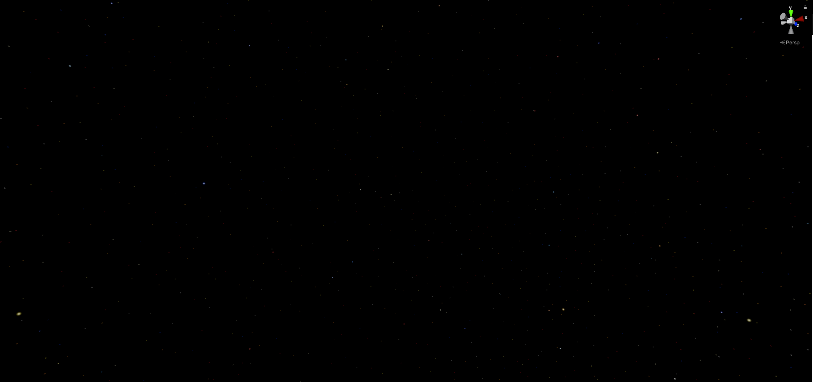
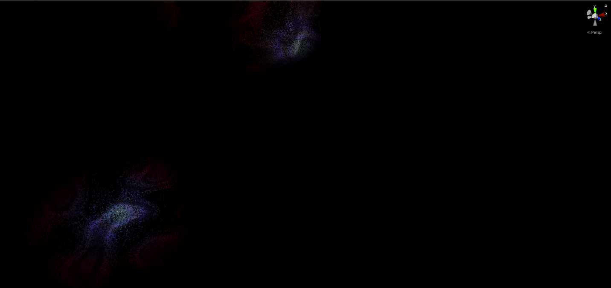
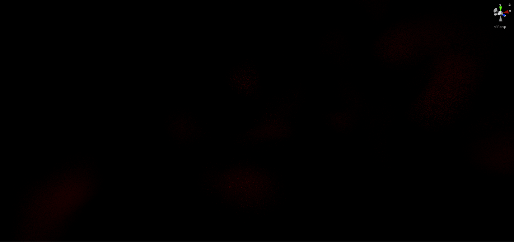

# Optimization Adventures: Part 3 – Space Sky 1

Psych! Once again, the next optimization adventure is totally different than
what I promised in the previous adventure. To make the long story short, I spent
a lot more time on my sample space shooter than I originally planned. Part of
that is because I had distractions like qualifying for a game tournament, but
that’s a story for a different day. Anyways, it didn’t seem fair to have a 9
month gap between releases with only one optimization adventure to show for it,
so I decided to tackle another one that came up in the space shooter that I
thought was pretty cool.

This time around, we are going to take a little break from CPU-world and revisit
my hometown of GPU-world. This is pretty much where I lived for all my crazy
simulations before DOTS was a thing.

This will be a short one.

## Space Sky Breakdown

For the space shooter, I needed a spacey environment. While I could have just
grabbed some space skybox, I wanted this project to be asset-free. So instead, I
took a procedural approach. Unlike Ray, I don’t live out past the ozone layer,
and I didn’t want to spend a ton of time on this. So I just sort-of hacked stuff
up that looked cool. It is composed of three layers:

### Star Field

The fundamental approach to the star field was based on this approach:
[Procedural Stars -
Overdraw.xyz](https://www.overdraw.xyz/blog/2018/7/17/using-cellular-noise-to-generate-procedural-stars)
However, instead of using a 3d grid noise, I wanted something that mapped a
little more cleanly to a sphere. So I went with a modified version of [Inverse
Fibonacci Mapping](https://dl.acm.org/doi/abs/10.1145/2816795.2818131).
Basically, for each pixel, I calculate the nearest Fibonacci node as well as the
distance to the neighboring region. The node index becomes the input to the
random number generator. I also have some goofy 3x3 kernel to help prevent the
stars from fluctuating in brightness due to half-pixel offsets in rotation. A
lot of that was trial-and-error, and it might be worth a revisit. But I am
pretty happy with the way it looks.

*Note: In case the details get lost from compression, you can look at
Starfield.PNG to see the full details.*

### Nebulas

Nebulas use the same inverse Fibonacci mapping algorithm to create large
circular objects in the sky. I then apply multiple layers of perlin noise as
masks to get the odd shapes, colors, and granular dust-like look. These aren’t
what actual nebulas look like, but I gave up trying to make them more realistic
and the look has grown on me since. Unlike the stars, there’s no 3x3 kernel.

*Note: Nebulas.PNG for higher-res image*

### Space Dust

The purpose of space dust was to inject a little bit of color to fill out space.
It is just two layers of perlin noise, so it is rather simple. Like the nebulas,
I think it also needs more tuning. But it was good enough at the time and I
haven’t heard any complaints about it from the initial feedback.

*Note: Dust.PNG for higher-res image*

### Combined

When you combine these layers, space starts to look very colorful!

*Note: Space Sky.PNG for higher-res image*

This isn’t perfect. There’s some weird warping around the corners as you rotate
the camera that might make people motion-sick. I suspect that has something to
do with the spherical mapping and the large nebulas. I don’t know if I screwed
up, or if this is an artifact of all skyboxes and I just never noticed until
now. Either way, I haven’t bothered to investigate any further.

## Where did my frame budget go?

This is an optimization adventure, so I’m sure you can probably guess that I ran
into a bit of a performance issue. Admittedly, the issue I ran into might not
even be present for most people. You see, my nearly 6-year-old rig is powered by
a Radeon R9 390. At the time, the 8GB of VRAM was awesome for Blender renders
and other compute workloads. Nowadays, it is good enough to do what I need to
do, but who knows how long that will last?

Anyways, when I was frequently missing v-sync every three frames or so on
Mission 1, the only possible explanation was that my skybox was hogging nearly
the entirety of my GPU frame budget. When I would play-test my game, even the
menu screen would get my GPU fans spinning and Windows would report 100% GPU
usage. Not good.

### Bake it until you make it?

My natural instinct was that maybe I just needed to bake the sky to a cubemap.
While I did not want to save a binary asset, that didn’t mean that I couldn’t
render the sky into a skybox during game load. The texture sampling hardware is
pretty underutilized, so sampling from a cubemap seemed innocent.

It didn’t work too well.

The reason? The stars started flickering again. Remember, the stars are only a
couple of pixels large, so if the cubemap resolution doesn’t match the sampled
resolution when drawing the sky per frame, the half-pixel sampling issues start
appearing again. Mipmapping didn’t help either, as it darkened the stars. I
needed to try something else.

### Find what is slow!

So just like the previous adventure, we need to profile the individual pieces
and combinations and look at the behavior. Let’s turn off v-sync, jump into
Mission 1, and start removing layers to see what the culprit is!

| **Layer**                | **Frame Time (ms)** | **GPU Utilization (%)** |
|--------------------------|---------------------|-------------------------|
| Stars                    | 8.1                 | 55%                     |
| Nebulas                  | 8.3                 | 65%                     |
| Dust                     | 8.2                 | 100%                    |
| Stars & Nebulas          | 8.3                 | 90%                     |
| Stars & Dust             | 10.0                | 100%                    |
| Nebulas & Dust           | 16.7                | 100%                    |
| Stars, Nebulas, and Dust | 16.8                | 100%                    |
| Cubemap                  | 8.2                 | 38%                     |

These results are a bit confusing. First there’s the fact that combining stars
and nebulas together still don’t peg 100% GPU utilization at 120 FPS. Second is
the fact that stars and dust use 10 ms but nebulas and dust use the full frame,
as if the stars were also being rendered. What is clear is that rendering the
stars alongside dust or nebulas is relatively cheap. Whereas nebulas and dust
are pretty expensive. This makes me suspect the noise fields may be the problem.
The stars don’t rely on perlin noise.

Initially, when I was optimizing this, I suspected there may have been an
occupancy issue due to VGPR pressure on GCN. But now I don’t think so. I think
the noise functions are using expensive trigonometric instructions which are
plugging up the computing lanes of the GPU. There’s probably some magical
latency hiding that the GPU can perform when rendering the stars along with the
nebulas and dust. I’ll save the topic of occupancy optimization for another
adventure.

## The Perfect Combo

Looking at the table, stars by themselves seem to be right in line with what I
wanted. I wanted about 4 ms for the sky. That’s good that stars are not crazy
expensive, because they were the thing that made the cubemap approach unviable.
Nebulas and dust were fine as a cubemap with 4K sides.

And that’s when I ask: How expensive are stars plus a cubemap?

Specifically, a cubemap that only contains nebulas and dust?

**Exactly the same as the stars!**

8.1 ms, 55% utilization, you would never be able to tell the difference looking
at the numbers.

So what is really happening here is that when a pixel starts computing its
color, it first makes a texture request to the texture unit to get the cubemap
color. But instead of waiting for the result, it calculates the procedural stars
nearby. By the time it is done with that, the texture unit has returned a
result. The texture sampling and star calculation happened concurrently in
separate parts of the GPU. Or to put it another way, the star calculation hid
the latency of sampling the cubemap.

And this is the power of latency hiding. By rendering into a 4K cubemap on load,
we just got colorful nebulas and dust for free. It is an extreme case on the
GPU, but latency hiding can also be done on the CPU. I’m sure we’ll have some
fun with that in a future optimization adventure.

Until then, I am going to enjoy flying around in this colorful space environment
without my GPU fans screaming, and more importantly, without Ray screaming about
how unrealistic the environment is. Shhhhh… I want to enjoy it while it lasts.

## Try It Yourself

Unlike the previous adventures, this is a GPU optimization made within the
[Latios Space Shooter
Sample](https://github.com/Dreaming381/lsss-wip/tree/v0.2.0). You can modify the
sample to try out the different combinations performed in this article.

To disable the cubemap rendering, comment out line 58 in SpaceSkyRenderer.cs.

To render only the cubemap, comment out lines 95-107 in SpaceSky.hlsl (HLSL has
the same commenting syntax as C\#) and then replace `starfields` with `0` in
line 110.

To disable the different layers, you can replace their function invocations with
`0` in the following locations:

SpaceSky.hlsl line 74 can disable the starfield.

SpaceSky.hlsl line 75 can disable both nebulas and dust.

Nebula.hlsl lines 109 – 115 can disable the nebulas and/or dust layers. I have
found simply modifying line 115 to be sufficient, as the shader compiler will
optimize out the generation of unused variables.
