# Optimization Adventures: Part 4 – Command Buffers 1

Have you ever had a bug where you were working with 2D arrays and you kept
screwing up which variable was the column indexer and which was the row indexer?
I know a guy who screws it up every time. It has reached the level of running
gag at this point, and he is always in denial about it too. The reason this gets
confusing is because incrementing the row indexer doesn’t iterate through the
row, it iterates through the column. If you want to iterate through the column,
you have to increment the row. As you say the words in your head, it gets
confusing, especially if you are dyslexic (I’m not by the way).

The solution, don’t call your column indexer “col”. Call it “indexInRow”. Now
you have “row” and “indexInRow” and while it might feel foreign and clunky at
first, it is much harder to mess up. But it also has another benefit, and that’s
performance! Well really it just helps you not mess up performance, but you were
totally going to screw up somewhere without it, so …

Performance!

Hello all you amazing readers! Welcome back! Or perhaps this is your first time?
That’s cool too!

This article is a long time coming, as it discusses one of the first features
added to [0.3.0]. Let’s just say the other features took plenty of time and
fire. In this adventure, we will be looking at the sync points, the
EntityCommandBuffer, and how to beat it using the EntityManager and some custom
NativeContainers.

Intrigued?

Well before we dive into the problem, I need to introduce you to some
performance concepts when it comes to 2D arrays. The optimizations we will
explore are an extension of these concepts.

## 2D Arrays

Imagine we have an 8-bit computer with 4-byte cache lines.

Let’s start with this 2D array with relative offset memory addresses. The bold
addresses represent a single cache line.

|        |        |        |        |    |    |    |    |    |    |    |    |    |    |    |    |
|--------|--------|--------|--------|----|----|----|----|----|----|----|----|----|----|----|----|
| **00** | **01** | **02** | **03** | 04 | 05 | 06 | 07 | 08 | 09 | 0a | 0b | 0c | 0d | 0e | 0f |
| 10     | 11     | 12     | 13     | 14 | 15 | 16 | 17 | 18 | 19 | 1a | 1b | 1c | 1d | 1e | 1f |
| 20     | 21     | 22     | 23     | 24 | 25 | 26 | 27 | 28 | 29 | 2a | 2b | 2c | 2d | 2e | 2f |
| 30     | 31     | 32     | 33     | 34 | 35 | 36 | 37 | 38 | 39 | 3a | 3b | 3c | 3d | 3e | 3f |
| 40     | 41     | 42     | 43     | 44 | 45 | 46 | 47 | 48 | 49 | 4a | 4b | 4c | 4d | 4e | 4f |
| 50     | 51     | 52     | 53     | 54 | 55 | 56 | 57 | 58 | 59 | 5a | 5b | 5c | 5d | 5e | 5f |
| 60     | 61     | 62     | 63     | 64 | 65 | 66 | 67 | 68 | 69 | 6a | 6b | 6c | 6d | 6e | 6f |
| 70     | 71     | 72     | 73     | 74 | 75 | 76 | 77 | 78 | 79 | 7a | 7b | 7c | 7d | 7e | 7f |
| 80     | 81     | 82     | 83     | 84 | 85 | 86 | 87 | 88 | 89 | 8a | 8b | 8c | 8d | 8e | 8f |
| 90     | 91     | 92     | 93     | 94 | 95 | 96 | 97 | 98 | 99 | 9a | 9b | 9c | 9d | 9e | 9f |
| a0     | a1     | a2     | a3     | a4 | a5 | a6 | a7 | a8 | a9 | aa | ab | ac | ad | ae | af |
| b0     | b1     | b2     | b3     | b4 | b5 | b6 | b7 | b8 | b9 | ba | bb | bc | bd | be | bf |
| c0     | c1     | c2     | c3     | c4 | c5 | c6 | c7 | c8 | c9 | ca | cb | cc | cd | ce | cf |
| d0     | d1     | d2     | d3     | d4 | d5 | d6 | d7 | d8 | d9 | da | db | dc | dd | de | df |
| e0     | e1     | e2     | e3     | e4 | e5 | e6 | e7 | e8 | e9 | ea | eb | ec | ed | ee | ef |
| f0     | f1     | f2     | f3     | f4 | f5 | f6 | f7 | f8 | f9 | fa | fb | fc | fd | fe | ff |

Notice the shape of the cache line. It is not a square, but a long rectangle
oriented horizontally. If you iterate by row, you only load 4 cache lines.
(*Italics = Data read so far*)

|        |        |        |        |        |        |        |        |        |        |        |        |        |        |        |        |
|--------|--------|--------|--------|--------|--------|--------|--------|--------|--------|--------|--------|--------|--------|--------|--------|
| ***00*** | ***01*** | ***02*** | ***03*** | ***04*** | ***05*** | ***06*** | ***07*** | ***08*** | ***09*** | ***0a*** | ***0b*** | ***0c*** | **0d** | **0e** | **0f** |
| 10     | 11     | 12     | 13     | 14     | 15     | 16     | 17     | 18     | 19     | 1a     | 1b     | 1c     | 1d     | 1e     | 1f     |
| 20     | 21     | 22     | 23     | 24     | 25     | 26     | 27     | 28     | 29     | 2a     | 2b     | 2c     | 2d     | 2e     | 2f     |
| 30     | 31     | 32     | 33     | 34     | 35     | 36     | 37     | 38     | 39     | 3a     | 3b     | 3c     | 3d     | 3e     | 3f     |
| 40     | 41     | 42     | 43     | 44     | 45     | 46     | 47     | 48     | 49     | 4a     | 4b     | 4c     | 4d     | 4e     | 4f     |
| 50     | 51     | 52     | 53     | 54     | 55     | 56     | 57     | 58     | 59     | 5a     | 5b     | 5c     | 5d     | 5e     | 5f     |
| 60     | 61     | 62     | 63     | 64     | 65     | 66     | 67     | 68     | 69     | 6a     | 6b     | 6c     | 6d     | 6e     | 6f     |
| 70     | 71     | 72     | 73     | 74     | 75     | 76     | 77     | 78     | 79     | 7a     | 7b     | 7c     | 7d     | 7e     | 7f     |
| 80     | 81     | 82     | 83     | 84     | 85     | 86     | 87     | 88     | 89     | 8a     | 8b     | 8c     | 8d     | 8e     | 8f     |
| 90     | 91     | 92     | 93     | 94     | 95     | 96     | 97     | 98     | 99     | 9a     | 9b     | 9c     | 9d     | 9e     | 9f     |
| a0     | a1     | a2     | a3     | a4     | a5     | a6     | a7     | a8     | a9     | aa     | ab     | ac     | ad     | ae     | af     |
| b0     | b1     | b2     | b3     | b4     | b5     | b6     | b7     | b8     | b9     | ba     | bb     | bc     | bd     | be     | bf     |
| c0     | c1     | c2     | c3     | c4     | c5     | c6     | c7     | c8     | c9     | ca     | cb     | cc     | cd     | ce     | cf     |
| d0     | d1     | d2     | d3     | d4     | d5     | d6     | d7     | d8     | d9     | da     | db     | dc     | dd     | de     | df     |
| e0     | e1     | e2     | e3     | e4     | e5     | e6     | e7     | e8     | e9     | ea     | eb     | ec     | ed     | ee     | ef     |
| f0     | f1     | f2     | f3     | f4     | f5     | f6     | f7     | f8     | f9     | fa     | fb     | fc     | fd     | fe     | ff     |

But if you iterate by column, you load 16 cache lines.

|        |        |        |        |    |    |    |    |    |    |    |    |    |    |    |    |
|--------|--------|--------|--------|----|----|----|----|----|----|----|----|----|----|----|----|
| ***00*** | **01** | **02** | **03** | 04 | 05 | 06 | 07 | 08 | 09 | 0a | 0b | 0c | 0d | 0e | 0f |
| ***10*** | **11** | **12** | **13** | 14 | 15 | 16 | 17 | 18 | 19 | 1a | 1b | 1c | 1d | 1e | 1f |
| ***20*** | **21** | **22** | **23** | 24 | 25 | 26 | 27 | 28 | 29 | 2a | 2b | 2c | 2d | 2e | 2f |
| ***30*** | **31** | **32** | **33** | 34 | 35 | 36 | 37 | 38 | 39 | 3a | 3b | 3c | 3d | 3e | 3f |
| ***40*** | **41** | **42** | **43** | 44 | 45 | 46 | 47 | 48 | 49 | 4a | 4b | 4c | 4d | 4e | 4f |
| ***50*** | **51** | **52** | **53** | 54 | 55 | 56 | 57 | 58 | 59 | 5a | 5b | 5c | 5d | 5e | 5f |
| ***60*** | **61** | **62** | **63** | 64 | 65 | 66 | 67 | 68 | 69 | 6a | 6b | 6c | 6d | 6e | 6f |
| ***70*** | **71** | **72** | **73** | 74 | 75 | 76 | 77 | 78 | 79 | 7a | 7b | 7c | 7d | 7e | 7f |
| ***80*** | **81** | **82** | **83** | 84 | 85 | 86 | 87 | 88 | 89 | 8a | 8b | 8c | 8d | 8e | 8f |
| ***90*** | **91** | **92** | **93** | 94 | 95 | 96 | 97 | 98 | 99 | 9a | 9b | 9c | 9d | 9e | 9f |
| ***a0*** | **a1** | **a2** | **a3** | a4 | a5 | a6 | a7 | a8 | a9 | aa | ab | ac | ad | ae | af |
| ***b0*** | **b1** | **b2** | **b3** | b4 | b5 | b6 | b7 | b8 | b9 | ba | bb | bc | bd | be | bf |
| ***c0*** | **c1** | **c2** | **c3** | c4 | c5 | c6 | c7 | c8 | c9 | ca | cb | cc | cd | ce | cf |
| ***d0*** | **d1** | **d2** | **d3** | d4 | d5 | d6 | d7 | d8 | d9 | da | db | dc | dd | de | df |
| e0     | e1     | e2     | e3     | e4 | e5 | e6 | e7 | e8 | e9 | ea | eb | ec | ed | ee | ef |
| f0     | f1     | f2     | f3     | f4 | f5 | f6 | f7 | f8 | f9 | fa | fb | fc | fd | fe | ff |

Things get worse if you can only store 12 cache lines, as when you reach the
next column, the cache is gone. And so is every one after as the cache lines
keep shuffling.

|        |        |        |        |    |    |    |    |    |    |    |    |    |    |    |    |
|--------|--------|--------|--------|----|----|----|----|----|----|----|----|----|----|----|----|
| ***00*** | ***01*** | **02** | **03** | 04 | 05 | 06 | 07 | 08 | 09 | 0a | 0b | 0c | 0d | 0e | 0f |
| *10*   | 11     | 12     | 13     | 14 | 15 | 16 | 17 | 18 | 19 | 1a | 1b | 1c | 1d | 1e | 1f |
| *20*   | 21     | 22     | 23     | 24 | 25 | 26 | 27 | 28 | 29 | 2a | 2b | 2c | 2d | 2e | 2f |
| *30*   | 31     | 32     | 33     | 34 | 35 | 36 | 37 | 38 | 39 | 3a | 3b | 3c | 3d | 3e | 3f |
| *40*   | 41     | 42     | 43     | 44 | 45 | 46 | 47 | 48 | 49 | 4a | 4b | 4c | 4d | 4e | 4f |
| ***50*** | **51** | **52** | **53** | 54 | 55 | 56 | 57 | 58 | 59 | 5a | 5b | 5c | 5d | 5e | 5f |
| ***60*** | **61** | **62** | **63** | 64 | 65 | 66 | 67 | 68 | 69 | 6a | 6b | 6c | 6d | 6e | 6f |
| ***70*** | **71** | **72** | **73** | 74 | 75 | 76 | 77 | 78 | 79 | 7a | 7b | 7c | 7d | 7e | 7f |
| ***80*** | **81** | **82** | **83** | 84 | 85 | 86 | 87 | 88 | 89 | 8a | 8b | 8c | 8d | 8e | 8f |
| ***90*** | **91** | **92** | **93** | 94 | 95 | 96 | 97 | 98 | 99 | 9a | 9b | 9c | 9d | 9e | 9f |
| ***a0*** | **a1** | **a2** | **a3** | a4 | a5 | a6 | a7 | a8 | a9 | aa | ab | ac | ad | ae | af |
| ***b0*** | **b1** | **b2** | **b3** | b4 | b5 | b6 | b7 | b8 | b9 | ba | bb | bc | bd | be | bf |
| ***c0*** | **c1** | **c2** | **c3** | c4 | c5 | c6 | c7 | c8 | c9 | ca | cb | cc | cd | ce | cf |
| ***d0*** | **d1** | **d2** | **d3** | d4 | d5 | d6 | d7 | d8 | d9 | da | db | dc | dd | de | df |
| ***e0*** | **e1** | **e2** | **e3** | e4 | e5 | e6 | e7 | e8 | e9 | ea | eb | ec | ed | ee | ef |
| ***f0*** | **f1** | **f2** | **f3** | f4 | f5 | f6 | f7 | f8 | f9 | fa | fb | fc | fd | fe | ff |

You’ve effectively made your algorithm 4 times slower. So yeah. Don’t iterate by
column. That is a stupid thing to do.

But there’s another factor when working with cache, and that’s the prefetcher.
If you start accessing adjacent cache lines, a prefetcher will try to stay ahead
of you in fetching cache lines, predicting you to continue blasting through the
adjacent addresses.

|        |        |        |        |        |        |        |        |        |        |        |        |        |        |        |        |
|--------|--------|--------|--------|--------|--------|--------|--------|--------|--------|--------|--------|--------|--------|--------|--------|
| *00*   | *01*   | *02*   | *03*   | *04*   | *05*   | *06*   | *07*   | *08*   | *09*   | *0a*   | *0b*   | *0c*   | *0d*   | *0e*   | *0f*   |
| *10*   | *11*   | *12*   | *13*   | ***14*** | ***15*** | ***16*** | ***17*** | ***18*** | ***19*** | ***1a*** | ***1b*** | ***1c*** | ***1d*** | ***1e*** | ***1f*** |
| ***20*** | ***21*** | ***22*** | ***23*** | ***24*** | ***25*** | ***26*** | ***27*** | ***28*** | ***29*** | ***2a*** | ***2b*** | ***2c*** | ***2d*** | ***2e*** | ***2f*** |
| ***30*** | ***31*** | ***32*** | ***33*** | ***34*** | ***35*** | ***36*** | ***37*** | ***38*** | ***39*** | ***3a*** | **3b** | **3c** | **3d** | **3e** | **3f** |
| **40** | **41** | **42** | **43** | 44     | 45     | 46     | 47     | 48     | 49     | 4a     | 4b     | 4c     | 4d     | 4e     | 4f     |
| 50     | 51     | 52     | 53     | 54     | 55     | 56     | 57     | 58     | 59     | 5a     | 5b     | 5c     | 5d     | 5e     | 5f     |
| 60     | 61     | 62     | 63     | 64     | 65     | 66     | 67     | 68     | 69     | 6a     | 6b     | 6c     | 6d     | 6e     | 6f     |
| 70     | 71     | 72     | 73     | 74     | 75     | 76     | 77     | 78     | 79     | 7a     | 7b     | 7c     | 7d     | 7e     | 7f     |
| 80     | 81     | 82     | 83     | 84     | 85     | 86     | 87     | 88     | 89     | 8a     | 8b     | 8c     | 8d     | 8e     | 8f     |
| 90     | 91     | 92     | 93     | 94     | 95     | 96     | 97     | 98     | 99     | 9a     | 9b     | 9c     | 9d     | 9e     | 9f     |
| a0     | a1     | a2     | a3     | a4     | a5     | a6     | a7     | a8     | a9     | aa     | ab     | ac     | ad     | ae     | af     |
| b0     | b1     | b2     | b3     | b4     | b5     | b6     | b7     | b8     | b9     | ba     | bb     | bc     | bd     | be     | bf     |
| c0     | c1     | c2     | c3     | c4     | c5     | c6     | c7     | c8     | c9     | ca     | cb     | cc     | cd     | ce     | cf     |
| d0     | d1     | d2     | d3     | d4     | d5     | d6     | d7     | d8     | d9     | da     | db     | dc     | dd     | de     | df     |
| e0     | e1     | e2     | e3     | e4     | e5     | e6     | e7     | e8     | e9     | ea     | eb     | ec     | ed     | ee     | ef     |
| f0     | f1     | f2     | f3     | f4     | f5     | f6     | f7     | f8     | f9     | fa     | fb     | fc     | fd     | fe     | ff     |

But there isn’t just one prefetcher. There’s several, which means you **can**
partially iterate by column. In fact, the rows don’t even need to be adjacent.

|        |        |        |        |        |        |        |        |        |        |        |        |    |    |    |    |
|--------|--------|--------|--------|--------|--------|--------|--------|--------|--------|--------|--------|----|----|----|----|
| ***00*** | ***01*** | ***02*** | ***03*** | ***04*** | ***05*** | ***06*** | **07** | **08** | **09** | **0a** | **0b** | 0c | 0d | 0e | 0f |
| ***10*** | ***11*** | ***12*** | ***13*** | ***14*** | ***15*** | ***16*** | **17** | **18** | **19** | **1a** | **1b** | 1c | 1d | 1e | 1f |
| 20     | 21     | 22     | 23     | 24     | 25     | 26     | 27     | 28     | 29     | 2a     | 2b     | 2c | 2d | 2e | 2f |
| ***30*** | ***31*** | ***32*** | ***33*** | ***34*** | ***35*** | ***36*** | **37** | **38** | **39** | **3a** | **3b** | 3c | 3d | 3e | 3f |
| 40     | 41     | 42     | 43     | 44     | 45     | 46     | 47     | 48     | 49     | 4a     | 4b     | 4c | 4d | 4e | 4f |
| 50     | 51     | 52     | 53     | 54     | 55     | 56     | 57     | 58     | 59     | 5a     | 5b     | 5c | 5d | 5e | 5f |
| 60     | 61     | 62     | 63     | 64     | 65     | 66     | 67     | 68     | 69     | 6a     | 6b     | 6c | 6d | 6e | 6f |
| 70     | 71     | 72     | 73     | 74     | 75     | 76     | 77     | 78     | 79     | 7a     | 7b     | 7c | 7d | 7e | 7f |
| 80     | 81     | 82     | 83     | 84     | 85     | 86     | 87     | 88     | 89     | 8a     | 8b     | 8c | 8d | 8e | 8f |
| 90     | 91     | 92     | 93     | 94     | 95     | 96     | 97     | 98     | 99     | 9a     | 9b     | 9c | 9d | 9e | 9f |
| ***a0*** | ***a1*** | ***a2*** | ***a3*** | ***a4*** | ***a5*** | ***a6*** | **a7** | **a8** | **a9** | **aa** | **ab** | ac | ad | ae | af |
| b0     | b1     | b2     | b3     | b4     | b5     | b6     | b7     | b8     | b9     | ba     | bb     | bc | bd | be | bf |
| c0     | c1     | c2     | c3     | c4     | c5     | c6     | c7     | c8     | c9     | ca     | cb     | cc | cd | ce | cf |
| d0     | d1     | d2     | d3     | d4     | d5     | d6     | d7     | d8     | d9     | da     | db     | dc | dd | de | df |
| e0     | e1     | e2     | e3     | e4     | e5     | e6     | e7     | e8     | e9     | ea     | eb     | ec | ed | ee | ef |
| f0     | f1     | f2     | f3     | f4     | f5     | f6     | f7     | f8     | f9     | fa     | fb     | fc | fd | fe | ff |

The number of prefetchers varies by CPU but typically ranges from 2 to 16.

So the takeaway here is that the CPU can handle a small number of rows at once,
but too many rows at a time will cause cache cycling and slowdowns. Commit that
thought to disk, because it will come into play later.

## The Problem

Like any performance problem, we start with the profiler. In this case, I was
looking at LSSS Mission 06 stress test (sector 02). They say a picture is worth
a thousand words, so this is what I saw:

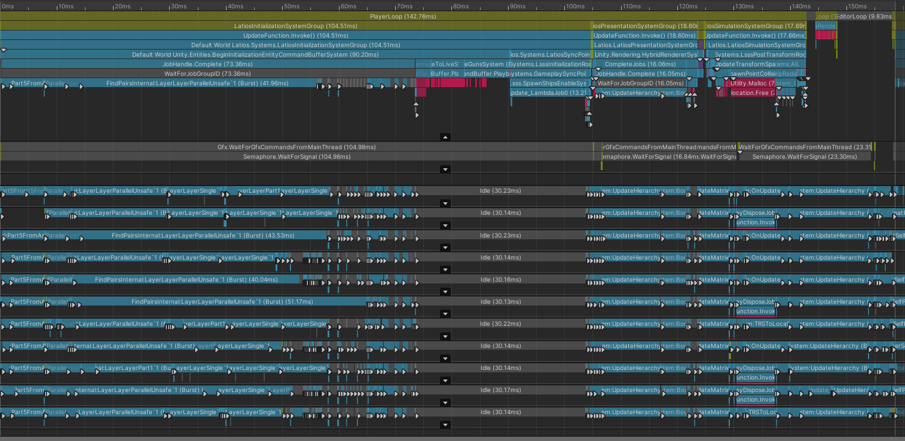

Ouch! That’s slow. There’s a lot of performance problems in this project. Many
of them have to do with the simulation at such a huge scale. But my focus was on
the sync point. Notice how the worker threads are all sitting idle during that
time?

I didn’t like that.

In my opinion, there’s no point trying to optimize the simulation jobs when I am
wasting resources by a long sync point.

To understand what parts are slow, I needed to understand the worst-case
scenarios. The above screenshot comes 100 frames into the simulation. In less
than 100 later, I found this guy:

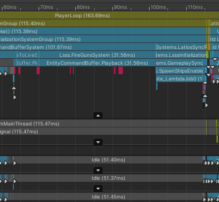

*Cue crisis meme*

## The Investigation

While there are other activities happening during the sync point, there are
primarily three that are suspiciously time consuming. They are the
UpdateTimeToLiveSystem, the FireGunsSystem, and the SpawnShipsEnableSystem. The
latter of which is an actual system rather than an EntityCommandBuffer playback.

### Suspect 1: SpawnShipsEnableSystem

This one is easy. Here’s the code, and let me know when you have the quick fix:

```csharp
var enabledShipList = new NativeList<Entity>(Allocator.TempJob);

Entities.WithAll<SpawnPointTag>().ForEach((ref SpawnPayload payload, in SpawnTimes times, in Translation trans, in Rotation rot) =>
{
    if (times.enableTime <= 0f && payload.disabledShip != Entity.Null)
    {
        var ship = payload.disabledShip;
        EntityManager.SetEnabled(ship, true);
        EntityManager.SetComponentData(ship, trans);
        EntityManager.SetComponentData(ship, rot);
        payload.disabledShip = Entity.Null;

        enabledShipList.Add(ship);
    }
}).WithStructuralChanges().Run();
```

If you are comfortable in the world of DOTS, you probably thought to move the
SetEnabled call outside the loop using the enabledShipList, switch the
SetComponentData to SetComponent, and remove the WithStructuralChanges() so that
Burst kicks in.

And you’d be right. The lack of Burst is the sin of this system, and using Burst
cleans this up to sub-millisecond execution.

Until this happens…

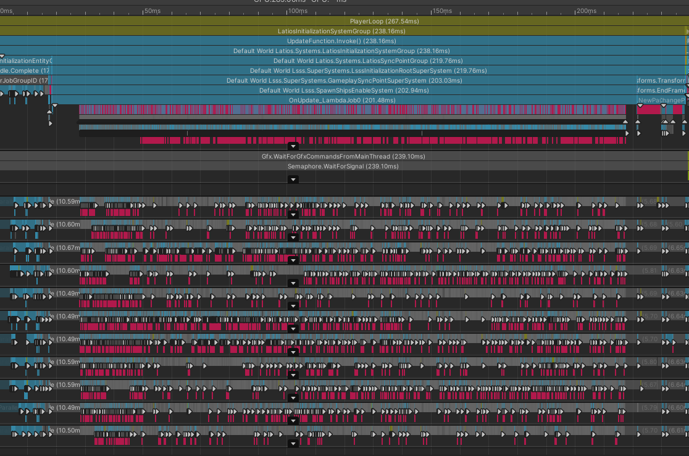

That’s the mass spawn wave, where a bunch of ships spawn all at once. Since a
ship is just larger than 10 entities, EntityManager spawns a bunch of parallel
jobs (in Entities 0.14, might be better in 0.17). Subsequent frames exhibit
similar unacceptable behavior, albeit less dramatic. Those frames average 30-70
milliseconds over a dozen frames for this one process.

Around this time, there were complaints on the forums about a lack of
EntityCommandBuffer.SetEnabled that worked with the LinkedEntityGroup. And while
record-time solutions were possible, playback-time was pretty much a no-go.

So what I learned is that I want a command buffer for enabling and disabling
entities that handled the LinkedEntityGroup at playback time. And this needed to
use some batching mechanism to avoid this job scheduling nonsense.

### Suspect 2: UpdateTimeToLiveSystem

If you didn’t like that last curve ball, then you definitely won’t like this
suspect:

```csharp
Entities.ForEach((Entity entity, int entityInQueryIndex, ref TimeToLive timeToLive) =>
{
    timeToLive.timeToLive -= dt;
    if (timeToLive.timeToLive < 0f)
        ecb.DestroyEntity(entityInQueryIndex, entity);
}).ScheduleParallel();
```

Yeah. There’s nothing wrong here. This is bread-and-butter DOTS code. Playback
for destroying entities is just that slow. So what we learned here is that we
need a faster command buffer for destroying entities.

### Suspect 3: FireGunsSystem

I’m focusing only on the inner loop here because it is a more complicated
system, but know that this is a parallel and Bursted job:

```csharp
var             bullet                                               = ecb.Instantiate(entityInQueryIndex, bulletPrefab.bulletPrefab);
CapsuleCollider collider                                             = GetComponent<Collider>(bulletPrefab.bulletPrefab);
float           halfLength                                           = math.distance(collider.pointA, collider.pointB) / 2f + collider.radius;
var             ltw                                                  = GetComponent<LocalToWorld>(gunPoints[i].gun);
var             rot                                                  = quaternion.LookRotationSafe(ltw.Forward, ltw.Up);
ecb.SetComponent(entityInQueryIndex, bullet, new Rotation { Value    = rot });
ecb.SetComponent(entityInQueryIndex, bullet, new Translation { Value = ltw.Position + math.forward(rot) * halfLength});
```

Here we are making three commands for each bullet. But that really isn’t
avoidable. Once again, playback is slow and we need something faster.

### Accusation

So in total, we need command buffers for enabling, disabling, instantiating, and
destroying entities, and they need to be faster then their EntityManager or
EntityCommandBuffer counterparts.

But how?

After all, I’m just one solo dev trying not to modify the Entities package, and
Unity is a team of smart developers and full package ownership.

The answer is tradeoffs. If we want performance, we have to give something up.
But that something doesn’t have to be valuable to us. So let’s pick a trait from
EntityCommandBuffer that we aren’t using.

That trait is *flexibility*.

The EntityCommandBuffer is capable of recording multiple different commands, and
plays them all back interleaved in deterministic order. Some commands are small,
some are large, and some require entity remapping. We’re using none of that.

In our case, our jobs only use one command each (two for FireGunsSystem, but
more on that later). Those commands are known at compile time. We can sacrifice
flexibility by making a command buffer process only one type of command. And in
the cases where we need flexibility, its not like EntityCommandBuffer is going
away.

But how does such a restriction help us go faster? Well, it allows us to make
assumptions. Assumptions mean less checks and evaluations. And less of those
means theoretical performance improvements. That also means there may be more
optimal data layouts, and more optimal algorithms to process those data layouts.

There are however things we do like about EntityCommandBuffer and want to keep,
such as deterministic parallel writing, dedicated system playback options, and
of course Burst support. Those will all be requirements on top of the
performance improvement requirements.

## EnableCommandBuffer

Our first challenge is how do we enact the structural change of enabling or
disabling entities? Unlike Unity, we only have the EntityManager and the
EntityCommandBuffer to work with. We’ll rule out the later because that would
defeat the point of using a single-type command buffer.

Let’s instead look at what happens when we enable an entity:

```csharp
[StructuralChangeMethod]
public void SetEnabled(Entity entity, bool enabled)
{
    if (GetEnabled(entity) == enabled)
        return;

    var disabledType = ComponentType.ReadWrite<Disabled>();
    if (HasComponent<LinkedEntityGroup>(entity))
    {
        //@TODO: AddComponent / Remove component should support Allocator.Temp
        var linkedEntities = GetBuffer<LinkedEntityGroup>(entity).Reinterpret<Entity>()
            .ToNativeArray(Allocator.TempJob);
        {
            if (enabled)
                RemoveComponent(linkedEntities, disabledType);
            else
                AddComponent(linkedEntities, disabledType);
        }
        linkedEntities.Dispose();
    }
    else
    {
        if (!enabled)
            AddComponent(entity, disabledType);
        else
            RemoveComponent(entity, disabledType);
    }
}
```

Ha! There’s not even any internal APIs being invoked. All that’s happening is
that the Disabled component is being removed from the entity in question. And if
the entity has a LinkedEntityGroup, it removes the component from all the
entities there too using a batch API.

In our case, we had too many batches, which we were telling the EntityManager
about one-by-one. But now that we will have all the entities in a command
buffer, we may be able to send the EntityManager one giant batch instead.

What? Didn’t think it would be that simple? Lol

The challenging part is getting the data to the EntityManager. So let’s walk
through that in order.

### Command Recording

Our first step is to record commands in parallel without imposing any additional
data requirements, since we want this to replace EntityCommandBuffer usage. This
means we won’t know the number of commands in advance, so NativeArray is out. We
also require this to be per-thread deterministic, which means NativeList,
NativeHashMap, and NativeMultiHashMap are out as well. That just leaves us with
NativeQueue and NativeStream.

Both of these containers follow the pattern of allocating a block of memory for
each thread, and letting the thread fill up that block before allocating another
one. Because the blocks are unique to the thread, we maintain per-thread
determinism. We might read the blocks in non-deterministic order, but we have
the sortKey to sort those issues out. *Serious question, was that a pun, or just
a consequence of good naming?*

There are two types of parallel containers, and they each have their own
attribute to represent themselves:

-   NativeContainerSupportsMinMaxWriteRestriction
-   NativeContainerIsAtomicWriteOnly

The former requires range indices tied to the job. This is extra data we may not
have, as we have a sortKey instead. Since NativeStream falls into this category,
it is out.

The latter is what NativeQueue uses, and wouldn’t you know it, but it is also
what EntityCommandBuffer uses too. So NativeQueue is our answer then, right?

Well…

### NativeQueue’s Got Baggage!

When you allocate a NativeQueue using Allocator.TempJob, and then you enqueue an
item, that item is stored in memory allocated with the TempJob allocator, right?

…Right?

… …Right???

It is stored using Allocator.Persistent.

All NativeQueues share a single pool of memory split up into blocks. Each block
is 16 kB and by default there are 256 of them. However, the number of blocks can
be set using PersistentMemoryBlockCount. This is a soft limit. If a NativeQueue
needs a new block and there isn’t one in the pool, it will always allocate a new
one. However, when it releases a block to the pool, if the active block count is
greater than the PersistentMemoryBlockCount, it will deallocate the block memory
rather than recycle it in the pool.

So what was the allocator argument for? Well, that’s where the metadata goes
that tells the NativeQueue which blocks it is currently using.

This behavior can cause some confusing performance side-effects. A command
buffer that receives lots of commands might experience a significant slowdown if
a bunch of smaller parallel command buffers were added in front consuming those
256 blocks and leaving them mostly empty.

Combine that with the facts that NativeQueues have no untyped variant, provide
no direct access to memory, can only be copied to a NativeArray
(single-threaded), and have no random-access capabilities, a lot of potential
optimization paths are not viable with NativeQueues.

While none of this by itself justified making a custom solution, if I were to
make a custom solution, I would definitely want to use it over NativeQueue. And
whether you wish to call it foresight or future sight, I knew I was going to be
making a custom solution for InstantiateCommandBuffer.

This was my first public API native container with full safety checks. The
container was relatively simple. And the bar was on the floor since there is no
EntityCommandBuffer equivalent. I decided to make EnableCommandBuffer my
practice flight, and began work on a backend data structure I call
UnsafeParallelBlockList.

But I’m going to save that design for later in this adventure. A lot of its
design decisions were based on tradeoffs against its competition. And in the
case of EnableCommandBuffer, that competition doesn’t exist. So for the sake of
EnableCommandBuffer, let’s just consider an UnsafeParallelBlockList a
NativeQueue drop-in replacement.

### Playback

So we have a filled up buffer of exclusively Enable commands and a user has just
called Playback(). It’s our time to shine, and create that batch of entities to
send to the EntityManager. How do we do it?

Well, first we need to capture all the entities from the buffer along with their
sort keys, which we will call EntityWithOperation. If we were using a
NativeQueue, we could just call ToArray() to get a
NativeArray\<EntityWithOperation\>. An equivalent mechanism exists in
UnsafeParallelBlockList that gives us the same result.

Now we have the array of elements that was gathered in a non-deterministic
order, and we need to make that array deterministic again. What we know is that
we have sortKey values that are deterministic, and we can also assume that
elements sharing the same sortKey are in a deterministic order. As long as we
use a stable sort over the sortKeys, we’ll have full determinism again.

We need a fast stable sort over 32 bit numbers? This certainly isn’t our first
time. We also did this when building our collision layers. That byte-sized radix
sort returns to show its muscles. This whole retrieval and recovery of
determinism is contained in the following code, where the input array already
knows the number of elements in the command buffer.

```csharp
private void GetEntities(NativeArray<Entity> entities)
{
    var tempEntitiesWithOperation = new NativeArray<EntityWithOperation>(entities.Length, Allocator.Temp, NativeArrayOptions.UninitializedMemory);
    var ranks                     = new NativeArray<int>(entities.Length, Allocator.Temp, NativeArrayOptions.UninitializedMemory);

    m_blockList->GetElementValues(tempEntitiesWithOperation);

    //Radix sort
    RadixSort.RankSortInt(ranks, tempEntitiesWithOperation);

    //Copy results
    for (int i = 0; i < ranks.Length; i++)
    {
        entities[i] = tempEntitiesWithOperation[ranks[i]].entity;
    }
}
```

However, we don’t just need these entities. We also need their LinkedEntityGroup
if they have them. Since we don’t know how many entities that will be, we have
to count them first. This unfortunately means reading a single integer 144 bytes
apart in a chunk. If we are lucky, our CPU will handle this intelligently using
something called Stride-Prefetching. Anyways, here’s the code for these two
steps, which should be pretty straightforward. The first entity in the
LinkedEntityGroup is the owning entity itself.

```csharp
private int GetLinkedEntitiesCount(BufferFromEntity<LinkedEntityGroup> linkedFE, NativeArray<Entity> roots)
{
    int count = 0;
    for (int i = 0; i < roots.Length; i++)
    {
        if (linkedFE.HasComponent(roots[i]))
        {
            count += linkedFE[roots[i]].Length;
        }
        else
        {
            count++;
        }
    }
    return count;
}

private void GetLinkedEntitiesFill(BufferFromEntity<LinkedEntityGroup> linkedFE, NativeArray<Entity> roots, NativeArray<Entity> entities)
{
    int count = 0;
    for (int i = 0; i < roots.Length; i++)
    {
        if (linkedFE.HasComponent(roots[i]))
        {
            var currentGroup = linkedFE[roots[i]];
            NativeArray<Entity>.Copy(currentGroup.AsNativeArray().Reinterpret<Entity>(), 0, entities, count, currentGroup.Length);
            count += currentGroup.Length;
        }
        else
        {
            entities[count] = roots[i];
            count++;
        }
    }
}
```

All of that runs in Burst and gives back a NativeArray to managed land. Managed
land then only has one step to perform:

```csharp
entityManager.RemoveComponent<Disabled>(entities);
```

And that’s that! We have a command buffer that can evaluate the
LinkedEntityGroup and enable entities at playback time. Its usage looks like
this:

```csharp
var ecb = new EnableCommandBuffer(Allocator.TempJob);

Entities.WithAll<SpawnPointTag>().ForEach((Entity entity, ref SpawnPayload payload, in SpawnTimes times) =>
{
    if (times.enableTime <= 0f && payload.disabledShip != Entity.Null)
    {
        var ship = payload.disabledShip;
        ecb.Add(ship);
        SetComponent(ship, GetComponent<Translation>(entity));
        SetComponent(ship, GetComponent<Rotation>(entity));
        payload.disabledShip = Entity.Null;

        enabledShipList.Add(ship);
    }
}).Run();

ecb.Playback(EntityManager, GetBufferFromEntity<LinkedEntityGroup>(true));
ecb.Dispose();
```

So how does it perform? Well, it is Bursted now, so you can probably take a
guess. I’ll go through the performance numbers at the end.

## DisableCommandBuffer

Um…

The only things that make this different from EnableCommandBuffer is the names
and the EntityManager calls. So if you like endless adventures, you can follow
this link to learn how DisableCommandBuffer works: [Link](#_EnableCommandBuffer)

## DestroyCommandBuffer

Oh hey! We actually have competition. Let me get my microphone…

THIS BATTLE WILL TAKE PLACE BETWEEN ENTITY COMMAND BUFFER FROM UNITY AND THE
CHALLENGER DESTROY COMMAND BUFFER FROM LATIOS FRAMEWORK CORE!

BATTLE BEGIN!

EntityCommandBuffer has a major advantage in that it has much more direct access
to the ECS data structures. It also runs in Burst, which means whatever
DestroyCommandBuffer does, it will also need to run in Burst to keep up.
However, EntityCommandBuffer may be held back by its flexibility, something
DestroyCommandBuffer may be able to exploit. To find the weak spot, we’re going
to have to trace the full path of EntityCommandBuffer’s DestroyEntity command.

EntityCommandBuffer operates on minimum-sized 4 kB blocks which it refers to as
“chains”. Sometimes, these chains are longer than 4 kB if the command stores a
large buffer or something. When a DestroyCommand arrives, it records a very
simple command which consumes 28 bytes. It also breaks the chain whenever the
sortKey is smaller than the one it previously read. This is so that the start of
the chain is always the smallest sortKey.

During playback, Unity uses a priority queue, and will play a chain up until it
finds a sortKey greater than the next chain’s sortKey in the priority queue. It
will then send the current chain back into the queue with an updated sortKey and
playback start point. It does this, cycling through chains until it depletes
them all.

When EntityCommandBuffer plays back the command, it destroys the entity using a
batch destroy function in the internal EntityComponentStore (what EntityManager
also talks to) with a count of 1. That command copies the LinkedEntityGroup if
any, destroys the entity in its chunk, and then recursively calls the batch
destroy function on the linked group. It tries to reorder the entities based on
the LinkedEntityGroup before making the recursive call, but I don’t think it is
very effective though as it is not a real sort. The recursive call looks at the
first entity and then looks for adjacent entities in the chunk. That becomes a
batch, and it runs through the rest of the algorithm for just that batch and
then collects the next batch.

In the best case, it is destroying entities in the LinkedEntityGroup all at
once. In the worst case, it is destroying every entity in every
LinkedEntityGroup one by one. So what does destroying an entity entail? How bad
is destroying a single entity at a time?

Well, remember our chunk is composed of arrays of components, like so:

|                        |   |   |   |   |   |   |   |   |   |   |
|------------------------|---|---|---|---|---|---|---|---|---|---|
| Translation            | 0 | 1 | 2 | 3 | 4 | 5 | 6 | 7 | 8 | 9 |
| Rotation               | 0 | 1 | 2 | 3 | 4 | 5 | 6 | 7 | 8 | 9 |
| LocalToWorld           | 0 | 1 | 2 | 3 | 4 | 5 | 6 | 7 | 8 | 9 |
| Collider               | 0 | 1 | 2 | 3 | 4 | 5 | 6 | 7 | 8 | 9 |
| Speed                  | 0 | 1 | 2 | 3 | 4 | 5 | 6 | 7 | 8 | 9 |
| Damage                 | 0 | 1 | 2 | 3 | 4 | 5 | 6 | 7 | 8 | 9 |
| BulletPreviousPosition | 0 | 1 | 2 | 3 | 4 | 5 | 6 | 7 | 8 | 9 |
| BulletFirer            | 0 | 1 | 2 | 3 | 4 | 5 | 6 | 7 | 8 | 9 |
| TimeToLive             | 0 | 1 | 2 | 3 | 4 | 5 | 6 | 7 | 8 | 9 |
| TimeToLiveFadeStart    | 0 | 1 | 2 | 3 | 4 | 5 | 6 | 7 | 8 | 9 |
| FadeProperty           | 0 | 1 | 2 | 3 | 4 | 5 | 6 | 7 | 8 | 9 |
| {HR_V2_Kitchen_Sink}   | 0 | 1 | 2 | 3 | 4 | 5 | 6 | 7 | 8 | 9 |

When an entity is deleted, first a check takes place to see if the entity has
system state components. If so, the entity and only those components are copied
to a new chunk with a special archetype for cleanup. After that check and
optional processing, the very last entity in the chunk has all of its data
copied over the entity that was destroyed.

|                        |   |   |       |   |   |   |   |   |   |       |
|------------------------|---|---|-------|---|---|---|---|---|---|-------|
| Translation            | 0 | 1 | **9** | 3 | 4 | 5 | 6 | 7 | 8 | **9** |
| Rotation               | 0 | 1 | **9** | 3 | 4 | 5 | 6 | 7 | 8 | **9** |
| LocalToWorld           | 0 | 1 | **9** | 3 | 4 | 5 | 6 | 7 | 8 | **9** |
| Collider               | 0 | 1 | **9** | 3 | 4 | 5 | 6 | 7 | 8 | **9** |
| Speed                  | 0 | 1 | **9** | 3 | 4 | 5 | 6 | 7 | 8 | **9** |
| Damage                 | 0 | 1 | **9** | 3 | 4 | 5 | 6 | 7 | 8 | **9** |
| BulletPreviousPosition | 0 | 1 | **9** | 3 | 4 | 5 | 6 | 7 | 8 | **9** |
| BulletFirer            | 0 | 1 | **9** | 3 | 4 | 5 | 6 | 7 | 8 | **9** |
| TimeToLive             | 0 | 1 | **9** | 3 | 4 | 5 | 6 | 7 | 8 | **9** |
| TimeToLiveFadeStart    | 0 | 1 | **9** | 3 | 4 | 5 | 6 | 7 | 8 | **9** |
| FadeProperty           | 0 | 1 | **9** | 3 | 4 | 5 | 6 | 7 | 8 | **9** |
| {HR_V2_Kitchen_Sink}   | 0 | 1 | **9** | 3 | 4 | 5 | 6 | 7 | 8 | **9** |

Can you smell the poisonous stench? If not, perhaps replicate this page in a new
tab and reread the first part.

That’s right, this is our 2D array being iterated by columns! Sure, our
components aren’t all the same size, so in bytes there’s no correlation, but the
cache system never really took that into account anyways (unless you have really
short rows which is a whole different irrelevant tangent).

Can we do better? Duh!

Let’s suppose we gave this magic destruction a consecutive batch of entities in
the chunk to destroy:

|                        |   |       |       |       |       |   |       |       |       |       |
|------------------------|---|-------|-------|-------|-------|---|-------|-------|-------|-------|
| Translation            | 0 | **6** | **7** | **8** | **9** | 5 | **6** | **7** | **8** | **9** |
| Rotation               | 0 | **6** | **7** | **8** | **9** | 5 | **6** | **7** | **8** | **9** |
| LocalToWorld           | 0 | **6** | **7** | **8** | **9** | 5 | **6** | **7** | **8** | **9** |
| Collider               | 0 | **6** | **7** | **8** | **9** | 5 | **6** | **7** | **8** | **9** |
| Speed                  | 0 | **6** | **7** | **8** | **9** | 5 | **6** | **7** | **8** | **9** |
| Damage                 | 0 | **6** | **7** | **8** | **9** | 5 | **6** | **7** | **8** | **9** |
| BulletPreviousPosition | 0 | **6** | **7** | **8** | **9** | 5 | **6** | **7** | **8** | **9** |
| BulletFirer            | 0 | **6** | **7** | **8** | **9** | 5 | **6** | **7** | **8** | **9** |
| TimeToLive             | 0 | **6** | **7** | **8** | **9** | 5 | **6** | **7** | **8** | **9** |
| TimeToLiveFadeStart    | 0 | **6** | **7** | **8** | **9** | 5 | **6** | **7** | **8** | **9** |
| FadeProperty           | 0 | **6** | **7** | **8** | **9** | 5 | **6** | **7** | **8** | **9** |
| {HR_V2_Kitchen_Sink}   | 0 | **6** | **7** | **8** | **9** | 5 | **6** | **7** | **8** | **9** |

Oh hey! We have consecutive data in memory being touched! So does the destroy
function take advantage of this?

You bet it does! It does the copies for all entities in the consecutive batch,
component type by component type.

So once again, the EntityManager batch API comes to the rescue. We can use the
exact same code that EnableCommandBuffer used, except drop the LinkedEntityGroup
step since Unity handles that for us. Our radix sort might be a little slower
than EntityCommandBuffer’s priority queue, or it might be faster. It really
depends on how random the sortKeys are.

### Confession Time

So DestroyCommandBuffer totally won, right?

No. No it did not.

You might suspect the issue is in our radix sort. And perhaps that is partly
true. Our radix sort might be a little slower than EntityCommandBuffer’s
priority queue, or it might be faster. It really depends on how random the
sortKeys are.

But the real issue is that the batch API only works if the adjacent entities in
the array are also adjacent in the chunks. Unity does not do any of the sorting
for us, and at the time I wrote this, I incorrectly assumed it did. At that
time, Entities was still at 0.14 and EnableCommandBuffer’s
EntityManager.RemoveComponent() call caused a sorting step to show up in the
profiler on a worker thread. That disappeared in Entities 0.16. The sort was way
slower than my radix sort anyways, so I’m not surprised it disappeared.

Also at this time, I didn’t have any way of sorting entities relative to their
owning chunks. Nor did I decide to spend any time investigating.
DestroyCommandBuffer was a quick implementation since it was nearly identical to
EnableCommandBuffer. In fact, all three of the containers discussed so far are
just consumers of the real NativeContainer called EntityOperationCommandBuffer.
This container allows you to write a bunch of entities and sortKeys in parallel
and retrieve a deterministic list of entities back, with or without their
LinkedEntityGroups. The container even has a mode that sorts first by entity for
grouping duplicate references. And this container is public API, so you can use
it if it happens to solve your use case.

But there’s one other problem that severely limits this technique, and is also
holding back Unity. And that’s that Unity doesn’t batch this scenario:

|                        |       |   |       |   |       |   |   |       |       |       |
|------------------------|-------|---|-------|---|-------|---|---|-------|-------|-------|
| Translation            | **7** | 1 | **8** | 3 | **9** | 5 | 6 | **7** | **8** | **9** |
| Rotation               | **7** | 1 | **8** | 3 | **9** | 5 | 6 | **7** | **8** | **9** |
| LocalToWorld           | **7** | 1 | **8** | 3 | **9** | 5 | 6 | **7** | **8** | **9** |
| Collider               | **7** | 1 | **8** | 3 | **9** | 5 | 6 | **7** | **8** | **9** |
| Speed                  | **7** | 1 | **8** | 3 | **9** | 5 | 6 | **7** | **8** | **9** |
| Damage                 | **7** | 1 | **8** | 3 | **9** | 5 | 6 | **7** | **8** | **9** |
| BulletPreviousPosition | **7** | 1 | **8** | 3 | **9** | 5 | 6 | **7** | **8** | **9** |
| BulletFirer            | **7** | 1 | **8** | 3 | **9** | 5 | 6 | **7** | **8** | **9** |
| TimeToLive             | **7** | 1 | **8** | 3 | **9** | 5 | 6 | **7** | **8** | **9** |
| TimeToLiveFadeStart    | **7** | 1 | **8** | 3 | **9** | 5 | 6 | **7** | **8** | **9** |
| FadeProperty           | **7** | 1 | **8** | 3 | **9** | 5 | 6 | **7** | **8** | **9** |
| {HR_V2_Kitchen_Sink}   | **7** | 1 | **8** | 3 | **9** | 5 | 6 | **7** | **8** | **9** |

Unfortunately, there’s not really a great excuse either. The small buffer
required to track the indices could be reset prior to the recursion call. And
the cache gains at the end of the chunk would be highly beneficial. Not to
mention that many of the entities would be close enough together to see better
cache hit rates. This case is quite common, and typically gets worse as the
simulation continues due to the increase in entropy over time. I can’t fix it
without making a custom fork of Entities. This is on Unity. Other than writes to
the index-tracking buffer, the new approach wouldn’t be any more expensive, but
would allow for people like me capable of passing in a sorted array of entities
to see significant performance gains. My radix sort generates far fewer cache
misses than what these component copies are generating.

*Dear Unity, if what is written on this page isn’t sufficient enough to guide
you through making this improvement, please reach out to me!*

Anyways, I should probably discuss that UnsafeParallelBlockList now. While it
might not lead to massive performance gains, it does reduce bandwidth by 57%.

## UnsafeParallelBlockList

When speed is a factor, it is important to design a container that can play to
assumptions about its use cases. There are always tradeoffs between flexibility
and speed, and the goal is to provide the optimal speed for the necessary
flexibility afforded by development time. I wanted to create a container that
was flexible enough to cover all the custom command buffers, but not be so
flexible as to cover the EntityCommandBuffer’s use cases.

The first decision was to use blocks. This was a pretty simple decision. We are
adding an unknown number of commands to multiple different threads. All the
other containers that handle this use case (NativeQueue, NativeStream, and
EntityCommandBuffer) also use blocks. Blocks avoid having to perform memory
copies as the array grows, which makes its performance approximately linear in
cost. Blocks do suffer from less optimal lookups, but the scope of lookups is
limited to playback, so the tradeoff is worth it.

The second decision is the size of the blocks, and this is the first aspect that
sets UnsafeParallelBlockList apart. All three of Unity’s block-based containers
store arbitrarily-sized data (NativeQueue because it pools blocks).
UnsafeParallelBlockList also needs to store different-sized data per instance,
but not per element. Generics weren’t an option though because we need these
containers stored in a system for playback, so they need to be the same type or
else we have constant GC. But that doesn’t mean we don’t know the size of the
data for any given instance at construction. We totally know that. So we can
store the size of the element and the number of elements per block in our
constructor, and our block size is just those two numbers multiplied together.
Because of this decision, we no-longer have to worry about whether or not an
element fits within the remaining bytes of a block. Each block has a fixed
number of elements that we can much more easily track.

The third decision is how to track the blocks. Most of Unity’s structures
reserve a part of the block for metadata including a linked list pointer to the
next block. However, this doesn’t make as much sense when my blocks are sized to
perfectly fit a fixed number of elements, and since I prefer to use radix sorts
and such over priority queues for managing sortKeys, random access seemed like a
valuable benefit. So instead of a linked list, I used an UnsafeList\<BlockPtr\>
to store the blocks assigned to each thread index. Each of these live inside a
64 byte (cache line size) struct called PerThreadBlockList which also stored the
number of elements and two extra pointers. What are the pointers for? Well,
these are shortcuts to making writing fast. Instead of having to calculate the
block to write and the index in the block, I just store the pointer to the
address in the block to write to next. After writing, I bump that pointer by the
element size. Of course, this fails if I run out of elements in the block, which
is why the second pointer points to the end of the block. I can simply check if
the write address is greater than the end of the block address, and if so,
allocate a new block. Unity’s containers also employ similar tricks, although
this version is able to achieve “just in time” allocation instead of “one ahead”
allocation and still require the same or less operations, due to the block
sizing methods.

The whole structure is as follows:

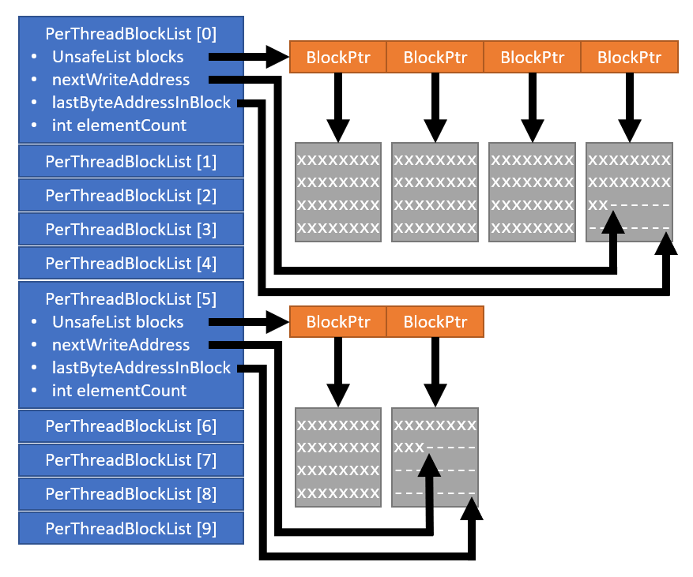

With this data structure, I can count the elements by simply summing the
elementCount values in the PerThreadBlockList array (blue). And I can easily
iterate through the data in fixed chunks if necessary, perhaps even in parallel
(I don’t do this yet).

In the case of DestroyCommandBuffer, each element only requires 12 bytes (entity
= 8, sortKey = 4) compared to EntityCommandBuffer which requires 28 bytes for
such a command. Thus, the memory footprint is reduced by 57%.

By the thinnest of margins, DestroyCommandBuffer comes out on top, but only if
memory is a contributing factor. The next round is between the aces. It should
be a good match.

## InstantiateCommandBuffer

EnableCommandBuffer and DisableCommandBuffer didn’t have any real competition.
DestroyCommandBuffer was just piggybacking off of EntityOperationCommandBuffer.
All of that was “practice” working with custom native containers and developing
UnsafeParallelBlockList. InstantiateCommandBuffer was always the prize.
Instantiating prefabs is one of the most powerful things in Unity’s ECS due to
the existence-based processing. A speedup here can benefit nearly any project.

But instantiating a prefab alone is actually not that useful. Any prefab
instantiated on the same frame will be identical, and the simulation will have
to make them unique. Usually, we want to specify some unique data on the entity
immediately after instantiating it. We might set transform data, or we might
parent it to another object. In the latter case, we need to not only set its
Parent, but we also need to ensure it has a LocalToParent, even though we don’t
need to initialize its value.

EntityCommandBuffer resolves this by returning a “fake entity” in which we can
apply further AddComponent and SetComponent commands to.
InstantiateCommandBuffer has the limitation that it must represent a single
command known at compile time. In cases where we know in advance that we need to
instantiate entities, we also typically know in advance what components we need
to add and/or initialize. So what if we combined the instantiate, add, and set
into a single command?

Making InstantiateCommandBuffer generic is the obvious answer. But
unfortunately, it isn’t that simple. Our playback system needs to store all the
different concrete versions of this container that a user might come up with. We
could create a Dictionary of list-containing generic classes similar to how
collection components work. But that seemed like a lot of main thread work I
wasn’t fond of, since this was all happening inside a sync point. It would make
the cost of using these containers grow exponentially as you used them more, and
since these containers are limited to a specific permutation, that could get
expensive fast.

The other option was to have a generic wrapper around an untyped command buffer
that could be played back with or without the generic wrapper. The untyped
command buffer could be stored by the playback system in a List. That requires
that we be able to store the types of components in the container at
construction time, and to be able to write untyped data to the correct component
arrays at playback time. Storing the types is easy. We have ComponentType for
this. And since EntityManager allows adding a component without initializing it
using ComponentType, our LocalToParent use case is also covered without having
to store dummy values for each command. And as for writing back data, we have
DynamicComponentTypeHandle. With a little API manipulation, we can get access to
pointers inside the chunks, which opens up opportunities for
UnsafeUtility.MemCpy(). This requires chunk iteration, which will present some
interesting challenges. But chunk iteration is also the secret weapon to
defeating EntityCommandBuffer in big ways.

### Initialization Theory

When instantiating an entity via EntityCommandBuffer, a new entity is added to a
chunk with a matching archetype. Then the prefab entity’s compontents are copied
one-by-one to the newly instantiated entity.

|                        |   |   |   |   |   |   |       |   |   |   |
|------------------------|---|---|---|---|---|---|-------|---|---|---|
| Translation            | 0 | 1 | 2 | 3 | 4 | 5 | **6** |   |   |   |
| Rotation               | 0 | 1 | 2 | 3 | 4 | 5 | **6** |   |   |   |
| LocalToWorld           | 0 | 1 | 2 | 3 | 4 | 5 | **6** |   |   |   |
| Collider               | 0 | 1 | 2 | 3 | 4 | 5 | **6** |   |   |   |
| Speed                  | 0 | 1 | 2 | 3 | 4 | 5 | **6** |   |   |   |
| Damage                 | 0 | 1 | 2 | 3 | 4 | 5 | **6** |   |   |   |
| BulletPreviousPosition | 0 | 1 | 2 | 3 | 4 | 5 | **6** |   |   |   |
| BulletFirer            | 0 | 1 | 2 | 3 | 4 | 5 | **6** |   |   |   |
| TimeToLive             | 0 | 1 | 2 | 3 | 4 | 5 | **6** |   |   |   |
| TimeToLiveFadeStart    | 0 | 1 | 2 | 3 | 4 | 5 | **6** |   |   |   |
| FadeProperty           | 0 | 1 | 2 | 3 | 4 | 5 | **6** |   |   |   |
| {HR_V2_Kitchen_Sink}   | 0 | 1 | 2 | 3 | 4 | 5 | **6** |   |   |   |

Then, a series of SetComponentData calls re-initializes some of the values.

|                        |   |   |   |   |   |   |       |   |   |   |
|------------------------|---|---|---|---|---|---|-------|---|---|---|
| Translation            | 0 | 1 | 2 | 3 | 4 | 5 | **6** |   |   |   |
| Rotation               | 0 | 1 | 2 | 3 | 4 | 5 | **6** |   |   |   |
| LocalToWorld           | 0 | 1 | 2 | 3 | 4 | 5 | 6     |   |   |   |
| Collider               | 0 | 1 | 2 | 3 | 4 | 5 | 6     |   |   |   |
| Speed                  | 0 | 1 | 2 | 3 | 4 | 5 | 6     |   |   |   |
| Damage                 | 0 | 1 | 2 | 3 | 4 | 5 | 6     |   |   |   |
| BulletPreviousPosition | 0 | 1 | 2 | 3 | 4 | 5 | 6     |   |   |   |
| BulletFirer            | 0 | 1 | 2 | 3 | 4 | 5 | **6** |   |   |   |
| TimeToLive             | 0 | 1 | 2 | 3 | 4 | 5 | 6     |   |   |   |
| TimeToLiveFadeStart    | 0 | 1 | 2 | 3 | 4 | 5 | 6     |   |   |   |
| FadeProperty           | 0 | 1 | 2 | 3 | 4 | 5 | 6     |   |   |   |
| {HR_V2_Kitchen_Sink}   | 0 | 1 | 2 | 3 | 4 | 5 | 6     |   |   |   |

It should be pretty obvious that this is terrible on cache memory. And once
again, we can look to the EntityManager to see if it offers a better batching
API. This time we, find three different options:

-   Instantiate(Entity srcEntity, NativeArray\<Entity\> outputEntities)
-   Instantiate(Entity srcEntity, int instanceCount, Allocator allocator)
-   Instantiate(NativeArray\<Entity\> srcEntities, NativeArray\<Entity\>
    outputEntities)

The first two are identical, the second just being convenience variant of the
first for some use cases (which won’t be ours). The third’s documentation states
that it ignores LinkedEntityGroup and assumes we provide all the entities. It
also instantiates each entity one by one with an instance count of 1. That’s not
what we want. We want to instantiate entities in batches when they come from the
same prefab.

The former, however, can instantiate in batches like this:

|                        |   |   |   |   |   |   |       |       |       |   |
|------------------------|---|---|---|---|---|---|-------|-------|-------|---|
| Translation            | 0 | 1 | 2 | 3 | 4 | 5 | **6** | **7** | **8** |   |
| Rotation               | 0 | 1 | 2 | 3 | 4 | 5 | **6** | **7** | **8** |   |
| LocalToWorld           | 0 | 1 | 2 | 3 | 4 | 5 | **6** | **7** | **8** |   |
| Collider               | 0 | 1 | 2 | 3 | 4 | 5 | **6** | **7** | **8** |   |
| Speed                  | 0 | 1 | 2 | 3 | 4 | 5 | **6** | **7** | **8** |   |
| Damage                 | 0 | 1 | 2 | 3 | 4 | 5 | **6** | **7** | **8** |   |
| BulletPreviousPosition | 0 | 1 | 2 | 3 | 4 | 5 | **6** | **7** | **8** |   |
| BulletFirer            | 0 | 1 | 2 | 3 | 4 | 5 | **6** | **7** | **8** |   |
| TimeToLive             | 0 | 1 | 2 | 3 | 4 | 5 | **6** | **7** | **8** |   |
| TimeToLiveFadeStart    | 0 | 1 | 2 | 3 | 4 | 5 | **6** | **7** | **8** |   |
| FadeProperty           | 0 | 1 | 2 | 3 | 4 | 5 | **6** | **7** | **8** |   |
| {HR_V2_Kitchen_Sink}   | 0 | 1 | 2 | 3 | 4 | 5 | **6** | **7** | **8** |   |

Of course this requires that we can combine instantiated instances in a
deterministic manner to reap the benefits. But that’s something we can totally
do. It also means we will have to instantiate each unique prefab at a time. This
could be really slow if every prefab was unique, especially outside of Burst. So
can we do it in Burst?

Yes. We can.

The secret to getting the EntityManager in a Burst job is
ExclusiveEntityTransaction. And while ExclusiveEntityTransaction doesn’t provide
the batch API at the surface, ever since EntityManager became a struct type,
those surface-level functions really only exist for legacy reasons.
ExclusiveEntityTransaction now exposes the EntityManager giving full access to
the EntityManager API inside a job. There were a few functions where this broke
in Entities [0.14] for EnableCommandBuffer (I believe Entities [0.16] fixed
this), but the Instantiate API is ready-to-go!

So one observation that we can make from the batch instantiation is that new
entities tend to be grouped together at the ends of their chunks. That means we
may also be able to do our initialization in chunks like so:

|                        |   |   |   |   |   |   |       |       |       |   |
|------------------------|---|---|---|---|---|---|-------|-------|-------|---|
| Translation            | 0 | 1 | 2 | 3 | 4 | 5 | **6** | **7** | **8** |   |
| Rotation               | 0 | 1 | 2 | 3 | 4 | 5 | **6** | **7** | **8** |   |
| LocalToWorld           | 0 | 1 | 2 | 3 | 4 | 5 | 6     | 7     | 8     |   |
| Collider               | 0 | 1 | 2 | 3 | 4 | 5 | 6     | 7     | 8     |   |
| Speed                  | 0 | 1 | 2 | 3 | 4 | 5 | 6     | 7     | 8     |   |
| Damage                 | 0 | 1 | 2 | 3 | 4 | 5 | 6     | 7     | 8     |   |
| BulletPreviousPosition | 0 | 1 | 2 | 3 | 4 | 5 | 6     | 7     | 8     |   |
| BulletFirer            | 0 | 1 | 2 | 3 | 4 | 5 | **6** | **7** | **8** |   |
| TimeToLive             | 0 | 1 | 2 | 3 | 4 | 5 | 6     | 7     | 8     |   |
| TimeToLiveFadeStart    | 0 | 1 | 2 | 3 | 4 | 5 | 6     | 7     | 8     |   |
| FadeProperty           | 0 | 1 | 2 | 3 | 4 | 5 | 6     | 7     | 8     |   |
| {HR_V2_Kitchen_Sink}   | 0 | 1 | 2 | 3 | 4 | 5 | 6     | 7     | 8     |   |

So now, we have three steps:

1.  Identify which chunks contain our new entities
2.  Identify which entities in the chunk are our new entities
3.  Map the entity to its respective initialization data stored in our command
    buffer

### Identifying Chunks

This one is easy. EntityManager has a GetChunk() method that lets us fetch a
chunk for a given entity. We can hash these chunks, or collect all of them,
radix sort them, and merge them, which I find to be faster and will have another
benefit in the next section.

### Identifying Entities in Chunks

Originally, I was going to hash all the newly created entities and when
iterating chunks, check if each entity was in the hashmap. But that seemed slow
and wasteful, both for building the hashmap, and for doing lookups. I could be
checking lots of old entities I don’t care about. And hashmaps are random
access. I was half way through the implementation and got frustrated because it
seemed so slow.

EntityManager can look up the data in an Entity. ComponentDataFromEntity can
look up the data in the entity. These must be looking up the indices in the
chunk component arrays. Why can’t I get this index?

So here is the GetChunk() code:

```csharp
public ArchetypeChunk GetChunk(Entity entity)
{
    var ecs = GetCheckedEntityDataAccess()->EntityComponentStore;
    var chunk = ecs->GetChunk(entity);
    return new ArchetypeChunk(chunk, ecs);
}
```

We can see, it gets a “chunk” and wraps it into an ArchetypeChunk.

Now what does EntityComponentStore.GetChunk() do?

```csharp
public Chunk* GetChunk(Entity entity)
{
    var entityChunk = m_EntityInChunkByEntity[entity.Index].Chunk;

    return entityChunk;
}
```

It looks up an array to get something that has a Chunk property based on the
entity index. Interestingly, there is a suspiciously similar function in the
same file a few lines down.

```csharp
public EntityInChunk GetEntityInChunk(Entity entity)
{
    return m_EntityInChunkByEntity[entity.Index];
}
```

Aha! So our magic type is an EntityInChunk. What does this have?

```csharp
public unsafe struct EntityInChunk : IComparable<EntityInChunk>, IEquatable<EntityInChunk>
{
    internal Chunk* Chunk;
    internal int IndexInChunk;

    public int CompareTo(EntityInChunk other)
    {
        ulong lhs = (ulong)Chunk;
        ulong rhs = (ulong)other.Chunk;
        int chunkCompare = lhs < rhs ? -1 : 1;
        int indexCompare = IndexInChunk - other.IndexInChunk;
        return (lhs != rhs) ? chunkCompare : indexCompare;
    }

    public bool Equals(EntityInChunk other)
    {
        return CompareTo(other) == 0;
    }
}
```

Seriously? This is exactly what we want! Why is this not public API? The value
is right there, and there is already a function that practically fetches it with
all safety intact and just discards the index we care about!

In the past, I would have used reflection for this sort of thing, as I did for
EntityDataCopyKit. However, that was for very low-frequency operations. This is
not. This needs Burst.

### Extending Packages without Reflection

As it turns out, my use of reflection was the wrong way to do things. Unity
provides a mechanism for appending C\# files into some other assembly in the
project using an Assembly Reference File (asmref). This also works for packages,
since the packages are in source code form and compiled locally. That means my
package can extend other packages at the source level, or I can grant my package
internal access using [InternalsVisibleTo] which is what a lot of people do.
Accessing internals is risky, as any update could break it, but I already have a
workflow and release schedule to keep up with this for EntityDataCopyKit. But
unlike reflection, breakage with asmref is now a compile-time breakage, because
the code runs native. And “native” means “Burst”!

So with a little asmref magic, I was able to write this EntityManager extension
fully Burst-compatible and pretty safe since it is just imitating already
existing safety-checked code:

```csharp
namespace Unity.Entities.Exposed
{
    public unsafe struct EntityLocationInChunk : IEquatable<EntityLocationInChunk>, IComparable<EntityLocationInChunk>
    {
        public ArchetypeChunk chunk;
        public int            indexInChunk;

        public ulong ChunkAddressAsUlong => (ulong)chunk.m_Chunk;

        public int CompareTo(EntityLocationInChunk other)
        {
            ulong lhs          = (ulong)chunk.m_Chunk;
            ulong rhs          = (ulong)other.chunk.m_Chunk;
            int   chunkCompare = lhs < rhs ? -1 : 1;
            int   indexCompare = indexInChunk - other.indexInChunk;
            return (lhs != rhs) ? chunkCompare : indexCompare;
        }

        public bool Equals(EntityLocationInChunk other)
        {
            return chunk.Equals(other.chunk) && indexInChunk.Equals(other.indexInChunk);
        }
    }

    public static unsafe class EntityManagerExposed
    {
        [BurstCompatible]
        public static EntityLocationInChunk GetEntityLocationInChunk(this EntityManager entityManager, Entity entity)
        {
            var ecs           = entityManager.GetCheckedEntityDataAccess()->EntityComponentStore;
            var entityInChunk = ecs->GetEntityInChunk(entity);
            return new EntityLocationInChunk
            {
                chunk        = new ArchetypeChunk(entityInChunk.Chunk, ecs),
                indexInChunk = entityInChunk.IndexInChunk
            };
        }
    }
}
```

That ChunkAddressAsUlong is a little convenience method that helps when sorting
these using radix sorts instead of comparison-based sorts.

### Mapping Entities to Data

With all of these tools in place, we are able to batch and sort prefabs before
instantiating them. Then we are able to locate their chunks as well as their
indices so we can jump right to them using chunk iteration. Now the last step is
initializing the component data.

When we extract the prefabs and sort keys that we want to instantiate, we don’t
want the initialization data just yet. Fetching that data is just doing an
unnecessary memcpy. But we need to keep track of which data corresponds to which
prefab through a sort operation. If we don’t want to sort the data directly,
then we have to sort some index, handle, or pointer to the data. For this
implementation, I chose pointers, because there wasn’t a simple way to make a 4
byte index and pointers lead directly to the data in question.

This means I have two UnsafeParallelBlockList instances. One is for the prefab
and sortKey. The other contains the component data payload and is sized as the
sum of all the components. Since I will only ever be using memcpy on this data,
alignment doesn’t matter. I just pack the data as tightly as possible.

As for fetching the pointers, if I know the first address in the block, I can
calculate all the other addresses in the block, since there is a fixed number of
elements with fixed sizes between them. And since I store the pointers to the
blocks in a separate UnsafeList, I don’t even need to touch the blocks
themselves to compute all the addresses. The last block is a little tricky, as
it is not fully filled, but I have PerThreadBlockList.elementCount to help with
that. Instead of iterating through the blocks, I just have to iterate through a
few UnsafeLists and calculate a bunch of pointers in an inner loop.

You better believe that’s fast!

The pointers are relatively cheap to sort. In fact, they go through both radix
sorts (sorting the prefabs and sorting the instantiated entities in their
chunks). I’m performing the minimum amount of random access required to get
access to the data per entity (pointer lookup of the data where it was initially
written) as I’m iterating newly instantiated entities in their chunks. This was
actually the main motivating factor behind UnsafeParallelBlockList. Owning this
structure meant that I could take aggressive memory management shortcuts not
possible with EntityCommandBuffer.

Let’s see this design in action!

### Putting it all Together

InstantiateCommandBuffers are created generically, providing a generic structure
for the user, and generating an InstantiateCommandBufferUntyped for the playback
system. The latter is the actual NativeContainer, similar to
EntityOperationCommandBuffer.

In a write operation, the write command is forwarded from the generic instance
to a generic method in InstantiateCommandBufferUntyped. That method writes out
the prefab and sortKey similarly to EntityOperationCommandBuffer. However, for
the component data, instead of writing a packed struct, it uses
UnsafeParallelBlockList.Allocate() to get a pointer where it can write the data
to. It writes each component one-by-one using
UnsafeUtility.CopyStructureToPtr(). All of these writes are treated as a single
element from UnsafeParallelBlockList’s perspectives, since an element in a block
was sized as the sum of all the component sizes at construction.

Playback is accomplished using seven steps broken up into two jobs. The first
job handles all but the last step, and is an IJob. It uses the EntityManager via
ExclusiveEntityTransaction.

In the first step, it fetches the prefabs and sortKeys from the first
UnsafeParallelBlockList.

In the second step, it fetches the pointers to the component data from the
second UnsafeParallelBlockList. Because writes are deterministically ordered per
thread, and any write uses the same thread index for both
UnsafeParallelBlockLists, the output of steps (1) and (2) is synchronized. A
shared index into both these arrays corresponds to a single and shared command.

The third step sorts the arrays first by prefabs and then by sortKeys. It then
walks through the array of prefabs and creates new arrays of unique prefabs and
counts.

The fourth step loops through each unique prefab. For each prefab, it first
instantiates it. Then it uses EntityManager.AddComponents() to add all the
components whose values need to be initialized. If the newly instantiated entity
already has one of these components, that particular component is skipped. An
additional AddComponents() call is used to add extra components that don’t
require initialization, such as tag components or the infamous LocalToParent.
This means that only two transitionary archetypes are ever created, compared to
one for each added component when using EntityCommandBuffer. That by itself is a
win, but we aren’t done! After this first entity is instantiated and set up with
the extra components, it then is instantiated for *n – 1* instances where *n* is
the count of commands using that prefab. The entities are instantiated into a
SubArray of the NativeArray\<Entity\> which contains all of the
newly-instantiated entities.

The fifth step figures out where these new entities are located using our new
EntityManager.GetEntityLocationInChunk() method. This gets written to a
NativeArray.

The sixth step sorts these EntityLocationInChunk instances first by chunk and
then by index. The sorting is also applied to the component data pointers. After
the sort, the chunks are collapsed into unique chunks and counts just like the
prefabs.

The job exports:

-   NativeList\<ArchetypeChunk\> containing unique chunks
-   NativeList\<int2\> representing the starting point and count for the
    instance data
-   NativeList\<int\> representing indices in chunks for the instance data
-   NativeList\<UnsafeParallelBlockList.ElementPtr\> which contains the actual
    instance data pointers

The second job is an IJobFor iterating over the unique chunks. For each chunk,
it collects a NativeArray\<byte\> from each DynamicComponentTypeHandle and
converts that into a pointer. Then it uses the int2 range to loop through
corresponding indices in the chunk and component data pointers. With a little
bit of clever pointer arithmetic, it is able to UnsafeUtility.MemCpy() each
component from the UnsafeParallelBlockList directly to its chunk array. While
this is a “column-wise” operation, the number of rows being accessed at once is
small (5 max), which means on most systems the prefetcher will handle this well.
Even if the prefetcher fails, it is very unlikely that relevant cache lines will
be evicted. And since all the new entities are adjacent to each other in their
chunks, the cache hit ratio should be pretty high. In addition, if multiple
instantiations of the same prefab happen consecutively on the same thread with
identical or adjacent sortKeys, then the component data in the
UnsafeParallelBlockList will also be accessed linearly. This is also a common
occurrence.

Unlike DestroyCommandBuffer, the only performance lost from Unity APIs is the
double-initialization of some of the components. But since these are done in
batch, the consequences of this are far less severe. Which brings us to the
final question, is it faster than EntityCommandBuffer?

## Performance Results

Benchmarking this might appear trivial, but there’s a nasty pitfall we need to
watch out for. LSSS is a variable framerate project, meaning that what happens
in a given frame is dependent on the timestep taken. Since bullets have
time-based triggers and timeouts for destruction, a larger timestep means more
of these bullets will be created or destroyed in a given frame. As framerate
increases, the bullets per second remains the same, but there’s more frames in a
second, so the bullets per frame decreases. Performance gains have a compounding
affect. From a crunch-time optimizer’s perspective, this is awesome! From
someone trying to know the exact speedup factor, this is not-so-awesome.

The only way to have a fair comparison is to run both EntityCommandBuffer and
InstantiateCommandBuffer at once. Since InstantiateCommandBuffer can add a tag
component at near-zero cost, we’ll tag bullets created by it. That means bullets
from InstantiateCommandBuffer will have a different archetype and bullets from
each will not be interfering with each other’s chunk occupancies. In addition,
we’ll alternate which command buffer plays back first, in case that has any
effect. I’ll also modify the code that destroys on timeouts to use separate
command buffers for bullets and playback every two frames so that we can avoid
as much biasing as possible.

I first tested Mission 5 from Sector 02, capturing about 300 frames after
hearing the first explosion sound. This was the comparison between
EntityCommandBuffer and DestroyCommandBuffer:

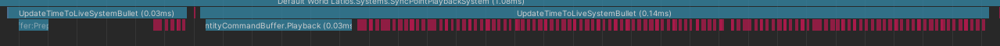

From this graphic, it appears that DestroyCommandBuffer has the clear advantage,
but only because EntityCommandBuffer generates significantly more
UnsafeUtility.Free commands. I wish there was a way to turn off this profiling,
as I suspect it is interfering with results.

The battle between EntityCommandBuffer and InstantiateCommandBuffer shows a
similar result where InstantiateCommandBuffer wins only because of
UnsafeUtility.Free commands:

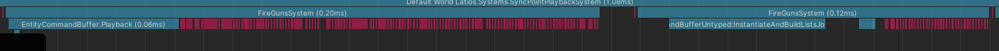

These results were consistent regardless of which command buffer played back
first, which is expected.

Allowing the simulation to run a while longer before capture revealed a little
bit of difference:

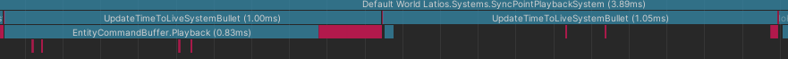

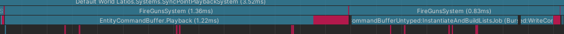

While EntityCommandBuffer and DestroyCommandBuffer trade blows,
InstantiateCommandBuffer starts to pull ahead.

In the extreme stress test of Mission 06 of Sector 02, InstantiateCommandBuffer
takes a much larger lead. However, Entities [0.17] has come quite a ways since
Entities [0.14]. This was the most extreme case:

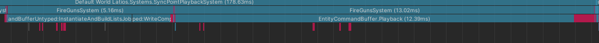

That’s a 60% decrease! Unfortunately, most frames weren’t quite that good.

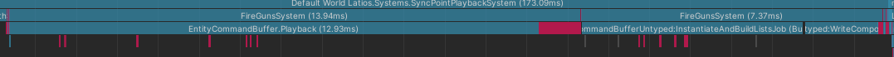

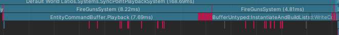

Most frames saw a 40% decrease, which is still pretty good.

DestroyCommandBuffer was a lot less consistent. Sometimes I would see it win:

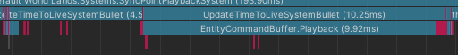

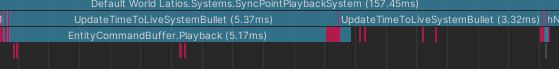

And sometimes it would lose:

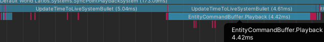

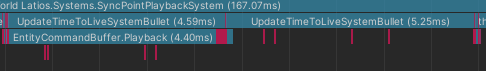

It seemed to come out ahead a little more often.

And if you are wondering what happened to EnableCommandBuffer, well here’s a
typical frame:

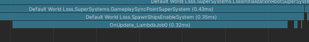

Here’s the spawn wave spike:

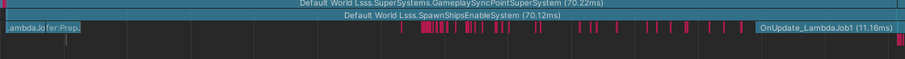

And here’s one of the follow-up frames:
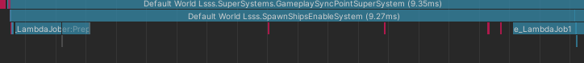

Removing the EntityCommandBuffer code, the sync point is now taking
approximately 16 milliseconds per frame, nearly half the time as before.
DestroyCommandBuffer is now the slowest of the bunch, with
InstantiateCommandBuffer outperforming it most frames.

Overall, this adventure was a success! EnableCommandBuffer and
InstantiateCommandBuffer saw noticeable and consistent performance gains. While
the gains weren’t that significant at smaller loads, they helped a lot during
spikes. The idle gap is now below 10% of the frame in most cases, which makes it
a lot more enticing to target the parallel jobs. I have a suspicion there may be
more than one Optimization Adventure in the next release!

## Try It Yourself

The performance of these command buffers has only been thoroughly compared in
LSSS. But different use cases might exhibit different behaviors. What happens
when a larger variety of prefabs comes into play? Does that throw off the
batching of InstantiateCommandBuffer? Or maybe that causes EntityCommandBuffer
to thrash cache more as it jumps between chunks? Does DestroyCommandBuffer hit a
batching sweet spot for you?

These command buffers are ready to use in your project! Try them out, and share
what kind of performance differences you notice either on GitHub or the Unity
forums. I would love to see your results!
