# Optimization Adventures: Part 6 – Collider Cast 1

Have you ever discovered an issue where some old code wasn’t meeting
requirements, so you implement some fancy state-of-the-art algorithm to replace
it, only to realize that the old code was only broken because it used some other
algorithm which was buggy? So now you have this state-of-the-art algorithm which
may or may not have been necessary, and you can’t decide if you just wasted your
time or if this new algorithm is too cool. Anyways, that just happened to me,
and this adventure is about me trying to justify the three or four weeks I spent
on this problem.

Welcome back to another one of these adventures. This time is going to be a
little different though, because we won’t be optimizing just performance. But
rather, we’ll be optimizing quality and accuracy by choosing better algorithms
for problems.

## How It Started

I was working on an adaptation of Unity’s GJK-EPA implementation to potentially
use for some new collider types. A collaborator was working on a voxel system
for an FPS and decided to use a box `ColliderCast` for a placement algorithm.
Box casting seemed like a weird choice for the use case in question, but to each
their own. What I was really concerned about was that when the `ColliderCast`
call was made, it uh…

It never came back.

That’s a problem.

So something about `ColliderCast` at the time, was that it was using a technique
called “Conservative Advancement”. Conservative Advancement works by running a
distance function between the caster and the target, then using the distance,
closest points, and cast direction to advance the caster closer by some amount
mathematically guaranteed to not intersect the target. This gets repeated until
some termination criterium is achieved.

Unity took a massive shortcut with their implementation. They terminate either
when the distance is within 0.001 or just give up after ten iterations.

This was neither accurate nor robust enough for a future Psyshock use case, so I
instead left the iterations uncapped and made the distance threshold tighter.
When the algorithm kept running and running, I thought for sure I was taking too
small of conservative steps to reach my tolerance. I would later learn my real
issue was a bug in `DistanceBetween` for two nearly touching boxes. But I was
already uncomfortable with using Conservative Advancement for `ColliderCast`,
and this issue pushed me over the edge. It was time to find a replacement.

But before I get into my journey of replacing Conservative Advancement, it is
important to understand why I disliked Conservative Advancement.

## How Good Is “Good Enough”?

The first issue with Conservative Advancement is the need to define a tolerance
in the first place. Tolerance can directly affect the performance of the
algorithm, and too strict of tolerance can lead to hundreds or thousands of
iterations. However, too lax of tolerance can cause funky things to other
algorithms and game logic. Often this leads to objects jittering uncontrollably.
It can also cause large enough errors that they oscillate uncontrollably. It is
difficult to predict what someone might use a `ColliderCast` for. And I would
like to not assume use cases, since that’s what Unity did and caused a need for
Psyshock to exist in the first place. So whatever threshold we choose, it has to
be close to the limits of the hardware.

And that’s where the second issue comes in. Floating-point errors can be
relative to the magnitude. In other words, how strict a tolerance we can
physically obtain depends on the magnitude of the numbers in question. The
limiting factors here are usually the transforms. Objects far away from the
origin will generate large floating-point errors, while objects close to the
origin might be capable of reaching tolerances less than visibly perceptible
even under a microscope.

The third issue is the convergence of the algorithm. Let’s imagine for a second
that we know some time point where the two colliders are intersecting. This time
point is past the time of impact. Let’s also assume the objects were not
intersecting at the start of the cast. Given these two constraints, we know two
time points that the time of impact must be between. We can then use a binary
search to reduce the search space by half each time. If we bisect our space
enough, we will run out of bits of precision and start getting the same values
back, which can be our termination criteria. If our search space was int values,
then we would have 32 bits-worth of possible values, and we would need 32
iterations. However, floating-point numbers are weirder. The values they
represent are not continuous. Dividing a floating-point number by two decrements
the exponent, so we would need at most 256 iterations to chew through the 8-bit
exponent, then another 23 iterations to bisect the 23 bits of the mantissa.
That’s about 280 iterations. Now that is a lot, and of course we would love to
do better. But it is worth noting that if we had to do that, we could still get
away with a few ColliderCast operations per frame.

Unfortunately, we can’t do that.

Conservate Advancement operates under the notion that we don’t know when or if
the colliders are intersecting. That means our steps could be infinitely small,
and we may never converge on a solution. Even if we relax the tolerance, we can
only hope that it prevents us from reaching a point where our algorithm churns
endlessly. There is no real way of knowing. Or maybe there is, but I’m not
familiar with it. Regardless, it is not a path I wish to explore.

Instead, ask yourself this question:

Why search for a time of impact if we can calculate it directly?

Computers are fast at running numbers through mathematical formulas. However,
they aren’t always exact. Floating-point errors still crop up. However, those
errors are caused by the limits of the hardware. But our goal is to be close to
the limits of the hardware. So as long as we don’t have some crazy biased error
propagation, a formula is almost certainly “good enough” by definition. And even
better, it accounts for the dynamic tolerances for the magnitudes of transforms
involved.

So now we have to ask this question:

Can we calculate a time of impact directly?

Well, only two collider type pairs used conservative advancement in the first
place. They were capsule vs box and box vs box. All other pairs are analytical
and make use of something called a “Minkowski Difference”.

## Minkowski Differences Are OP

Maybe you have heard of Minkowski Differences before, or its sibling Minkowski
Sums. But my guess is that most people who are reading this have not. I’m going
to do my best to explain it, but it can be a bit of a mind-bender and you may
wish to consult other parts of the internet.

Minkowski Sums fall into the category of Set Theory; however, I’ll be looking at
them from a geometric viewpoint since that’s how I prefer to reason about them.

Let’s imagine a sphere centered at the origin in local space. It contains some
point inside the sphere called P. This can be any point inside the sphere.

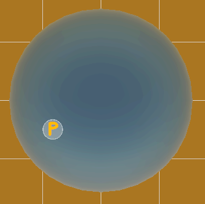

Now let’s pretend we parented this sphere to an object located at (5, 0, 0). To
get a point occupied by the sphere in world space, we simply need to take a
point P and add (5, 0, 0) to it.

Behold, this is the Minkowski Sum of our sphere and the point (5, 0, 0):

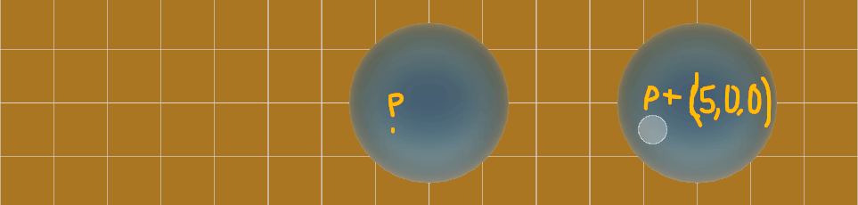

Now instead of a point (5, 0, 0), let’s instead create a line segment whose
endpoints are (0, 5, 0) and (5, 5, 0). The sphere is now allowed to “slide”
along the segment. In this case, the Minkowski Sum represents a point in space
that *could* be contained by the sphere. We represent some point along the line
segment as Q. Similar to P, Q can be any point along the line segment. Thus, to
get a point that could be contained by the sphere, we need to add P and Q
together.

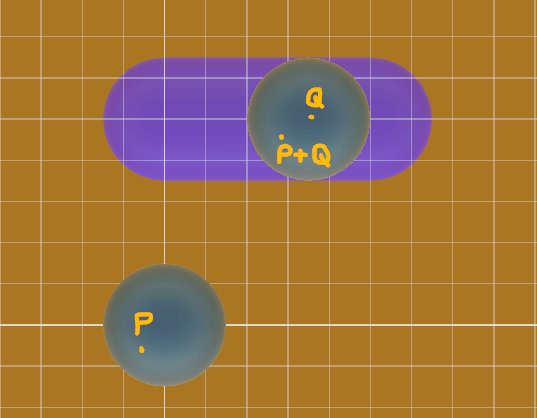

Look at that!

It’s a capsule!

In fact, both Unity Physics and Psyshock define capsules in terms of the
Minkowski Sum of a segment and a sphere centered at the origin. We could
continue this exploration into a few other shape pairs too.

-   Two spheres will generate a sphere with the sum of their centers and the sum
    of their radii.
-   A sphere and a capsule make a larger capsule.
-   A sphere and a box make a rounded box.
-   Two segments make a quad, unless they are parallel in which they become a
    longer segment.

So that’s Minkowski Sums. But what about Minkowski Differences? Well instead of
adding P + Q, we instead subtract P – Q. This is equivalent to scaling the
second object by -1 on each axis before doing the Minkowski Sum. The Minkowski
Difference still generates the same kind of shapes as the Minkowski Sum, so a
sphere and a segment will still form a capsule. But why do we care so much about
the difference instead of the sum?

Well, imagine a sphere and a box which are colliding, and we choose point P that
happens to be inside both. Then we choose Q to be the same point like so:

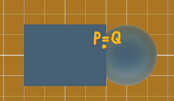

To get a point inside the Minkowski Difference, we subtract P – Q. But since P =
Q, that gives us (0, 0, 0). That’s the origin. And from this, we can derive a
whole bunch of useful mathematical rules. Here’s three which will be useful for
this adventure:

1.  If the origin is inside the Minkowski Difference, the objects are
    intersecting.
2.  If the origin is on the boundary of the Minkowski Difference, the objects
    are touching.
3.  If the origin is outside the Minkowski Difference, the objects are not
    intersecting.

The Minkowski Difference is so useful for collision detection, the resulting
geometric shape has a special name: Configuration Space Obstacle, or CSO for
short. (Some people refer to it as Configuration Space *Object.*) I believe the
name’s origins stem from robotics, but I can’t say with any certainty. What I do
know is that everyone likes using the acronym, so that’s what I will use from
here on out.

## Shape Casting Tricks

So now we have a new tool for detecting collisions. But how can we apply that to
shape casts?

Remember, a shape cast is just sliding the origin of the shape in world space
along the cast direction. This simply offsets all points contained by the shape.
Well, if an offset is applied to shape A, then the offset also gets applied
as-is to the CSO. In other words, sliding shape A slides the CSO by exactly the
same amount. If we want to know how far we have to slide A until it touches B,
then we just need to know how much we have to slide the CSO until it touches the
origin.

Here's a picture to show what I mean. The top left is the CSO and the top right
is the origin. The bottom left is A and the bottom right is B.

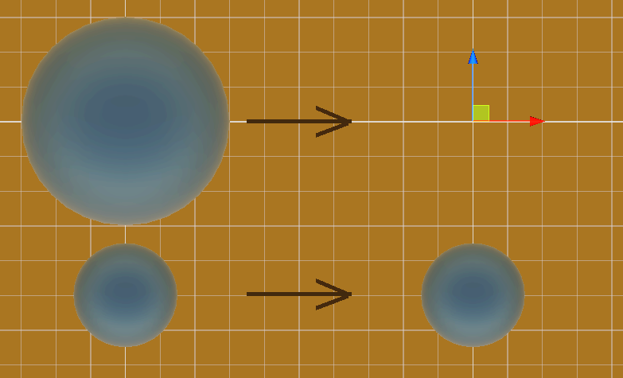

Now let’s imagine that instead of moving the CSO along the cast direction
towards the origin, we moved the origin against the cast direction towards the
CSO. The distance it needs to travel is exactly the same!

Bingo!

Huh? Don’t get why that’s so important?

It’s easy. What I just described is a raycast, a raycast from the origin against
the CSO.

Now this article is about `ColliderCast`, and not `Raycast`, so I won’t go into
detail about raycast algorithms. All you need to know is that we have formulas
for raycasting against primitive shapes, and these formulas are fast and
accurate.

From the raycast, we can get the distance we need to slide A to make them touch.
Then we can call `DistanceBetween` to get hitpoints and normals. We can also use
the distance of `DistanceBetween` to see how much error was introduced. In the
end, a `ColliderCast` can be composed of a `Raycast` plus a `DistanceBetween`.
That’s pretty fast for a `ColliderCast`! And it covers a large range of the
Psyshock spectrum:

-   Sphere vs Sphere = Raycast vs Sphere
-   Sphere vs Capsule = Raycast vs Capsule
-   Sphere vs Box = Raycast vs Rounded Box
-   Capsule vs Capsule = Raycast vs 3D-Rounded Quad (4 capsules and two
    non-rounded quads)

That just leaves Capsule vs Box and Box vs Box, the two algorithms which
previously used Conservative Advancement. So why were these two using
Conservative Advancement? Well have a look at some of their CSOs:

First is a box vs line segment. I omitted the capsule radius for now just to
show how complex these primitives are.

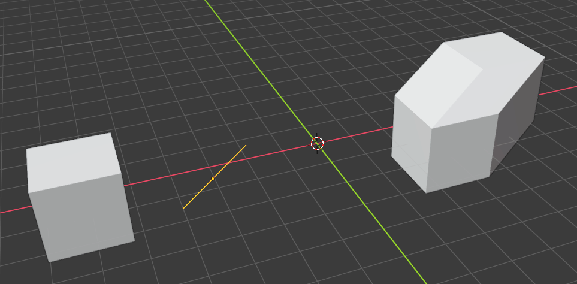

And now is box vs box. The resulting CSO is composed of 32 vertices, 66 edges,
and 36 faces. Yikes!

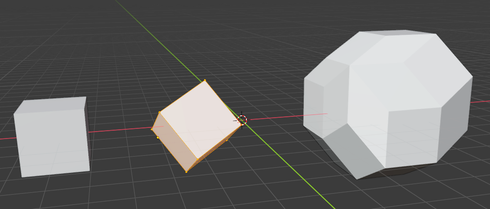

They are kinda weird looking, right? Well I had to use Blender 3.0 alpha and the
Convex Hull geometry node to generate these. It is fast for a modeling app, but
not fast for a realtime game with potentially hundreds or thousands of queries.

Anyways, calculating a box vs box CSO is not trivial, so I was going to need
something a little more clever. Fortunately, I happened to have just finished
working in a space which provided such a trick.

## Support Mapping a CSO

Psyshock uses some unique algorithms for `DistanceBetween`, primarily Capsule vs
Box and Box vs Box. These algorithms are based on the Separating Axis Theorem,
but are tweaked to account for the closest points and normals of
non-intersecting objects. Unity Physics does not do this. Instead, they use a
pair of algorithms known as GJK + EPA. That’s Gilbert-Johnson-Keerthi and
Expanding Polytope Algorithm. I won’t go into details on these algorithms now,
but the main premise behind them is that they only calculate the vertices of the
CSO, and only the ones they need.

So what does it mean to only calculate specific vertices of the CSO, and how do
we do that?

Well let’s imagine we wanted the highest point on the CSO, the point with the
largest y-value. To get it, rather than compute the entire CSO, let’s try and
find optimal values to plug into the Minkowski Difference formula. Remember, it
is any A point minus and B point. So naturally, if we take the point in A with
the largest y-value and the point in B with the smallest y-value (or largest
negative value), then there can be no other point pair that generates a y-value
on the CSO greater than these two.

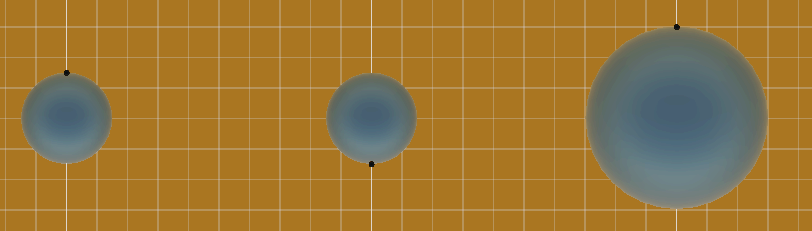

The same trick actually works for any arbitrary direction, not just up. These
are what are called *support points*. And the function which calculates them is
called a *support mapping function*. From here, an algorithm can compute
direction vectors between points and the origin or generate them from plane
normals composed by other support points. Then such an algorithm dumps these
direction vectors into the support mapping function to get more support points.

GJK and EPA perform these operations in a special order to compute the closest
point on the CSO to the origin, which can then be mapped to the results of a
`DistanceBetween` function using some additional point queries. The value of
these pair of algorithms is that they generalize to convex meshes, a collider
type I would like to support.

So anyways, GJK is designed for `DistanceBetween`. Unfortunately, it doesn’t
work for `ColliderCast`. There is a GJK-Raycast algorithm detailed in
white-papers, but I haven’t been able to wrap my head around it yet, and I’m not
even sure it bypasses the tolerance problem of Conservative Advancement. But as
I was searching through old forums on the subject, I eventually encountered this
article:

[Thoughts on shape
casting](http://tuxedolabs.blogspot.com/2010/03/thoughts-on-shape-casting.html)

This was exactly what I was looking for.

## Minkowski Portal Refinement

GJK and EPA aren’t the only algorithms which use support mapping. Minkowski
Portal Refinement (MPR) is another one. It is often overlooked as the “poor
man’s GJK” because it does not converge as quickly and the common implementation
can only report whether or not there is an intersection. But the benefits are
that it is more intuitive and easier to optimize for hardware. However, as the
linked article points out, this algorithm hides a little secret that makes it
perfect for `ColliderCast`. But to understand this secret, we need to walk
through the algorithm.

We first identify some point to be inside the CSO. This is typically created
from the centers of the two colliders. Then, we create a ray from this point
towards the origin. After that, we find three support points which form a
triangle that the ray passes through. This is often iterative. This triangle is
called the *portal*. From there, we iteratively identify new support points
using the portal’s normal as the search direction. Each new support point
replaces one of the portal points such that the ray’s intersection with the
portal happens further along the ray. The algorithm stops when the intersection
point passes the origin, in which an intersection is reported. If there is no
intersection, the portal will eventually become the surface of the CSO and no
new support will be derivable.

So that’s the algorithm. There’s a [good graphic in
2D](http://xenocollide.snethen.com/mpr2d.html) that is concise and provides a
strong visual of what is happening. The concepts translate well to 3D with a
couple of exceptions which I will mention later.

Did you catch the secret? The key word here is *ray*. If you ignore the early
out of when the portal passes the origin, this algorithm eventually identifies a
triangle on the CSO where the ray passes through. This is a raycast algorithm!
It is inside out, and returns the last hit instead of the first, but we can work
with that.

So normally, we raycast against the CSO in the opposite direction of the cast.
But this time, we need our MPR ray to be in the same direction as the cast, and
then figure out how to relate that inside-out cast to the normal raycast.
There’s a couple of ways to do this. Unfortunately, the one the article proposed
is not one of them, and breaks with shapes that look like this:

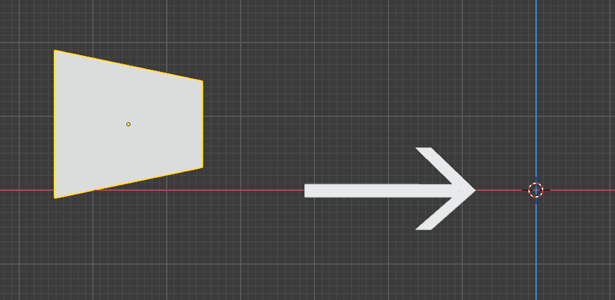

Fortunately, I knew what I needed to do at this point, so it was full-speed
ahead.

One way to solve this would be to identify some start point behind the CSO where
the ray along the cast direction would intersect the origin. Once the triangle
is identified, then a ray from the origin to the triangle can determine the hit
distance.

The other way involves sliding the CSO past the origin. Then the ray is cast
from the origin in the cast direction. The hit distance from this ray tells us
how much we slid too far by. This is similar to the approach in the article,
except instead of using the geometric center, one would use the support point in
the negative cast direction to ensure the entire CSO is beyond the origin. This
is the approach I used. It has two advantages. The first is that moving the CSO
closer to the origin increases floating point precision. The second is that MPR
often forms planes between two support points and the ray start position. With
the ray start position being the origin, the plane distance to the origin is
always zero so I don’t have to calculate it. It’s a nice little optimization.

Now allow me to exercise my innate future-prediction abilities. Some of you
might be concerned that now our MPR ray starts outside the CSO from behind it.
Doesn’t that break MPR?

Not at all actually. All that matters is that we find a portal that the ray
passes through. That’s easier said than done though, because unlike the
traditional usage of MPR, it might actually be impossible this time. Actually,
it will be impossible, if it misses.

So how do we know if the ray hits or not? Isn’t that part of raycasting? It
seems like circular reasoning. However, we don’t need all the raycast data this
time. All we need to know is if the ray hits, not when or where. In fact, we
don’t even care that it is a ray, the infinite line along the ray will do just
fine. That means we now have a CSO vs infinite line test. It looks like this:

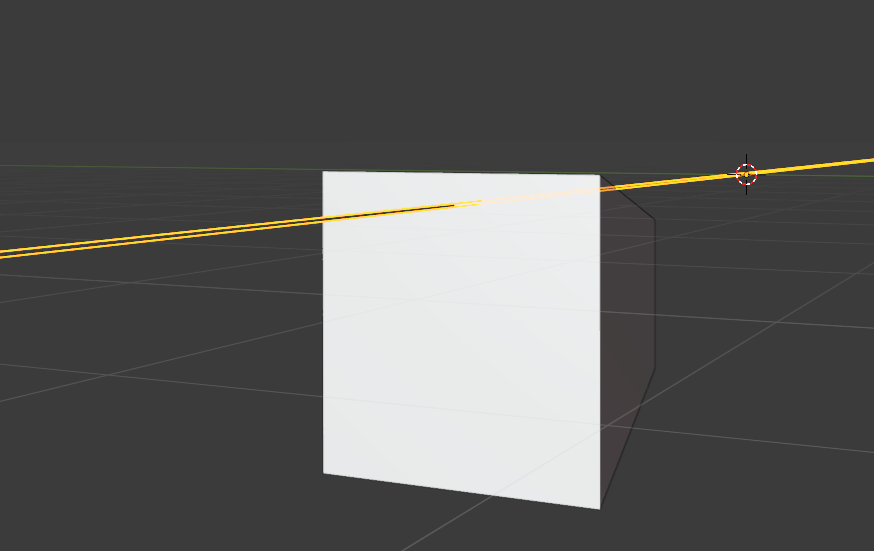

In this case, there is an intersection. But we only know that because we can see
the whole CSO. We could try to use a Minkowski Difference of the ray and the CSO
and run GJK or MPR on that, but there’s another trick which is a little cleaner.
If we take our camera, and point it such that its local z is parallel to the
ray, and use an orthographic view, we get this:

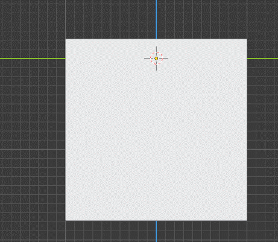

Suddenly, our yellow infinite line has become a point at the origin (red and
white cursor with crosshairs). Now this looks like a 2D flattened CSO vs the
origin. And indeed we can treat it as such for this use case. We now have two
options, we can either use a 2D GJK, or we can use a 2D MPR used in the
traditional way. I chose the latter, because it provides another useful feature.
It can identify a starting 3D portal.

One of the biggest differences between 2D MPR and 3D MPR is that in 3D, the ray
can miss the initial guess at the portal, and so it then needs to run an
iterative search step after the initial guess. In 2D, the ray never misses the
initial guess. What is more, the 2D ray start and the two portal points in 2D
form a triangle surrounding the 3D ray. If these three points are support points
in 3D as well, then this is a real portal in 3D. The 2D portal points can easily
be mapped to 3D support points, and the initial 2D start point could also be
mapped to a 3D support point derived from the cast direction. This effectively
means I get the initial 3D portal for free, since I needed to find the 2D portal
points anyways. I still have the 3D portal search iteration code in the final
algorithm for sanity, but it always exits on the first iteration.

## MPR Implementation Adventures

So now that I had all the pieces I needed to solve ColliderCast for Box vs Box
(and potentially new collider types in the future), I just needed to implement
it and hope there weren’t any surprise issues.

There were a lot of surprise issues.

One issue was that it was possible to encounter degenerate cases where two
support points kept trading places in the portal. I had to add some ping-pong
detection logic to handle it. It turns out a lot of strange things happen when
the casted collider just scratches by the target and the ray becomes parallel
with the face of the CSO.

But probably the most confusing part of the implementation is that unlike the 2D
case, the ray from the origin to a new support point might not be inside the
portal. At first, I thought that was a bug, but in fact those support points
were correct and did push the portal out further. Trying to figure out what
point to replace while avoiding degenerate cases was tricky, especially since I
wanted to do things using `simdFloat3`. But I will spare you the details of that
for another adventure if I ever revisit and optimize this algorithm more. All
that matters now is that I got something to work. And then that’s when I
discovered something that nearly crushed my spirit.

There was bug in `DistanceBetween` for box vs box.

It was a nasty bug.

It took me quite a while to debug. The issue was that for very close boxes, the
separating axis test for edge pairs might have been slightly preferred over the
point-face pairs, but the actual closest points would be much farther apart
since the edges were skew. Since MPR and the original Conservative Advancement
algorithm were placing the boxes close to each other, this bug happened a lot.
In the case of Conservative Advancement, it was likely the real cause of the
freezes. In the case of MPR, it was falsely triggering my sanity check to debug
MPR. I suddenly went from using `DistanceBetween` to debug MPR, to using MPR to
debug `DistanceBetween`.

But I triumphed. The bugs were eradicated with fire. And now instead of
tolerance-based time of impact, I had an exact time of impact.

So allow me to walk through the box vs box `ColliderCast` algorithm one last
time, as there’s a couple of remaining optimization details I haven’t discussed.

`ColliderCast`s in diagonal directions tend to generate large AABBs with many
false positives, so it can be useful to do some simpler checks and early out.
For the first of these checks, I compute the extents of the CSO along the cast
direction, both forward and backwards. I then add these extents to the end of
the cast ray and see if the origin is contained in their span. If not, then the
cast doesn’t reach or is going in the wrong direction, so I return early.

For the second test, I compute the CSO’s AABB. That might sound complicated, but
it is actually fairly cheap and I already had it implemented for EPA. I then
check if the origin is inside this AABB. If not, I raycast from the origin and
see if it hits the AABB. If it doesn’t, then I know that the casted collider
moves past the other without hitting it, so I return early here too.

The third test is the 2D MPR. By this point, it is highly likely that there will
be a hit, so this test just confirms it and sets up the 3D MPR. It is after this
point that I slide the CSO by sliding the caster.

Finally, 3D MPR executes. The result of this will be a distance. I still have to
check if this distance is within the range of the cast, so the algorithm could
still report a miss. But that’s it.

Next up is box vs capsule.

## Some Thoughts About Round Things

I have a confession. In the twenty-some years of my life, I haven’t actually met
a female of my kind (nor any female that seems to like what I do in the world of
Unity DOTS for that matter). But I imagine that wherever they congregate, there
is always one who uses a human projection with especially round “features”.

She and I would **NOT** get along!

My point here is that as appealing as round things might be, they are going to
cause us a lot of trouble. Let’s break it down.

The first issue is how MPR terminates. What happens is that in each iteration it
finds a new support point. Each support point has a unique ID associated with
it, which is represented as an integer. If the support point’s ID matches one of
the portal’s existing IDs, then the portal is known to be the boundary. This
assumes there are a limited number of possible support points. And indeed, for
boxes, there are. Each box has 8 vertices, which means there may be up to 64
support points possible. But really there are only as many support points as
there are vertices on the CSO.

But how many vertices are there on a sphere?

Yeah. That’s the problem.

Some implementations of GJK and MPR use a tolerance criterion of convergence to
get around this. But once again, we want to avoid this. If we used a tolerance,
we would no longer have an exact time of impact and our number of iterations
could balloon out of control. While MPR is an iterative algorithm like
Conservative Advancement, for boxes it had a much more finite number of
iterations as we were searching for a triangle on a CSO rather than a
floating-point distance. Anyways, Unity didn’t like the iteration issue either,
and they came up with a clever solution for their GJK implementation.

Here's a little experiment:

First, draw a capsule. Make sure to draw out the internal segment.

Next, pick some point P on the outside of the capsule.

Draw a line from that point to the closest point C on the internal segment. Call
this line CP.

Where CP intersects the capsule, draw a tangent line to the capsule, which we
will call T.

Now assuming you did it right, CP and T are perpendicular to each other.

So why is that relevant? Well, that means that CP is the normal of the capsule
at the intersection point. And consequently, the distance from that intersection
point to the segment point is exactly the radius of the capsule. All GJK has to
do is get the distance between the segment and the box, and then subtract off
the radius.

This property is actually really powerful, because it means that even if two
colliders are intersecting, the actual parts used in the GJK algorithm might not
be intersecting. Unity can then avoid running EPA for these situations while
still detecting and resolving collisions. This is why boxes and other convex
colliders have a small radius around them. EPA can be pretty expensive (Unity’s
implementation is over 2000 lines of C\# spread across two files).

Unfortunately, we don’t care about the closest points. We care about the
intersection point along some query ray. Have a look at this scenario:

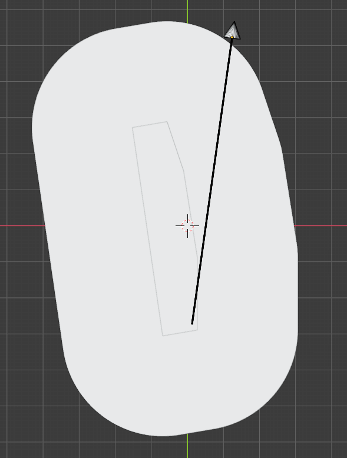

The inner shape is the CSO between the capsule segment and the other convex
collider. The outer shape is the CSO between the full capsule and the same other
convex collider. You’ll notice that where the ray leaves the full CSO has no
correlation whatsoever to where it leaves the inner CSO. If we want there to be
a correlation, then we have to inflate the support points along the edges like
this:

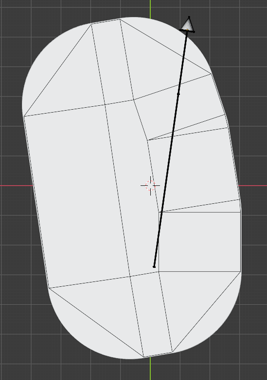

With this, we can map an intersection of an outer edge to either an inner edge
or an inner vertex, and then raycast against a circle or capsule appropriately.
The same concept extends to 3D.

So the difficulty with this method is that we need to extrude along the normals
of the CSO faces by the radius. But we don’t really know what the CSO is. That
won’t stop us though, because we can reason about this. We know that the CSO
will always at least contain the box placed at each end of the capsule segment.
There are six box faces, and each face has four vertices, so 2 \* 6 \* 4 = 48
support points with normals matching the box. Then, each edge of the box when
slid along the capsule segment will form a face composed of 4 vertices, with a
normal being the cross product of the two. That makes for another 12 \* 4 = 48
vertices for a grand total of 96 support points. Now not all of them are real
support points, but calculating the convex hull is really expensive. The false
positives would be ignored by the support mapping function which just looks for
the point with the largest dot product with the search direction, and the inner
points will never be that.

I actually started going down this path, but frequently paused. I didn’t like
it. This was way more complicated than the box vs box case, despite capsules
usually being the cheaper collider type. In addition, capsules typically
represent characters that want to use `ColliderCast` for collision detection.
Boxes are common in the environment. This is a common use case, and it is the
most expensive `ColliderCast` algorithm yet. Yuck.

But the worst part of all of it is the memory. Just storing the support points
in float3 format requires over a kilobyte of memory. That’s before we count any
IDs and mapping to the inner CSO. We might be able to get away with a
`stackalloc`, but that just wasn’t going to scale with other convex colliders.
And it would get completely out of hand for other rounded shapes more complex
with capsules, like rounded boxes.

I decided to look for another solution, something that wasn’t MPR.

## GDC FTW

I recalled having watched a GDC presentation about capsule continuous collision
detection against a triangle mesh world. My thought was that a box could be made
up of triangles, and perhaps triangulating the box in memory would be less
expensive. After all, this is how Unity Physics treats box colliders.

[This is the
video](https://youtu.be/6BIfqfC1i7U?list=PL2e4mYbwSTbaw1l65rE0Gv6_B9ctOzYyW&t=2673),
timestamped to when they evaluate a capsule against a single triangle. The
general idea is to break up the capsule and triangle into individual features,
and then test those feature pairs. Incidentally, the types of features of the
triangle also happen to be the same types of features of a box, so we might be
able to skip the triangulation. This seems promising. These are the feature pair
tests we need, as well as the algorithms that might already work for them:

-   Vertex vs Sphere – raycast against sphere
-   Edge vs Sphere – raycast against capsule
-   Vertex vs Cylinder – raycast vs cylinder, which I wrote before in a
    prototype
-   Edge vs Cylinder – ???
-   Face vs Sphere – raycast vs rounded quad
-   Face vs Cylinder – ???

Now up until this point, I have never heard of an algorithm that could report a
time-of-impact of an edge casted against a cylinder, or vice versa. But as I was
thinking through it, I realized that it didn’t matter if it was an edge vs
cylinder or an edge vs capsule. And that’s when it hit me like a sight.

An edge is just a capsule with zero radius!

So this is a capsule vs capsule. We have that algorithm! In fact, it actually
covers several of the other feature pairs. Edges include their vertices, and
since we are testing the entire capsule, we don’t have to break out the spheres
either. Our feature pairs now become this:

-   Edge vs Capsule – 12x capsule vs capsule = raycast vs rounded quad
-   Face vs Sphere – raycast vs rounded quad
-   Face vs Cylinder – ???

I actually have a little trick for the face vs sphere case which I borrowed from
the sphere vs box. We can actually just raycast anAABB expanded on all sides by
the radius, and then ignore hits that are too close to an edge.

That just leaves the face vs cylinder.

Wait, how does that even happen?

No seriously. On an infinite plane, the cylinder part of the capsule can’t hit
the plane before the end spheres. It can only tie. And if the spheres both miss,
but the cylinder still hits, then the cylinder must stretch across two edges in
order for the spheres to miss. That’s already covered by the edge vs capsule
case.

Since we only care about time of impact, we don’t need face vs cylinder. We have
all the tests we need. We’re done.

What I like so much about this technique is how well it generalizes. We only
need two kinds of tests, spheres vs faces, and capsules vs capsules. What’s
more, any convex rounded object can be decomposed into faces and capsules, and
so the same types of tests can be used. Now that might seem really expensive to
test every vertex-mapped sphere against every face and every capsule-mapped edge
against every edge, but unlike in a CSO, we know the shapes and sizes of these
features up front. They are small compared to the full collider. That means we
can make use of some bounding box culling and remove most of the tests. Perhaps
I may even implement my own *EXTREME SIMD* algorithm.

But for now, I once again have an exact time-of-impact algorithm. As far as I am
concerned, Conservative Advancement doesn’t exist.

There’s just one problem.

This is an *Optimization Adventure*, and it would be wrong to not have some kind
of benchmark. But I really did not want to benchmark against the old
Conservative Advancement algorithm. I made up tolerance values there, and it
just didn’t seem valuable.

If these new algorithms can’t battle old ones, there’s only one other meaningful
competitor.

Unity Physics.

## The Showdown

It is not often I write code using Unity Physics. As good as it is at what it
does, the things it does are rarely what I need it to do. And sometimes, it just
does things really weird.

Why are the query algorithms in local-space to the target?

Seriously, they don’t have overloads for specifying the world-space transform
for the target. I guess that can be nice for some sparse optimizations. But
really, it is a bug-prone decision. It takes a level of ignorance to think
Psyshock requires the target in local-space when the function requires a
transform. But I wouldn’t blame you for accidentally thinking Unity Physics did
its operation in world-space when it didn’t ask you for a transform. The absence
isn’t as obvious.

Anyways, to try and keep things relatively fair, I simplified the randomness of
the test compared to what I would normally do with Psyshock benchmarks. There
are only three colliders, the default primitives of sphere, capsule, and box.
The target is always placed with the identity transform. The caster’s transform
and cast vector is randomized in a 10x10x10 space. The Unity Physics box has a
bevel radius of zero. Result accuracy was measured by moving the collider by the
cast result distance and using both Psyshock’s `DistanceBetween` and Unity
Physics’ `CalculateDistance`. However, in all but the box vs box case, the
results between these two were nearly identical, so with the exception of that
case, only one result will be displayed. Each pair was queried with 10,000
`ColliderCast` operations, but only hits were recorded for errors. Each query
resulted in one to four hits only reported by Unity Physics, while the minimum
number of hits was over 800.

So without further ado, here’s the results:

|                                | Psyshock Min Error | Psyshock Mean Error | Psyshock Max Error | Unity Physics Min Error | Unity Physics Mean Error | Unity Physics Max Error | Psyshock Time (ms) | Unity Physics Time (ms) |
|--------------------------------|--------------------|---------------------|--------------------|-------------------------|--------------------------|-------------------------|--------------------|-------------------------|
| Sphere vs Sphere               | 0                  | 3.0e-6              | 2.1e-5             | 9.9e-5                  | 2.6e-4                   | 1.0e-3                  | 1.4                | 1.5                     |
| Sphere vs Capsule              | 0                  | 2.7e-6              | 2.7e-5             | 1.0e-4                  | 2.5e-4                   | 1.0e-3                  | 1.8                | 1.6                     |
| Sphere vs Box                  | 0                  | 3.0e-6              | 4.4e-5             | 9.9e-5                  | 2.2e-4                   | 9.9e-4                  | 1.7                | 1.6                     |
| Capsule vs Sphere              | 0                  | 2.7e-6              | 3.0e-5             | 9.9e-5                  | 2.6e-4                   | 1.0e-3                  | 1.9                | 1.8                     |
| Capsule vs Capsule             | 0                  | 2.5e-6              | 1.9e-5             | 9.9e-5                  | 2.4e-4                   | 1.0e-3                  | 2.7                | 2.0                     |
| Capsule vs Box                 | 0                  | 2.6e-6              | 4.5e-5             | 9.9e-5                  | 1.9e-4                   | 1.0e-3                  | 23.4               | 8.4                     |
| Box vs Sphere                  | 0                  | 3.2e-6              | 4.0e-5             | 9.8e-5                  | 2.1e-4                   | 9.9e-4                  | 1.7                | 1.8                     |
| Box vs Capsule                 | 0                  | 3.0e-6              | 4.3e-5             | 9.9e-5                  | 1.9e-4                   | 9.9e-4                  | 23.9               | 8.8                     |
| Box vs Box                     | 0                  | 6.8e-6              | 4.9e-6             | 6.3e-5                  | 1.1e-4                   | 9.7e-4                  | 6.9                | 13.8                    |
| Box vs Box (CalculateDistance) | 0                  | 9.7e-6              | 3.8e-5             | 9.9e-5                  | 1.1e-4                   | 9.7e-4                  |                    |                         |

Alright. There’s a lot of crazy in these results! Let’s unpack them, starting
with performance.

Remember, the algorithm Unity Physics uses is completely different from
Psyshock. Yet in spite of this, it seems any query involving a sphere was nearly
identical between the two implementations.

As for capsule vs capsule and capsule vs box, Unity executes faster. One thing
that these two have in common is that Psyshock raycasts a rounded quad. For
capsule vs box, this happens twelve times. I suspect something in that algorithm
is especially slow.

Box vs Box is definitely interesting. I’m not sure what aspect of it makes
Psyshock fast, but it is fast! My guess is that the aggressive culling steps
play a role.

Now let’s talk about accuracy as that was the primary goal. In every single
case, the maximum error of Psyshock is less than the minimum error of Unity
Physics.

Let that sink in for a moment. In most cases, we have the same performance, but
with one or two orders of magnitude better accuracy!

In some cases, we reach perfect accuracy. Although on average we seem to be off
by a couple of micrometers, assuming one Unity unit is one meter. MPR seems to
be especially accurate in the worst case, though I cannot explain why that is.

So what the heck is going on with Unity Physics? And why are its box vs box
distances different?

Well, it all has to do with one algorithm, EPA. As I mentioned before, EPA
involves a lot of code and is relatively slow. It also operates in a
bit-compressed integer space, and so the results it generates tend to introduce
more error than the other distance algorithms. Therefore, Unity tries to avoid
it when performing `ColliderCast`s by forcing the result to be between 1 mm and
0.1 mm. Anything below that causes EPA to run in `CalculateDistance`. For most
of the collider types, this isn’t an issue because the objects have a round
radius. But for box vs box, this radius is gone, and because Psyshock has high
accuracy, EPA runs on every hit.

This is where the Psyshock `DistanceBetween` algorithm for box vs box shines.
Because it uses SAT instead of EPA, it does not benefit from the bevel radius
hacks Unity Physics uses, and so Psyshock boxes can keep their sharp corners.

But probably the most telling aspect of this EPA behavior is box vs box using
Unity Physics. For the mean and max values, Psyshock and Unity Physics are in
agreement about the error. However, there’s a case where Unity Physics brings
the box slightly past that 0.1 mm threshold and the results diverge. This makes
me suspect there may be a bug in Unity Physics causing EPA to still run
sometimes, as there shouldn’t be any difference in the arguments between the
last step of Unity’s Conservate Advancement `CalculateDistance` and the
arguments I provide to `CalculateDistance` after the fact. I use the exact same
logic for moving the caster and the target is in the same coordinate space at
all times. Glad to know I’m not the only one who runs into weird issues like
this.

But enough speculating.

In the end, we achieved a fast and accurate box vs box algorithm, which is an
improvement in every regard. We also optimized the accuracy of capsule vs box,
but currently there still appears to be more optimization opportunities.
Normally I would dive in and investigate it right away, but honestly, I think I
need a break from all this 3D spatial query code. Bugs are usually considered a
weakness of mine. There were a lot of them, and I need rest.

Maybe I’ll explore some compute shader optimizations. Stay tuned!

## Try It Yourself!

If you would like to run the benchmark for yourself, there are a few things you
need to do.

First, create an empty project and add the DOTS packages including Unity
Physics. Also install the Latios Framework version 0.4.1 or higher.

Next, create a Latios Bootstrap using the Injection Workflow.

After that, create a C\# file called ColliderCastBenchmark.cs and add this code
to it:

```csharp
using System;
using System.Diagnostics;
using Latios;
using Latios.Psyshock;
using Unity.Collections;
using Unity.Entities;
using Unity.Mathematics;

[GenerateAuthoringComponent]
public struct ColliderCastBenchmark : IComponentData
{
    public Entity sphere;
    public Entity capsule;
    public Entity box;
    public Entity boxUnity;
}

class BenchmarkSystem : SubSystem
{
    const int   kCount = 10000;
    const float kScale = 10f;

    protected override void OnUpdate()
    {
        ColliderCastBenchmark benchmark = default;
        Entities.WithoutBurst().ForEach((in ColliderCastBenchmark ccb) =>
        {
            benchmark = ccb;
            Enabled   = false;
        }).Run();

        if (Enabled)
            return;

        RunBenchmark(benchmark.sphere,  benchmark.sphere,  "sphere ", "sphere ");
        RunBenchmark(benchmark.sphere,  benchmark.capsule, "sphere ", "capsule");
        RunBenchmark(benchmark.sphere,  benchmark.box,     "sphere ", "box    ", default,            benchmark.boxUnity);
        RunBenchmark(benchmark.capsule, benchmark.sphere,  "capsule", "sphere ");
        RunBenchmark(benchmark.capsule, benchmark.capsule, "capsule", "capsule");
        RunBenchmark(benchmark.capsule, benchmark.box,     "capsule", "box    ", default,            benchmark.boxUnity);
        RunBenchmark(benchmark.box,     benchmark.sphere,  "box    ", "sphere ", benchmark.boxUnity);
        RunBenchmark(benchmark.box,     benchmark.capsule, "box    ", "capsule", benchmark.boxUnity);
        RunBenchmark(benchmark.box,     benchmark.box,     "box    ", "box    ", benchmark.boxUnity, benchmark.boxUnity);
    }

    Stopwatch m_stopwatch = new Stopwatch();

    unsafe void RunBenchmark(Entity a, Entity b, string aName, string bName, Entity aUnityHack = default, Entity bUnityHack = default)
    {
        var psyA = GetComponent<Collider>(a);
        var uniA = GetComponent<Unity.Physics.PhysicsCollider>(aUnityHack == default ? a : aUnityHack);
        var psyB = GetComponent<Collider>(b);
        var uniB = GetComponent<Unity.Physics.PhysicsCollider>(bUnityHack == default ? b : bUnityHack);

        var aabbB = Physics.AabbFrom(psyB, RigidTransform.identity);

        var random = new Rng("ColliderCastBenchmark").GetSequence(0);

        var starts = new NativeArray<RigidTransform>(kCount, Allocator.TempJob);
        var ends   = new NativeArray<float3>(kCount, Allocator.TempJob);

        Job.WithCode(() =>
        {
            for (int i = 0; i < starts.Length; i++)
            {
                RigidTransform tfStart = default;
                RigidTransform tfEnd   = default;
                for (int j = 0; j < 100; j++)
                {
                    tfStart       = new RigidTransform(random.NextQuaternionRotation(), random.NextFloat3(-kScale, kScale));
                    tfEnd         = new RigidTransform(tfStart.rot, random.NextFloat3(-kScale, kScale));
                    var aabbStart = Physics.AabbFrom(psyA, tfStart);
                    var aabbEnd   = Physics.AabbFrom(psyA, tfEnd);
                    var aabbA     = Physics.CombineAabb(aabbStart, aabbEnd);
                    if (Physics.DistanceBetween(psyA, tfStart, psyB, RigidTransform.identity, 0f, out _))
                    {
                        j--;
                        continue;
                    }

                    if (!math.any(aabbA.max < aabbB.min | aabbB.max < aabbA.min))
                        break;
                }

                starts[i] = tfStart;
                ends[i]   = tfEnd.pos;
            }
        }).Run();

        var psyHits    = new NativeArray<bool>(kCount, Allocator.TempJob);
        var psyResults = new NativeArray<ColliderCastResult>(kCount, Allocator.TempJob);

        m_stopwatch.Restart();
        Job.WithCode(() =>
        {
            for (int i = 0; i < psyHits.Length; i++)
            {
                psyHits[i]    = Physics.ColliderCast(psyA, starts[i], ends[i], psyB, RigidTransform.identity, out var res);
                psyResults[i] = res;
            }
        }).Run();
        m_stopwatch.Stop();
        var psyTimeMS = m_stopwatch.Elapsed.Ticks / 10000.0;

        var uniHits    = new NativeArray<bool>(kCount, Allocator.TempJob);
        var uniResults = new NativeArray<Unity.Physics.ColliderCastHit>(kCount, Allocator.TempJob);

        m_stopwatch.Restart();
        Job.WithCode(() =>
        {
            for (int i = 0; i < uniHits.Length; i++)
            {
                var input = new Unity.Physics.ColliderCastInput
                {
                    Collider    = uniA.ColliderPtr,
                    Start       = starts[i].pos,
                    Orientation = starts[i].rot,
                    End         = ends[i]
                };
                uniHits[i]    = uniB.ColliderPtr->CastCollider(input, out var res);
                uniResults[i] = res;
            }
        }).Run();
        m_stopwatch.Stop();
        var uniTimeMS = m_stopwatch.Elapsed.Ticks / 10000.0;

        float3 psyMins  = float.MaxValue;
        float3 psyMeans = 0f;
        float3 psyMaxs  = float.MinValue;

        float3 uniMins  = psyMins;
        float3 uniMeans = 0f;
        float3 uniMaxs  = psyMaxs;

        int psyHitOnly = 0;
        int uniHitOnly = 0;
        int hits       = 0;

        Job.WithCode(() =>
        {
            for (int i = 0; i < psyHits.Length; i++)
            {
                if (psyHits[i] != uniHits[i])
                {
                    if (psyHits[i])
                        psyHitOnly++;
                    else
                        uniHitOnly++;
                    continue;
                }
                else if (psyHits[i] == false)
                    continue;

                hits++;

                //PsyCast
                var psyHitTransform = new RigidTransform(starts[i].rot, math.lerp(starts[i].pos, ends[i], psyResults[i].distance / math.distance(starts[i].pos, ends[i])));
                Physics.DistanceBetween(psyA, psyHitTransform, psyB, RigidTransform.identity, float.MaxValue, out var psyDistancePsyCast);
                var distanceInput = new Unity.Physics.ColliderDistanceInput
                {
                    Collider    = uniA.ColliderPtr,
                    Transform   = psyHitTransform,
                    MaxDistance = float.MaxValue
                };
                uniB.ColliderPtr->CalculateDistance(distanceInput, out var uniDistancePsyCast);

                float3 newPsyDists = new float3(psyDistancePsyCast.distance, math.distance(psyDistancePsyCast.hitpointA,
                                                                                           psyDistancePsyCast.hitpointB), uniDistancePsyCast.Distance);
                newPsyDists  = math.abs(newPsyDists);
                psyMins      = math.min(psyMins, newPsyDists);
                psyMeans    += newPsyDists;
                psyMaxs      = math.max(psyMaxs, newPsyDists);

                //UniCast
                var uniHitTransform = new RigidTransform(starts[i].rot, math.lerp(starts[i].pos, ends[i], uniResults[i].Fraction));
                Physics.DistanceBetween(psyA, uniHitTransform, psyB, RigidTransform.identity, float.MaxValue, out var psyDistanceUniCast);
                distanceInput = new Unity.Physics.ColliderDistanceInput
                {
                    Collider    = uniA.ColliderPtr,
                    Transform   = uniHitTransform,
                    MaxDistance = float.MaxValue
                };
                uniB.ColliderPtr->CalculateDistance(distanceInput, out var uniDistanceUniCast);

                float3 newUniDists = new float3(psyDistanceUniCast.distance, math.distance(psyDistanceUniCast.hitpointA,
                                                                                           psyDistanceUniCast.hitpointB), uniDistanceUniCast.Distance);
                newUniDists  = math.abs(newUniDists);
                uniMins      = math.min(uniMins, newUniDists);
                uniMeans    += newUniDists;
                uniMaxs      = math.max(uniMaxs, newUniDists);
            }

            psyMeans /= hits;
            uniMeans /= hits;
        }).Run();

        UnityEngine.Debug.Log(
            $"{aName} vs {bName}: psyTimeMS: {psyTimeMS}, uniTimeMS: {uniTimeMS}, psyMins: {psyMins}, psyMeans: {psyMeans}, psyMaxs: {psyMaxs}, uniMins: {uniMins}, uniMeans: {uniMeans}, uniMaxs: {uniMaxs}, hits: {hits}, psyHitOnly: {psyHitOnly}, uniHitOnly: {uniHitOnly}");

        starts.Dispose();
        ends.Dispose();
        psyHits.Dispose();
        psyResults.Dispose();
        uniHits.Dispose();
        uniResults.Dispose();
    }
}
```

You may need to enable unsafe code in the player settings to get the code to
compile.

Finally, set up the scene. You will need one GameObject with ConvertToEntity and
a ColliderCastBenchmark component attached to it. You’ll also need four prefabs.
The default sphere, capsule, and cube GameObject types work well for the first
three. Just create them in your scene and then drag them into your project
folder.

However, for the “Box Unity” prefab, you will need to copy the cube prefab,
remove the Box Collider component, and add a Physics Shape component. Set the
Bevel Radius to 0.

Once all that is complete, you should be able to press play and see what
happens. Don’t forget to disable safety checks, leak detection, and the jobs
debugger for more accurate results.
