# Optimization Adventures: Part 7 – Frustum Culling 1

In trying to start writing this, I have spent a lot of idle time asking myself
how much do people already know. Like do people know what I am talking about
when I reference “bones”, “skeletons”, “skinning”, or “bindposes”? Do people
know what a “bone-relative coordinate space” is or how matrices can convert a
position between coordinate spaces? Well, I don’t want to waste people’s time,
so if you don’t know these things, ask me on the forums so I can learn how
out-of-touch I am.

Welcome to the seventh installment of Optimization Adventures. This comes with
following the debut of Kinemation, and so that’s what I am going to talk about.
Originally, I was going to talk about the new custom compute skinning method,
and how it is way faster than the Hybrid Renderer’s compute skinning method. But
then I compared it to vertex skinning via the Linear Blend Skinning node, and
the topic got a lot less interesting. It is still faster… sometimes.

So rather than talk about something highly content-dependent, I want to talk
about a technique I came up with and haven’t seen anywhere else. And I want to
talk about how I made it really fast using lots of Unity-ECS tricks and
exploits. In past adventures, I usually focused on a specific algorithm or
routine. This time, we’re zooming out and looking at big pictures and lots of
complexity.

Strap in, because there’s a lot of sky to cover!

## What is the Hybrid Renderer Doing?

Let me make a couple things clear in this article. I’m not looking to build an
animation system for massive battle simulations. While Kinemation is fast enough
to break into that territory, usually animation textures or compute shaders are
better suited for that task. I’m also not looking to build something that is
mobile-friendly. It might run well on mobile, but that’s not the focus. And
lastly, my animations aren’t simple. If you just need simple humanoid animations
with blending and IK and 4 bone-weights, then what I did in Kinemation is
probably overkill for you (complexity-wise, not performance-wise, so there’s no
downside).

My use case is hundreds of creatures with crazy squash-and-stretch abilities
such as springs for limbs or long shudder-inducing tongues. These roams freely
in a large open-world. Many games of this nature despawn animated characters
when they are too far away. But due to performance constraints, “too far away”
is not very far, resulting in “popping”. I’ve been playing a game like that
recently. And while the gameplay is great, I can’t imagine shipping something
with such immersion-breaking popping artifacts.

As an initial investigation into this space, I wrote a little experiment using
the Hybrid Renderer’s skinned mesh rendering mechanisms to see if it held up.
Spoiler, it didn’t. But before I explain why, I should probably explain how the
Hybrid Renderer works, since most of you probably haven’t dug through the code
as much as I had to.

### Hybrid Renderer Static Pipeline

The Hybrid Renderer is broken up into 5 stages in order:

1.  Skinning
2.  Structural Changes
3.  Updates
4.  GPU sync
5.  Culling

We’ll skip (1) for now and focus on the rest.

Starting with (2) Structural Changes, these are where the Hybrid Renderer adds
missing components. These are either ambient probes or the chunk component
`HybridChunkInfo`. The Hybrid Renderer keeps track of material properties,
components, archetypes, GPU batches, and GPU memory locations. And it is the
`HybridChunkInfo` that ties these various pieces together to a chunk-full of
entities. While a few aspects of this are slow, and a couple I fixed by
introducing Burst to, for the most part this is pretty intelligently designed,
even if the code is tough to follow.

Next are (3) Updates. Ambient probes get updated. But the more relevant piece
for this adventure are bounds. Bounds are AABBs, and are used for frustum
culling. That is, we test if a mesh might be visible to the camera by testing if
the AABB crosses or is inside the camera frustum. If you read the previous
adventures, you might be thinking: “Here comes FindPairs”. But actually, because
there are very few cameras, we typically don’t rely on physics algorithms for
frustum culling. Unity’s approach is a good one. Every mesh has local bounds.
Whenever the local bounds or transform changes (using change filters), calculate
a world-space AABB. Then calculate an encapsulated AABB for all entities in the
chunk. Then for each camera, first test the chunk AABB. If that is fully
outside, skip the chunk. If it is fully inside, add all the entities to the
render list. And if it is partially inside, test each entity individually. It is
not always the best algorithm for every kind of game. But it has a nice benefit
of becoming more efficient with higher entity counts, regardless of where the
camera is or how fast things move.

After all the bounds are updated, the Hybrid Renderer runs its main system which
plays the role of (4) GPU sync. This is where all the book-keeping gets updated
for new and modified entities and their chunks. After updating all states, the
Hybrid Renderer then uploads all changed rendering info to the GPU.

(5) Culling happens while the Scriptable Render Pipeline code is executing. The
SRP can call certain functions which then need to gather all visible entities.
This happens via a callback function to the Hybrid Renderer, which then uses
Entity Queries to perform culling. But before running the frustum culling
algorithm I explained earlier, it updates a bitmask specifying whether or not an
entity is allowed to render based on LOD rules. The bitmask is per chunk, and
the frustum culling code iterates it using `tzcnt` iteration, which I will
discuss in another adventure.

### Static Stinkies

Design-wise, there’s really only one flaw with this approach for static and
rigid dynamic objects. And that’s that the Hybrid Renderer is uploading a bunch
of transform matrices and other material properties for entities which may not
be visible. This is measurable in LSSS, but isn’t a deal-breaker by itself and I
wasn’t planning on fixing it. But spoiler, I did. You’ll learn why.

### Hybrid Renderer Linear Blend Skinning

Before I get into how the Hybrid Renderer renders skinned meshes, I need to
explain what a `SkinMatrix` is.

A vertex in a mesh has a position in the mesh’s coordinate space. In a shader,
it gets multiplied by the `LocalToWorld` matrix to compute its position in world
space. Then it gets multiplied by the camera matrix to compute its position on
your screen. Sometimes these matrices are pre-multiplied for performance
benefits. Now for skinned meshes, we want those vertices to move and rotate
around based on bones in the mesh. So how do we do that?

I’m not going to waste my energy predicting whether or not you are wearing a hat
right now. So if you aren’t, please put one on.

Is the hat on yet?

I’m serious about this…

Alright. Now that the hat is hopefully on your head, move your head around. The
hat stayed in place relative to your head, right? In games, we typically do this
by parenting. We can apply the same principle to a vertex influenced by a single
bone. Just like how the hat has a `LocalToParent` matrix to your head that is
constant, all the vertices in a skinned mesh have a mesh-to-bone matrix relative
to each bone. Where the bones are located when the mesh is attached to the
skeleton dictates these matrices, which are called *bindpose* matrices. By
multiplying a mesh vertex by the bindpose, we get the vertex in the bone’s
coordinate space. Then multiplying by the bone’s LocalToWorld gets a world-space
position for the vertex. However, the shader still expects vertices to be in
mesh space. We need one more matrix to convert back. Or we can use a little hack
and compute bone-to-root-bone matrices and force the mesh to be a child of the
root bone with identity transform. That way, the mesh and the root bone share a
coordinate space and the shader is happy. The Hybrid Renderer conversion code
uses this hack, and currently, so does Kinemation for performance and
anti-scope-creep reasons. But I plan to add more flexibility in this regard in
the future.

Now you might be wondering how this works when there are multiple bone
influences. Simple, each vertex uses do… *cough* …sorry, each vertex shadow
clones itself for each bone influence. Then after transforming all the clones by
the different bones, the results are blended together for a final vertex
position.

So now that you know the process, the `SkinMatrix` is the bindpose multiplied by
the bone-to-mesh matrix. These are what the Linear Blend Skinning node in Shader
Graph likes to use. Unity has a dynamic buffer of these attached to each skinned
mesh. It is up to the user or some ghostly animation package to update these
matrices. Then during the skinning phase of the Hybrid Renderer, Unity copies
all of these matrices into a `ComputeBuffer` and sets it as a global shader
variable.

### Violations Detected

Did you notice something missing? We just talked about moving vertices around,
but never talked about how those moving vertices affect the bounds of frustum
culling. This is a long-standing problem in the graphics world. Most engines
just hack it by extending the bounds by some fudge factor. That works for simple
animations, but not for long tongues out to murder your soul. Other engines
precompute the max bounds of the skinned mesh animated by all animation clips.
That works for animations, but not ragdolls or other procedural bone motion
which I consider requirements. Some engines perform skinning on the CPU to
calculate this. And some engines just disable frustum culling for skinned
meshes. I’m not sure which approach(es) classical Unity uses, but the Hybrid
Renderer just pretends the problem doesn’t exist. Killer tongues that I can’t
even see? No thank you!

But while we’re on the topic of frustum culling, let’s also acknowledge the fact
that all the skin matrices are uploaded for each mesh regardless of if the
skinned mesh is even visible. Skin matrix buffers are a lot larger than the
other material properties. That’s not scalable, and the results at the end of
this adventure will prove it. But it only gets worse…

### Memory Abuse

So far, we have talked about the Linear Blend Skinning node, which does the
vertex manipulations in the vertex shader. It is limited though in that it only
supports 4 bone influences and doesn’t play well with blend shapes. To get
beyond those limitations, we need compute skinning.

Often times, render pipelines (especially advanced ones) will run the vertex
shader for each mesh multiple times for shadows, reflections, or as a form of
occlusion culling. When the number of calculations to figure out a vertex gets
large, it is better to do that calculation once in a compute shader, save the
result in a buffer, and load that result instead whenever it is needed. That
loading of the cached vertex is what the Compute Deform ShaderGraph node does.
But how the cached vertices get there… brace yourself.

First, the Hybrid Renderer iterates through each shared mesh of all skinned
meshes and calculates the entity count. It combines the vertex total across all
entities and allocates a giant `ComputeBuffer` to store it. Then for each shared
mesh, it runs through three compute shaders. The first clones the raw mesh
vertices to all the cached mesh instances in the giant cache buffer. The second
applies blend shapes in place on the giant cache buffer. And the third runs the
skinning algorithm, again in place on the giant cache buffer.

I’ve been out of the low-level graphics API world for a while now, so perhaps
this has changed in the new APIs. But traditionally, when a shader dispatch is
given read-write access to a buffer, it locks that buffer from all other shader
dispatches. That means all of our unique meshes are processed serially. That’s
not a big deal when we have lots of the same mesh. But how often does that
happen for characters? However, another point of pain is that the Hybrid
Renderer is scheduling all these compute shader dispatches from the main thread
without Burst.

But the worst memory offence is the vertex cache buffer itself. That’s allocated
for all skinned meshes using compute skinning regardless of if they are visible.
That’s a lot of memory. In my test, I had a mesh with 4,000 vertices and had
10,000 instances in the scene. Each vertex is 36 bytes (position, normal,
tangent). That’s 1.4 GB! Sure, that’s also a lot of instances, but now think
about a higher resolution mesh with 5 times the vertices, and 2000 instances
scattered across a large open world. That memory gets allocated regardless of if
an instance is on screen. And even if an instance were on screen, it might be
using a lower LOD that doesn’t need compute skinning. Yet the Hybrid Renderer
still allocates the memory, and worse of all, still dispatches the compute
shaders for it.

### What Needs Fixing

All of these problems I have mentioned has resulted in DOTS Animation previews
not meeting performance expectations (they were all GPU-bound, though the CPU
side had its own issues). Sure, it is still better than classical Unity. But it
left a lot of performance on table. If we really want to push skinned mesh
rendering to the limit, let’s go over what we need to fix:

-   We need to make frustum culling account for vertices moving around in a way
    that is robust but also not slow.
-   We need a compute skinning pipeline that can handle multiple meshes in a
    single dispatch.
-   We need to compute skin matrices and dispatch compute shaders based on
    culling results.
-   We need to dynamically allocate skin matrices and vertex caches on the GPU
    after culling to reduce their size, then somehow tell the shaders where to
    find these things.

About that last point, those locations are material instance properties, which
the Hybrid Renderer uploads before culling. See? I told you we were going to
have to fix the upload process.

We’ve got a lot of work to do, and we haven’t even met our real performance
adversary yet! And no, it is not the title of the next section. Patience.

## Conservative Skeletal Bounds Algorithm

First, we need a strategy for robust frustum culling. But let’s just cut to the
part where I tell you the clever thing I came up with…

Actually, it is not that original, as I learned while writing this. But I did
think of it on my own, and the way I will present it will be new, a lot more in
depth, and hopefully a bit less misleading than the discussion I found online
around this technique.

Let’s imagine we have a vertex influenced by two bones. As I mentioned earlier,
the vertex effectively duplicates itself for each bone.

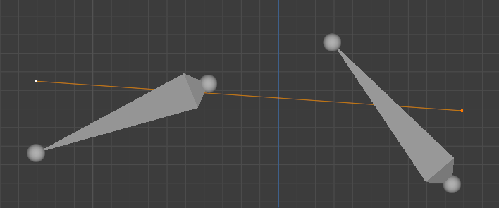

Each end of the yellow line is our vertex associated with one of the bones,
after the bones have moved and rotated about. If we think of the vertex being in
a coordinate space relative to the bone, then these points are fixed to the
bones. The yellow line is all the places the final vertex can be depending on
the weight distributions between the bones. This line is the “linear” aspect of
linear blend skinning.

Now let’s rotate these bones around and draw out some of the lines it forms.

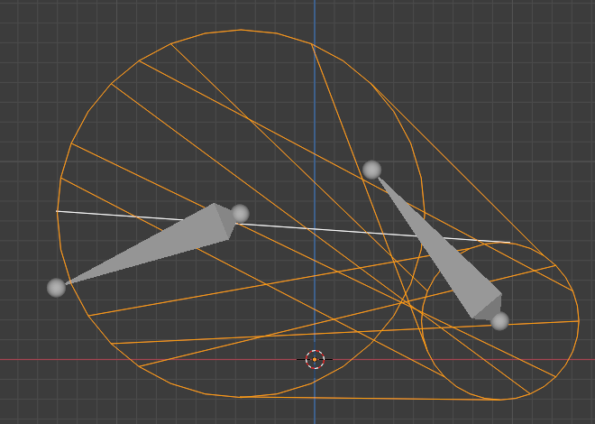

Notice how we have two circles, and for all possible combinations of rotations
and weight distributions, our vertex can be anywhere on or in between them.
However, those circles don’t just represent all possible rotations, they also
represent all possible locations for a vertex a specified distance away from the
bone position. This means that if another vertex weighted to these bones was
within each of these bones, our same weird-looking volume encapsulates it as
well.

As we add more bone influences, we add more circles forming a sort of network.

Here, for any vertex influenced by any combination of these bones with any
weight values and within the radius of each circle for each influenced bone,
then the final deformed vertex is somewhere in this volume. Note the circle in
the middle. That’s a bone too, but given all the positions of the bones at the
moment, it doesn’t contribute. But it could.

Where I am going with this is that if for each bone we make a circle whose
radius is the largest distance to a vertex it influences (in the bone’s local
coordinate space), then all the vertices in the deformed mesh will be contained
by the network of circles. And we can compute a bounding box around this network
by combining the bounding boxes of all the circles.

Now this is all done in 2D to hopefully make things easier to understand, but
the same principle applies to 3D as well. Instead of circles, we have spheres.
And that’s really the only difference.

One question remains, how do we calculate the spheres? Well, the center is going
to be the position of the bone in world space. As for the radius, well remember
how I was pretending that vertices were parented to the bones they were
influenced by and never moved relative to the bone? Well that means that the
radii for the bones for a given mesh never changes.

Never ever.

We can precompute the radius for each of our bone spheres for a given mesh. And
then at runtime we only need to evaluate the bounding box around the spheres. We
just removed the vertices from the equation!

### That’s Still a Lot of Bounds

Yes it is. Calculating potentially a couple hundred bounds just to figure out if
a skinned mesh is on screen is potentially expensive. And people online seem to
dismiss the technique because of it. However, the technique is robust. And we
have to evaluate the animation of all the bones anyways, which is a lot more
expensive than evaluating bounds. I would much rather optimize a simple
algorithm than deal with the extra complexity and edge cases that come with the
alternative methods.

### Dual Quaternions?

If you scroll back up to the image with just two circles, you’ll notice how a
lot of the lines seem to cross close together in the middle. If you imagine
several vertices weighted around where those lines cross, the resulting
triangles are going to be a lot smaller. That’s the infamous volume loss from
linear blend skinning, also sometimes referred to as the “candy wrapper
effect*”. Dual quaternion skinning* is a different algorithm for distributing a
vertex’s position between its influencing bones. Instead of a straight line
between the two per-bone vertices clones, it uses an arc. The arc preserves
volume, but can also make things look like they are “bulging”.

Uh oh. What if the arc goes outside the boundary of our goofy dual sphere shape?

It can’t. I won’t dig too deep into the math, but by definition, the arc can
only perfectly touch the boundary at its greatest extent. In addition to
positions, dual quaternions blend the rotations of bones. But our goofy shape
encompasses the blending of all possible rotations at either end, which means it
encompasses any blended rotation as well.

In short, our bounds algorithm supports linear blend skinning, dual quaternion
skinning, and even a mix of them.

### Multi-Mesh Shortcut

A big thing when it comes to skinned meshes is character customization. In such
scenarios, players can mix and match different meshes all skinned to the same
skeleton. The shirt, pants, jacket, and hair will all need to deform with
animations. So now we have up to five meshes all skinned to the same skeleton.
That means that with 200 bones, instead of our character needing 200 sphere
bounds, it needs 1000. Yikes! These numbers are starting to get big.

However, how often is only a subset of these meshes on screen in any given
frame? Almost always, if one mesh is on screen, all of them are. But with our
current algorithm where we have a sphere radius per bone per mesh, we are
checking all of them. Let’s not do that.

The sphere center is only dependent on the bone position, so we don’t have to
worry about that. For the radius, instead of the max distance of a vertex to its
influencing bone for one mesh, we want the max distance across all meshes. That
really just means taking all the max of all radii across all meshes for a given
bone. Now we have 200 bounds for 5 meshes.

Twice now, we have reduced our problem by identifying shared characteristics in
the relationships between our meshes and our skeletons. The problem that
Kinemation solves is ultimately one giant relationship problem. We have the
algorithms that reduce our problem. And we have jobs and Burst at our disposal.
Now we just need to handle the relationships efficiently.

I think it is time I introduce you to our villain:

Random-Access Relationships

And for this adventure, Rars.

## Rars Goes Rawr

A big aspect of Unity’s ECS is that similar entities are laid out in chunks.
When entities within a chunk are accessed in quick succession, the CPU goes
super fast. We’ve already stressed how important this is back in Adventure 4
when we investigated structural changes. So what does a skeleton with exposed
bones and several meshes look like?

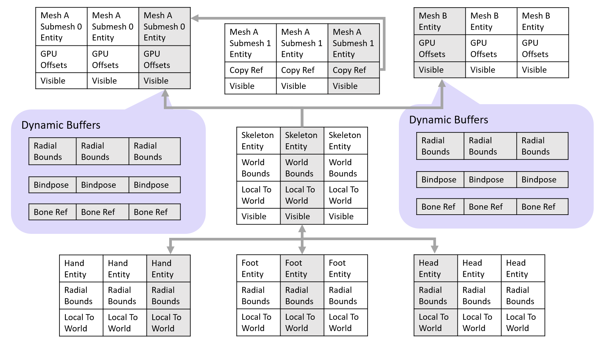

Oh my…

This is a disaster!

With the exception of our dynamic buffers, all of our data is in columns in
completely different chunks. This is bad. Why is it happening?

Well, there’s never a good reason to have more than one of the same mesh and
material combination attached to a particular skeleton instance. So due to
having unique RenderMesh instances, all our attached skinned meshes are going to
be in different chunks.

As for the bones, they don’t always organize the way I have them illustrated,
but they tend to. In fact, it is so common that I wrote an optimized transform
hierarchy system that takes advantage of this tendency. A big reason to have
bones exposed is so that they can have different gameplay components attached.
But the downside is that we don’t really have much control over which chunks
they end up in. They say one’s trash is another’s treasure, and so we need to
respect trash. At least we also have the optimized skeletons which look a bit
better.

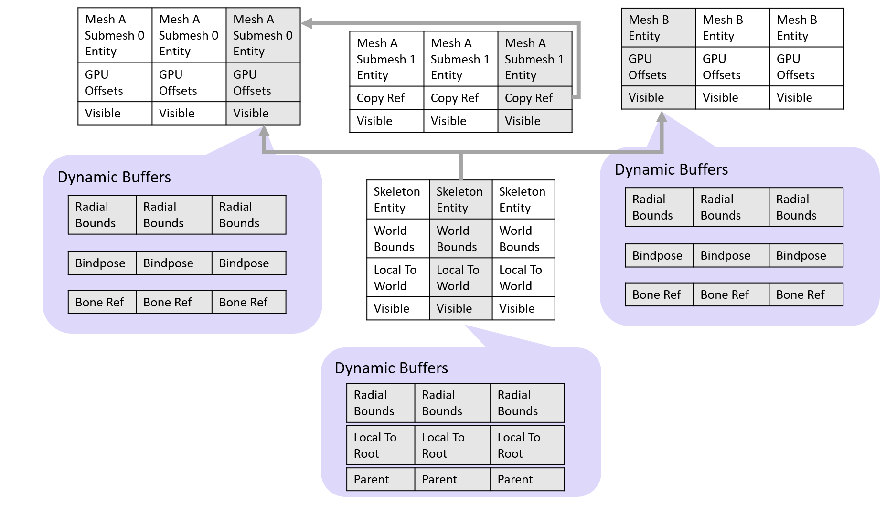

So how bad is it? Well, in a real test case, I have a skeleton with 7 meshes,
one of which having 3 submeshes, and 297 bones. I have a perfectly good reason
for having it that way and I *totally* didn’t just be lazy and not optimize my
model. You know what, let’s just pretend this is our customizable character,
alright?

Anyways, we have a bunch of data scattered across our ECS chunks, and that data
has inter-relationships. It hurts to access each mesh from a skeleton. It hurts
a lot more to access each bone from a skeleton. And if we have to access every
bone from every mesh…

Let’s not talk about that.

This is Rars. Rars is here to make sure that any naïve approach to animation and
skinned mesh rendering is slow. Rars is the reason Unity is struggling to
deliver a high-quality solution. We won’t be able to free ourselves from Rars
completely. But we can definitely give Rars a fight and put the beast in its
place.

### Analyzing the Beast

We have a bunch of relationships, but those by themselves can’t hurt us. It is
only when we apply data transformations directly on those relationships where
Rars is going to ambush us. Let’s analyze all the transformations where Rars
could be hiding.

We’ve already established that if we know the visibility of the skeleton, then
we know the visibility of all the meshes. We can start with calculating the
bounds of the skeleton. For that, we need the radial bounds of both the mesh and
the bones, as well as the bone transforms.

For optimized transforms, that means we have a relationship transform between
the skeleton and the skinned meshes. However, for each mesh, we can process the
entire mesh dynamic buffer at once alongside the skeleton buffer. That’s two
linear arrays, and we know that the CPU can handle at least that many arrays at
once while going fast. Rars strikes here, but it is not very effective.

As for exposed bones, we need to process each element of each skinned mesh
buffer with each bone.

Oh crap…

Let’s just move on, and we’ll deal with that later.

Next, for each camera, we need to determine if a skeleton is visible and report
the result to the appropriate skinned meshes. And those need to report to
additional submesh entities. Often we have multiple cameras, making a Rars
attack here more dangerous.

Lastly, for each visible skinned mesh, we need to calculate the skin matrices
using the bindpose buffer and the bone transforms. Once again, for optimized
skeletons, these are two dynamic buffers in an inner loop. Rars is not very
effective. As for exposed bones, once again,

Oh crap…

Fortunately, that’s the worst of Rars strategies. And now that we know that, it
is time to come up with some strategies of our own.

## Strategy 1: Data Deduplication Defense Buff

The reason Rars hits hard is because our randomly accessed data isn’t in cache
and we have to wait for the memory system to load it. Caches are fixed size, but
the memory we use is something we have some control over. That means that if we
shrink our memory usage, a greater percentage of our memory can fit in cache.
And when that happens, there’s a greater chance that a random access is already
in cache, thus reducing the damage of Rars.

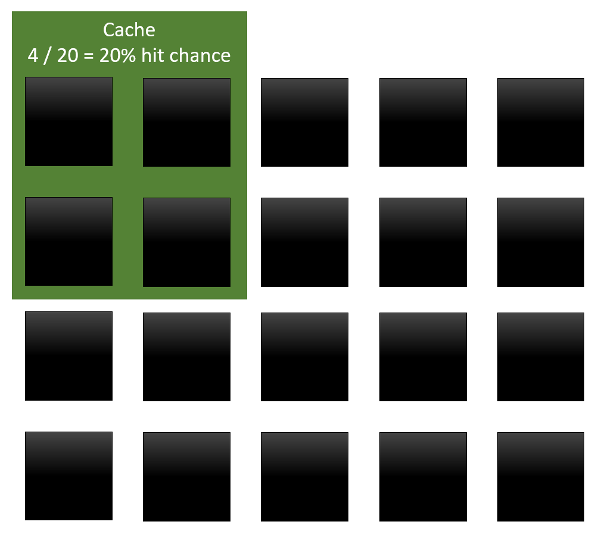

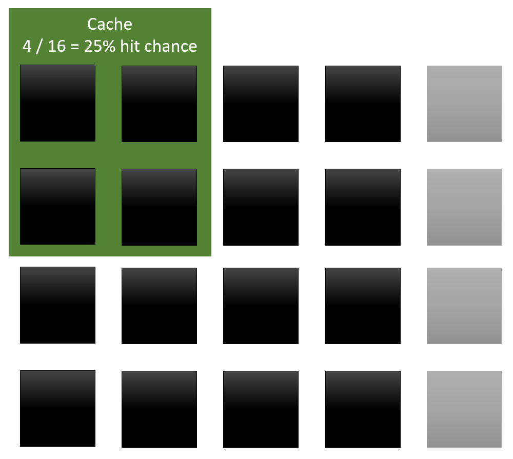

The easiest way to shrink our data is to get rid of duplicates. And as it turns
out, we have duplicates in our data model, specifically with our meshes. The
bindposes and mesh radial bounds come from either the mesh definition or are
calculated at authoring time. They are just like the skinning weights in that
regard. Since that data isn’t going to change at runtime, we can stuff it into a
BlobAsset. BlobAssets automatically deduplicate during conversion, and so we no
longer have copies of that data per instance. That’s an easy buff.

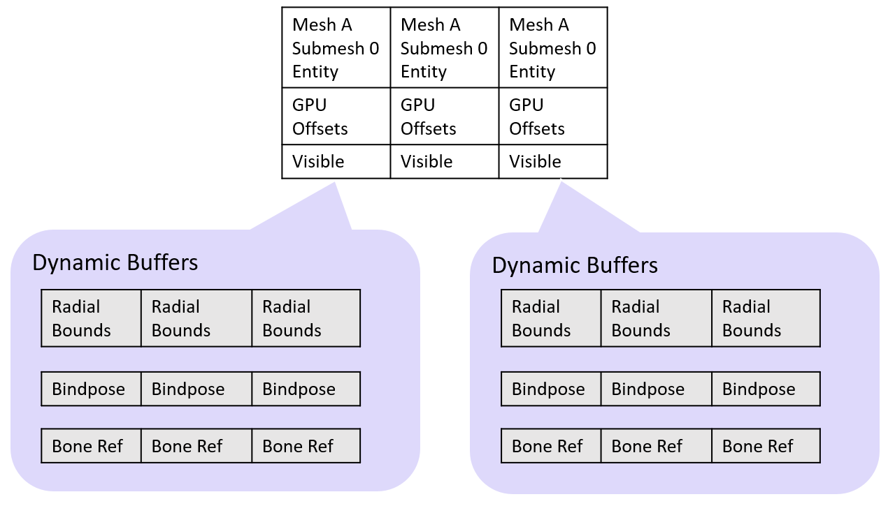

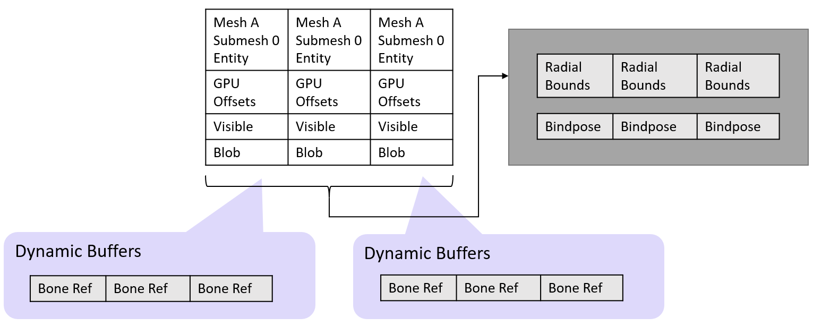

The bone refs are a little trickier. There’s the chance that multiple skinned
meshes attached to the same skeleton share the same bone refs, but there’s
actually an even better option. If we look at the case of the optimized
skeleton, a bone ref is an index. And since we limit the number of bones in a
skeleton, we can get by with a 16-bit index. It may be that a sequence of
indices is shared between multiple mesh-skeleton relationships.

Actually, that’s really common, and it comes from the fact that skeletons are
defined with a strict bone order which gets instantiated by prefabs. Same goes
for meshes, so instantiated mesh-skeleton pairs will have matching bone ref
sequences. So how do we share these indices?

The solution I came up with was to have a resizable buffer of all deduplicated
sequences of indices, and an allocator that can fit new sequences inside of it.
Then each sequence has an entry item in a second array which handles reference
counting. Skinned meshes store the entry index, which can then be used to look
up the actual sequence. Now whenever binding happens, we have to find an entry
that is associated with our sequence. There are two ways we can generate a
sequence during binding. The first is that we get it directly from the user. In
that case, we hash the sequence and use a `NativeHashMap<Hash, Entry>`. The
second is where we automatically calculate the binding sequence at runtime using
binding blobs and an expensive matching algorithm. We can use a second
`NativeHashMap<BindingBlobPair, Entry>` and bypass the expensive algorithm if we
computed the pair before. All these containers live on the
`worldBlackboardEntity` collection component `BonesOffsetsGpuManager`.

This works for optimized skeletons, but it would be really nice if it worked for
exposed skeletons too. First, the archetype of the skinned mesh wouldn’t depend
on which type of skeleton it was bound to. Second, 16-bit integers are smaller
than 64-bit entity refs. And third, we’d get the same deduplication
opportunities. The downside is that we would have to access the bones indirectly
through a bone ref buffer on the skeleton. Is that a bad thing? Well, the first
skeleton lookup would be random, but after that, the bone ref buffer will be in
cache.

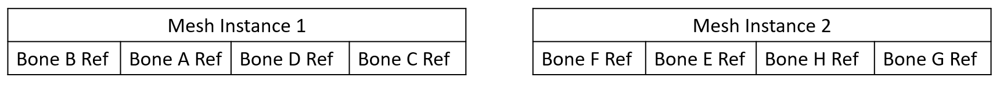

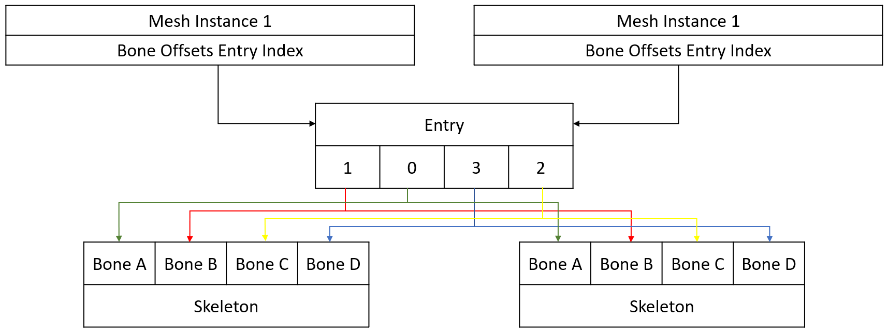

All in all, using shared indices reduces our memory a fair bit, but comes at the
cost of a new not-very-effective skeleton-mesh Rars attack as well as extra
damage from indirectly looking up the indices from the entries. In addition, we
now have a new tradeoff for binding in which we can often skip an expensive
matching algorithm, but now bindings will likely have to be single-threaded so
that we can add new sequences.

Is it worth it? Honestly, I don’t know. However, I’m sure my keen-eyed sky
friends noticed the “GPU” callout. You see, our strategies have synergy. Rars
might be dangerous, but so is this veteran fighter. We’re far from finished.

## Strategy 2: Sticky Quick Strikes

I’ve mostly been presenting the problem as if all transforms have to happen
every frame. But as we just saw with our first strategy, we can move some work
to a more “one off” binding step. Bindings and rebinds don’t happen every frame
for every skeleton. If we do any difficult calculation only when they happen, we
effectively lower our average frame processing. As it turns out, there’s one
calculation whose results only change after a rebind, and that’s the combination
of radial bounds of all the skinned meshes attached to a skeleton.

If we combine our radial bounds during binding and store them per exposed bone
or as an optimized skeleton dynamic buffer, we no longer have to touch the
skinned meshes when computing the skeleton bounds. It’s simple, and perhaps the
extra memory usage counteracts our first strategy, but it is a huge win.

For exposed skeletons, this was the most dangerous Rars attack, and we just
stepped it down a tier. Instead of processing every bone for every mesh, we now
only process each bone once per skeleton. As for optimized skeletons, bounds are
now Rars-free!

## Strategy 3: GPU Raids

When I was first prototyping Kinemation, I didn’t fully understand how Unity
represents skeletal hierarchies. I made the assumption that a skeleton could
only have one bindpose, so I copied the bindpose from the mesh to the skeleton.
That way, the skin matrices could be shared for all the attached meshes, using
less CPU memory, and requiring less data to be transferred to the GPU.

That assumption came from the fact that there was a rigid armature object that
skinned meshes were weighted to. However, in Unity, such an “armature” from a
DCC application gets left behind at import. Bones are just transforms. And a
skinned mesh contains references to transforms. In Unity’s asset model, a
skeleton could have been posed differently for each skinned mesh weighted to it,
and bindposes are truly a property of the mesh and not the skeleton.

But alas, that means that we need to multiply every bone transform with every
mesh bindpose. And for exposed bones, that means a dangerous Rars ambush. Sure,
it isn’t as potent as the skeleton bounds was, but as soon as we take the camera
high in the sky…

Quick tangent on LODs. When you take a camera far away from the center of the
action, lots of dangerous critters show up on screen. But they are all really
small. People often use LODs to render them at lower resolution and with simpler
shaders. Unfortunately, simpler shaders can’t get rid of the need for skin
matrices. And “lower resolution” usually means less vertices. But we already
removed those from the equation. So while LODs make the GPU happier, they are
baiting people into a nasty Rars trap.

We badly need to mitigate Rars here! To do that, let’s really break down this
data transform and hope we find something.

First is the construction of the skin matrix. We have two inputs here. One of
them is a bindpose, which is static for the mesh and never changes. The other is
a dynamic transform from the bone. When multiplied together, we have a skin
matrix. Second, we need to get that skin matrix to the GPU. That’s just copying
to a GPU-mapped NativeArray. However, on some platforms, a GPU-mapped array is
actually an array in CPU memory that the GPU reads from. That’s kinda slow, but
is often faster than copying to GPU memory if the data is only read once by the
GPU.

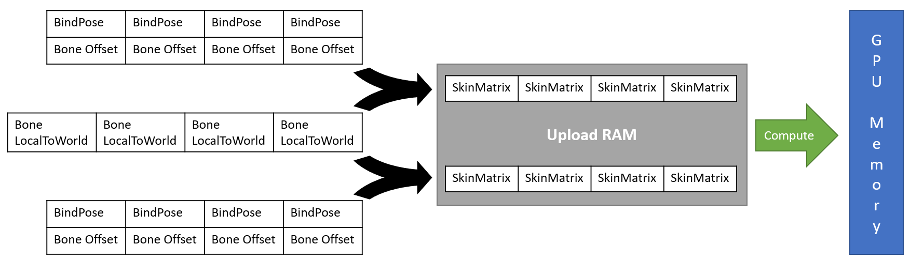

Usually, smart graphics people use a compute shader to copy the array into an
actual GPU memory array, but sneak in some extra data transforms in the process
like inverting matrices (that’s what the Hybrid Renderer does for material
properties). That obviously got me thinking, for linear blend skinning where we
just need the skin matrices in a real GPU buffer, what GPU work could we do
while copying from the CPU to the GPU?

Well, we don’t actually need the skin matrices on the CPU. Could we calculate
those on the GPU instead?

You bet we can!

But hold up…

We started out with the Hybrid Renderer being GPU-bound. And now we are going to
make the GPU do more work?

That’s a good point. But let’s put things in perspective. While it’s a stupid
idea, some shaders will multiply two matrices together for each vertex of the
mesh. Games with those shaders ship, with players none the wiser. GPUs are
really strong, and if they can handle matrix multiplication per vertex per mesh,
then a matrix multiplication per bone per mesh is a featherweight workload. This
is not a workload that is going to cause your GPU’s fans to spin up. But even
better, instead of having to upload a skin matrix per bone per mesh (bones \*
meshes), we now just have to upload the bones and the bindposes (bones + meshes
\* bindposes). That might seem worse, but bindposes are constant properties of
meshes. That means that they can be deduplicated with the mesh, and perhaps
stored persistently in GPU memory along with the base mesh vertices and bone
weights. Doing this, that means we only need to upload the bone transform
matrices. That’s far less data that needs to be uploaded per frame. We may have
added a little extra GPU work, but in return we decreased GPU memory transfers.
There’s a real chance this is a GPU optimization!

In my prototype, frustum culling was so effective at taming the GPU workload
that my tests actually became CPU-bottlenecked. That’s also why I am so worked
up about Rars. Shifting some of the work back onto the GPU helps balance things
out. It also comes with another benefit. I realized that I could do compute
skinning and skin matrix calculation in a single compute shader. This unified
the codepaths for supporting Unity’s Linear Blend Skinning shaders and Compute
Deform shaders. However, this required that I store the skin matrices in a
special GPU cache that is fixed size. And that’s why there’s currently a cap of
341 bones per skeleton (really, the rule is [bones + single_mesh_bindposes \<=
682] and 341 is just a conservative guarantee). That limit is unfortunate, but I
do know a way around it without compromising this strategy. It just takes a lot
more HLSL work and buffer management.

Oh shoot.

How do we map the mesh bindposes to the right bones?

Actually, that’s easy. All that work we did in our first strategy to convert
those mappings into indices pays off. Guess who knows how to work with indices?
It’s our good friend the GPU!

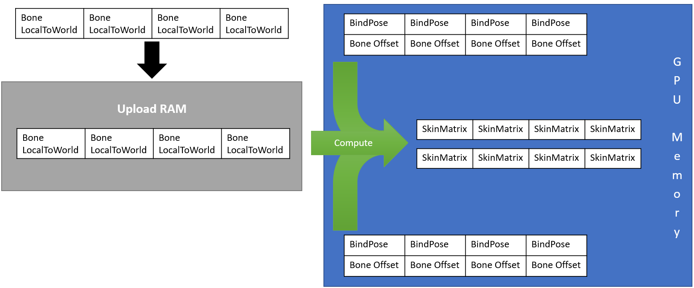

Anyways, we now just have to upload the bone transforms for every visible
skeleton, and then somehow tell the GPU which sets of bindposes to use and where
to output the results. But the latter is a separate data transform we’ll cover
in our next strategy.

Just like with skeletal bounds, we’ve reduced exposed bone processing to no
longer depend on the mesh but only the skeleton. This is unfortunately as far as
we can push it. We need the bone matrices to be ordered for the GPU, and the
bones simply aren’t in that order in memory. Either Rars hits us on the read, or
Rars hits us on the write. Fortunately, culling is a saving grace here that will
alleviate the blow.

As for optimized skeletons, we’re once again Rars-free. Woohoo!

## Strategy 4: Arena Control

We just made a major architectural change with how we migrated work to the GPU.
But with an architectural change, that may have opened up some new hiding spots
for Rars. For example, we now require that all meshes be batched together with
the skeleton when sent to the GPU. By “mesh”, I really mean metadata about where
the mesh data lives on the GPU, which is just a few integers. But even so, that
means we’ll probably want to dispatch our compute shaders iterating over
skeletons instead of iterating over meshes.

A big caveat is that while a mesh depends on the skeleton for visibility, just
because the skeleton is visible doesn’t mean the mesh is visible. Other factors
like gameplay and LODs can also dictate mesh visibility. And the skeleton will
want to know that before requesting compute shader work. That means the mesh
needs to know the skeleton visibility, then the skeleton needs to know about the
mesh visibility. And if any mesh is visible to the skeleton, the skeleton needs
the mesh metadata to do the compute shader setup. Finally, each mesh needs the
destination locations of the compute shader for the material property to look
up.

That’s a lot of Rars, not awful Rars, but Rars nonetheless. But we can employ
some of our already established strategies against them too. For example, the
mesh metadata is fairly constant. And so, like the radial bounds, we can copy
that to the skeleton during binding. After all, we are iterating skeletons which
means the skeleton needs to know all the meshes bound to it. We build a dynamic
buffer containing all the skinned mesh entity references during binding, and may
as well cache some additional useful data along with the references.

### Prefix Sums

When we talk about memory locations on the GPU, what we are really talking about
are offsets from the start of a `ComputeBuffer`. Global memory addresses and
pointers are things the GPU world is just beginning to explore. But that’s okay,
because relative offsets work just fine for what we need. However, not all of
our meshes are the same size, so how do we efficiently distribute deformed
vertices or skin matrices across a buffer so that each rendered entity has a
unique range of offsets for its data?

The way most people do it is they start with a global counter at zero. Then for
each entity, assign the global counter to the entity’s data offset, then add
however many elements the entity needed to the global counter. At the very end,
the global counter is the size of the buffer needed. This works. Actually, it
works really well, and generally leads to optimally packed buffers. It even has
a name, *prefix sums*. The issue is that every value depends on all the previous
values, which means making it run multi-threaded is tricky.

If you search the internet for “parallel prefix sum”, you’ll find lots of crazy
talk on GPU programming and supercomputers. But the way we typically do it on a
CPU for game-sized data is the following:

1.  In parallel, perform a prefix sum for “batches” with each batch having its
    own running counter.
2.  Perform a prefix sum for all the batch counters on a single thread.
3.  In parallel, add the batch counters to all elements in their respective
    batches.

This is actually fairly innocent. There’s no Rars attack in this parallel
algorithm. However, this happens per camera view, including each light’s shadow.
We want this to be fast. Both the skeletons and the meshes need the result. The
skeletons need it to write commands for the GPU. The meshes need it when
uploading material properties. There’s a one-to-one correspondence, so it really
doesn’t matter which calculates it first. But one way is more optimal.

If we look at skeletons, we see that our cached mesh metadata to compute our
prefix sum is buried in small dynamic buffers per skeleton. Here’s the thing
with dynamic buffers. They aren’t Rars bad or anything, but when you have a lot
of small buffers like this, you want to be very efficient with them. One pass we
can be very efficient, since we need nearly all the metadata to create our GPU
commands. But the second pass required by the prefix sum would just be picking
out small parts of our cache in each buffer.

Now let’s compare that to the meshes. Each chunk has a `RenderMesh` shared
component. The mesh stored in that `RenderMesh` component is extremely likely to
be what generated the mesh skinning blob data stored with each mesh entity. That
means that 99.9% of the time, all the meshes in the chunk have the same element
stride for our prefix sum. They all add the same value to the counter. If we
incrementally updated a per-chunk cache of the element stride (using a
conservative maximum for that pesky 0.1%) once per frame using change filters,
then as long as we knew the count of visible meshes per chunk, we could skip
Step 1 of our prefix sum! But do we have such a count?

Well, kinda.

The Hybrid Renderer limits mesh entities to 128 per chunk. And the reason it
does that is because it uses something called *chunk components*. Every normal
chunk has a special entity called a *meta entity*. Meta entities live in *meta
chunks*. And those meta chunks can contain chunk components. A normal chunk can
access chunk components from its meta entity. When a normal entity switches
chunks, it leaves behind any chunk components, but its archetype dictates that
it moves to a chunk with the same chunk component types. That means chunk
components serve as chunk-level caches which are invalidated by structural
changes. Fortunately, with Entities 0.50, there is a robust way to detect
invalidation using change filters. Both our element count per mesh and our batch
prefix sum can easily fit in the mold of chunk components.

But it gets even better! We can iterate over meta chunks, processing a whole
bunch of chunk components in linear arrays at once. This is extremely fast, as
there are relative few meta chunks. As long as we can also find our visibility
counts in chunk components, we can have a very fast Step 2 of our prefix sum.

Remember how I mentioned a 128-bit mask stored per chunk? Well, this is where
that matters. The Hybrid Renderer actually only stores LOD visibility in that
mask, and then transforms that mask and the frustum culling results directly
into `UnityEngine` visibility indices. However, I had to rewrite that, since I
needed custom culling for different archetypes. While I was at it, I defined two
new bitmasks. One holds the visibility for each of the up to 128 entities for
the current camera. The other holds whether each entity was visible for any of
the previous cameras in the frame. With only a few bitwise instructions, we can
get a mask of all the entities in a chunk that are being rendered for the
current frame for the first time, and make sure they get a newly generated GPU
skinning command and new GPU offset. Now all we need is to count the bits in
that mask. It turns out there’s a magic instruction for that operation. It is
called *population count*. And as you probably suspect, it is really fast. I
challenge you to find this Step 2 job in the profiler!

By the way, this mask-based culling is fully public Kinemation API so you can
add in your own gameplay visibility masks too. That means that when your enemies
take damage, they can do the blinky blink.

### Meet Sars

Our little side-quest with chunk components was fun, but it is time to focus
back on Rars again. Fortunately, this side-quest yielded a new weapon, as well
as some clarity on where Rars might be hiding. We now know that skeletons will
have to fetch the visibility of meshes from chunk components. But this is also
really good news.

You see, visibility info is really tiny memory-wise. And if we can pack a whole
bunch of values into masks, we use considerably less memory. As we know from our
first strategy, less memory means weaker Rars. But there’s an even bigger
benefit here. When we randomly access tiny pieces of data from a small region of
memory over and over and over again, our accesses aren’t really random anymore.
With each access, there’s a high chance the cache line containing the data is
still hanging around. This is also why iterating over bones and randomly
accessing skeletons is usually faster than iterating over skeletons and randomly
accessing bones.

We’ll call this phenomenon *Shared-Access Reads*, AKA Sars. Sars is faster than
Rars, but isn’t always as fast as linear memory traversal, so Sars can still
hurt performance. But it is almost always a good idea to replace a Rars attack
with a Sars attack.

Anyways, we already have ours Sars masking strategy to relay mesh visibility to
the skeletons. But before that, we also have to relay skeleton visibility to the
meshes. Turns out, we can make a skeleton visibility mask chunk component and
use the same trick!

Hold on…

Where’s the API for reading a chunk component from another entity?

Yeah, the process is a little convoluted here. Here’s how we do it.

First, we need a `StorageInfoFromEntity`. From that, we can get any entity’s
chunk and its index in it (which is also the index in our bitmasks). From the
chunk, we can use a `ComponentTypeHandle` to read the chunk component.
Interacting with other chunks using `ComponentTypeHandle`s in this way is super
dangerous, so make sure you know what you are doing.

And that’s it for GPU metadata syncing as far as Rars is concerned. We got rid
of Rars everywhere except fetching exposed bone transforms for visible skeletons
and syncing the special material properties between the meshes and skeletons. I
could ramble about the crazy `NativeStream` chunk indexing prefix sum
shenanigans used to allocate and generate the compute shader inputs, but that
requires explaining the details of the compute shader. And I am not doing that
right now.

## Strategy 5: Cornering Rars with Sars

Now that we have our skin matrices under control, it is time we revisit our
bounds update and see if we can’t do something about Rars and exposed skeletons.
I made the comment about how it was faster to iterate over bones and randomly
access skeletons than vice versa. The only problem is that we need to write the
bounds to the skeleton, not read. That’s not thread-safe.

However, what if instead of the bones writing to the skeleton, they wrote to an
agreed-upon offset in an array? That way, each thread could allocate its own
array on the fly and then write to that.

Now what do I mean by “allocate its own array on the fly”?

Basically, I have a `NativeArray<UnsafeList<Aabb>>` where the array has an
element for each thread index. Then for each chunk, I check if the `UnsafeList`
for the thread has been allocated. And if not, I allocate it using the
`World.UpdateAllocator`. That allocator is nice, because it will automatically
dispose itself long after the jobs finish. We don’t have to worry about memory
leaks. Just race conditions. But since we are doing things per thread, that’s
not really threatening either.

Anyways, we now have a situation where sometimes a thread updates more than one
bone in the same skeleton and can combine their bounds. And at the same time, it
rearranges the bounds into parallel arrays by skeleton. That means that a second
pass to combine the per-thread bounds will be Rars-free. However, that’s work we
wouldn’t have done if we iterated by skeleton. So this only helps when each
thread touches more than one bone per skeleton and the write destinations are
still hanging around in L2 cache.

This is kinda like Sars, but it is not really Sars. And it is not hitting Rars
very hard. No, the benefit doesn’t reveal itself until we start using change
filters.

If a skeleton is far away from where the player can see it, there might not be
any real benefit to updating the skeleton’s animation. Animation sampling is
expensive after all. And while Kinemation doesn’t really get to say when
animation updates, users that do this sort of animation culling could help us
out. If we could find out which skeletons were untouched, and somehow
efficiently notify the bones, then some of the bones could skip writing bounds
data, reducing Rars. That sounds promising, but the trick is to do this in a way
that doesn’t introduce Rars in the process.

We need to chunk iterate bones to find bones that changed, and report to the
skeletons. Then we need skeletons to report back to all their bones. If this
sounds familiar to what we did with visibilities, that’s because it is. Once
again, we have one bit signals we can synchronize with masks. Except this time,
we have one other benefit.

You see, I kinda lied earlier about our chunk component masks replacing Rars
with Sars. A more accurate statement is that we replaced half of Rars with Sars.
A `ComponentDataFromEntity` lookup actually requires two random accesses. One to
look up the entity metadata, and the other to get to the actual component value.
The component value lookup was Sars, but we still had to look up the entity with
`StorageInfoFromEntity`, which was Rars.

This time however, we don’t have to look up entities. We have agreed-upon
offsets that each bone knows about. Here’s some really stupid math. If we have
32 kB of L1 cache, 16 kB goes to a chunk that we process one at a time, and 8 kB
is used by the job’s stack, that leaves 8 kB of bitmasks. If one bit represents
a skeleton, how many skeletons can we fit inside 8 kB?

If you guessed 65_536, you’d be right!

In reality, we are only looking at a small fraction of the chunk data, and not
using that much stack, so the CPU is going to allocate things a little more
intelligently. But it should be obvious that we can read and write per thread
masks for all our skeletons without ever missing L1 cache.

This is Sars in full glory, who has completely turned on Rars with might and
fury!

With these offsets (of which each is referred to as a *Culling Index* in the
code), we write to a per-thread skeleton mask using bone chunk iteration. Then
we combine them in a tiny single-threaded job. And finally, we read from the
combination using bone chunk iteration again. We never actually had to touch the
skeleton entities!

And you know what? We don’t have to touch them when we compute our final bounds
either. We can just leave the bounds in an array, and use the same bitmask trick
in culling to report back to the skeletons.

Having agreed-upon offsets between the skeleton and the bones does a lot of
amazing things. But where do we set that up?

I’m sure you can guess by now that we set this up in our reactive system that
handles all the bindings. After all, we usually only need to establish this
relationship once and just leave it. But we’re starting to rely heavily on this
reactive system to do our dirty work. We should probably check in and make sure
it isn’t getting too out of hand.

## Final Blow: Rars Fights Unity

Reactive systems. If you aren’t familiar with them, I’m sorry. I’ll give you a
quick brief, but you should probably spend some more time researching them.
Basically, they are systems which operate on entities which have some components
but are missing others. Then after the operation, they either add the missing
components or remove the present components so that the entity is only ever
processed once (until something else adds or removes a relevant component). In
addition, there’s a special type of component called System State
(`ISystemStateComponentData`, `ISystemStateSharedComponentData`, and
`ISystemStateBufferElementData`). When an entity with at least one of these is
“destroyed”, all of its normal components are removed, but the entity is left
alive with these components. It is up to systems to remove these components
explicitly until all components are removed and the entity can be destroyed for
real. Reactive systems invoke structural changes which are really slow, so there
has to be a good reason to use them. Let’s review what structural changes we
need to make.

### The System States

First, there’s our skinned meshes. Not only do we want skinned meshes to attempt
to bind when instantiated, but we also need to reference count their skinning
data to keep the GPU in sync. Reference counting requires System State
components to do accurately. We have no choice here.

Second, there’s our exposed skeletons, which have culling indices. Those indices
need to be assigned and released as skeletons come and go. While there is
technically another way to do this instead of using System State components, the
latter is better here.

You see, optimized skeletons seem like they don’t have anything that would
require reactive systems, but what happens when you instantiate a skeleton that
already has meshes bound to it? Which skeleton do the meshes stay bound to?
Well, by normal ECS behaviors, it would be both. Both skeletons would have a
copy of the cached bound meshes, and both would try to deform the mesh at the
same time.

That’s not ideal.

However, System State components don’t get copied during instantiation. Our
problem goes away if we make our dynamic buffer of bound meshes and cached
metadata a System State type. But now that means all skeletons have a System
State component and will need structural changes. Adding a second structural
change for exposed skeletons is significantly cheaper if we add and remove both
at once.

As for exposed bones, those need culling indices, but there tend to be a lot of
bones which would lead to very heavy structural changes. Plus, the user controls
the `BoneReference` buffer. Reactive systems work a lot better when we can
process entire Entity Queries rather than read entity values out of buffers. For
exposed bones, we’ll assume they have the correct components and use the other
trick instead.

What’s that trick?

The trick is we designate a specific culling index as “no synced skeleton”. The
index we use is 0, since it is a valid array index and also the default value of
an integer in C\#. Basically, the 0-index skeleton is a fictional skeleton with
no meshes bound to it. All the other algorithms just work.

### Outsider Jobs

Our reactive system requires a mix of jobs that can run in parallel, jobs that
must be single-threaded, and structural changes that need to run on the main
thread. Our goal is to reduce the latency as much as possible, and that means
organizing the jobs in a smart way.

One thing we’ll do, is we will have all our structural changes happen together
in sequence without interruptions from jobs. During this time, we can’t touch
ECS data, so our worker threads sit idle.

But it doesn’t have to be that way.

If we have a job that only uses Native Containers, then we can technically run
it while the main thread is doing its sync point thing. We actually have a few
situations like this.

First, it is the meshes that contain which skeletons they bind to, and not the
other way around. That means we chunk-iterate meshes when detecting new
bindings. However, writing to the skeleton in parallel is not thread-safe, so we
need to iterate skeletons and have them know about all the new and deleted
meshes. The way we do that is by writing mesh-skeleton pairs into a buffer, then
rearrange that buffer to group by skeleton, and finally iterate by skeleton.
Guess what type that buffer is?

It's our old friend `UnsafeParallelBlockList`!

But on top of that, entity references are stable across structural changes, so
as long as we don’t try to access components, we can rearrange a buffer of
entity references however we want during a structural change.

Parallelizing rearrangement like this is really tricky. But if a single-threaded
rearrangement job always finishes before the structural changes finish because
structural changes are really slow, is there any point?

Nope. Single-threaded job it is!

Actually, single-threaded jobs are especially good candidates here. And another
one is the allocation of exposed skeleton culling indices. We can capture new
and destroyed skeleton entity references in parallel. Then process allocations
in a single-threaded job and output an array of new assignments. And finally
process that array of assignments in parallel.

Lastly, there’s the GPU management of skinning data. This requires reading blob
assets, which are also safe in parallel to structural changes. This job does a
lot. It hashes the blob assets to look up entries. It iterates through gap
tables for allocations. It updates reference counts. And, because the GPU needs
the bone offsets from the binding, it even handles the expensive binding map
matching algorithm. All of that is a lot of work, and a lot of Rars. We
definitely need to optimize this, right?

Nope. Still faster than structural changes.

Consequently, by making Rars run simultaneously with structural changes, Rars
becomes nothing more than a harmless pet to keep the worker threads company.

There’s potentially more work in the parallel jobs that I could move to occur
during the structural changes, but this is as far as I have taken it.

## Fixing the Hybrid Renderer

Before we get to the results, I still need to address something. We made a lot
of optimizations to the realm of culling, but does this play nicely with the
Hybrid Renderer?

No.

That’s why I rewrote a large part of it.

Specifically, I disabled the Hybrid Renderer’s Skinned Mesh Renderer conversion,
the entire deformation system, and the main Hybrid Renderer System. I then made
a copy of the Hybrid Renderer System. That’s a 3000+ line beast by the way. In
my copy, I deleted all the parts where I could reference the original directly
using asmref. I also reorganized the file to make it easier to find the pieces I
care about.

Next, I had to split off parts into separate systems that would run in the
culling callback. The Hybrid Renderer’s culling callback scheduled jobs using
Entity Queries to handle `JobHandle`s. And some of that code was a little hacky.
I instead ran a full `SuperSystem` in the callback, which means all the jobs
were associated with proper systems with automatic dependency management.

The culling callback has arguments, so I stuffed those into components, buffers,
and Collection Components on the `worldBlackboardEntity`. It requires a
`JobHandle` as a return value, so I extracted that from a Collection Component
which contains the final visibility indices.

Extracting frustum culling and LODs updates into separate systems was trivial.
Moving material property uploads over was not. For one, it is more heavily
dependent on internal state of the Hybrid Renderer System. Fortunately, I could
put a lot of that into a Collection Component to transfer it over. But two,
using change filters to sync properties to the GPU is no longer valid. Change
filters only flag for a single system update. And if that update skips an entire
chunk due to culling, it won’t know that the properties are still dirty and need
to be synced.

My solution for this was to have a “dirty” bitmask for all the possible
properties in the chunk stored as a chunk component. Then, my copy of the Hybrid
Renderer System would go through the chunks and set the dirty bits based on the
change filters the original Hybrid Renderer would have used. In the case of
structural changes, all properties get dirtied, and the invalidated chunk
component gets completely overwritten with an all-dirty mask. Material
properties that are updated during culling dirty these masks directly.

Aside from refactors, there were a couple other surprises. One was that motion
vectors in HDRP broke. Motion vectors are generated from `MatrixPrevious`, which
is the `LocalToWorld` of the previous frame. The Hybrid Renderer handles this by
copying the `LocalToWorld` immediately after material property uploads once per
frame. But Kinemation does material property uploads multiple times per frame,
and has no idea which culling callback will be the last in a frame. That meant
the only option was to create an intermediate buffer component that would copy
`LocalToWorld` before culling and then have `MatrixPrevious` copy from it the
next frame.

A `float4x4` requires 64 bytes, meaning only 256 can fit in a 16 kB chunk. With
both `LocalToWorld` and `MatrixPrevious` being `float4x4` types, it is already
impossible for a chunk with both to have 128 entities and use the full 128-bit
visibility masks. Adding another `float4x4` would hurt chunk capacity even more.
But it turns out, the Hybrid Renderer only uploads the first three rows of the
matrix as a `float3x4`. The last row is left completely unused and wasted. So I
borrowed the last row of `MatrixPrevious` for a row of my intermediate buffer,
since `MatrixPrevious` is only used for rendering anyways. And because only
three rows matter, I only needed a `float2x4` to store the rest. I effectively
cut my new component’s size in half, which helps chunk capacity. Despite the job
being more complicated to repack the data, it runs in about the same amount of
time. Burst does an amazing job optimizing it.

The other issue is that the Hybrid Renderer System’s update needs the
`ChunkWorldRenderBounds`. But skinned meshes aren’t using those for culling
anymore. The reason the Hybrid Renderer wants this is so that it can write
global bounds for all of the entities it manages, which it then feeds into the
engine. That means we can give all our skinned meshes chunk bounds equal to one
giant bounds of all the skeletons. Optimized skeletons and exposed bones
calculate their bounds before the replaced Hybrid Renderer System for this
reason. The exposed skeleton gathering step happens afterwards to help reduce
worker thread idling while the culling callbacks set up.

There were a couple other small issues and surprising areas of technical debt
that I won’t get into. But I will say this. Try not to couple systems, folks. If
you have to do it for a special update callback, make it a
`ComponentSystemGroup` instead.

We’re ten thousand words in. Want to see some results?

## Profiling Results and Comparisons

For these results, I’m going to be profiling my dancer prototype scene with 10k
dancers and blending animations disabled. There is only one kind of mesh in the
scene and consequently one mesh per skeleton. This is the best-case scenario of
the Hybrid Renderer, so I am really putting it in its best light with this test.

Here’s what the Hybrid Renderer did with optimized skeletons:

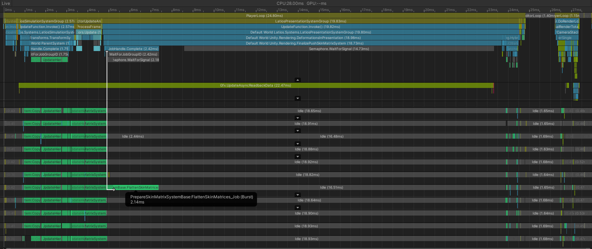

This was with Linear Blending Skinning. Here we can see the Hybrid Renderer
spends most of its time blocked by the GPU. Though if it weren’t for that, it
also has a single-threaded combining job.

Surprisingly, Compute Deform took 2 milliseconds longer being blocked by the GPU
but was otherwise identical. This baffled me, because Linear Blend Skinning does
perform frustum culling before skinning. Even if it isn’t 100% correct, I would
expect a performance uplift.

Regardless, that large stall on the main thread happens during a call to
`ComputeBuffer.SetData()`. Yeah, the Hybrid Renderer is not using the fancy GPU
upload API here. Now let’s see how Kinemation did:

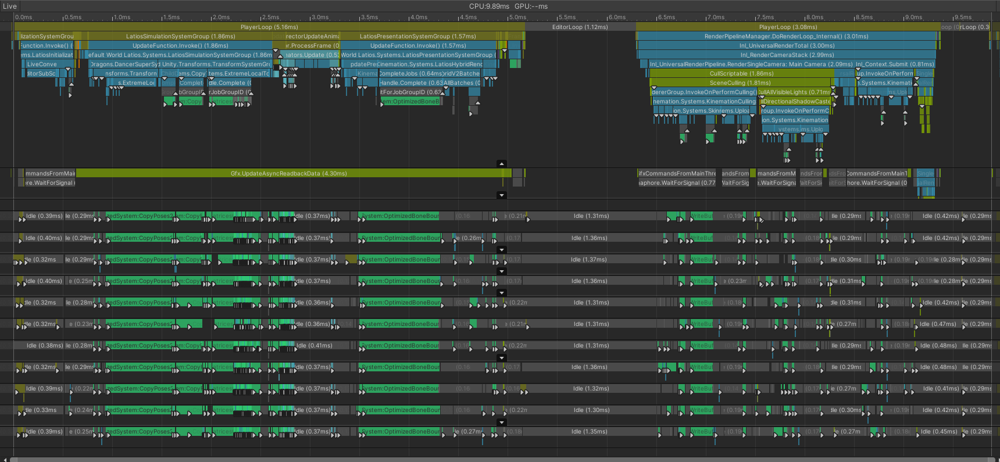

Yeah. This isn’t really a fair comparison. I tried. But simply switching the GPU
upload mechanism has a massive impact. Not only is our rendering thread
processing a lot faster, but we also aren’t blocking on it anymore.

There are only two big jobs in culling and rendering. First is the
`OptimizedBoneBoundsJob` which is taking 0.8 milliseconds. And the second is our
first camera’s `WriteBuffersJob` which takes 0.25 milliseconds. The rest of the
jobs are tiny.

Compare that to the Hybrid Renderer where writing out all the skin matrices
takes 1.1 milliseconds in an initial parallel job and then 2.1 milliseconds
single-threaded just to combine them in a single array. Building our
conservative bounds has a cost, but in the end, it is faster than uploading all
the matrices in this test. That won’t be the case when nearly all entities are
on screen, but then you are probably GPU-bound anyways.

Now let’s see how exposed skeletons handle in Kinemation:

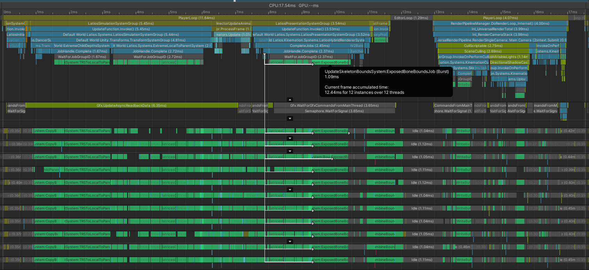

Ok. So definitely a bit slower. That mess of jobs up until the 9 millisecond
mark is mostly the special optimized transform system I mentioned earlier. And
this is the problem with exposed skeletons. Transforms hierarchies are expensive
to update and incur a lot of Rars. But at the same time, this also shows us how
effective our Rars mitigation strategy is.

First, there’s the computing of the bone’s world space bounds which is taking
1.1 milliseconds. Curiously, this is slower than the optimized bounds, and this
is just chunk iteration. However, our optimizations for combining the bounds per
skeleton paid off. Finding dirty bounds takes 0.21 milliseconds. Combining
bounds per thread where we had per-thread Sars takes 0.6 milliseconds. And
merging the bounds across threads takes 0.24 millesconds.

Lastly, `WriteBuffersJob` takes 0.46 milliseconds, which isn’t bad at all for a
Rars-heavy job. The frustum culling is really paying off here.

## New Villains?

For as much as I would like to investigate why chunk iteration bounds updates
are so slow for exposed entities, if we look closely at the profiler, we can see
two gap areas which show up in our profiler results (ignoring Editor gaps). The
first happens during `LatiosHybridRendererSystem` after all the jobs are forced
to complete and this gap takes about half a millisecond before jobs start
running again. The second is in the culling callback. There’s lots of small gaps
here, because the main thread is not keeping up with all the culling callback
systems. It seems that if we want to take Kinemation to the next level of
performance, we’ll have to do some main thread optimizations. But that’s for
another adventure.

By the way, if you like these adventures and want to learn about animation
sampling, check out [this
blog](http://nfrechette.github.io/2016/10/21/anim_compression_toc/). ACL is what
powers animation sampling in Kinemation. You’ve read enough of my words, so go
read his for a change.

## Try It Yourself!

You can find the dancers demo in this repo. The master branch contains a Hybrid
Renderer compatible implementation as well as an early prototype of Kinemation.
The Journey_To_Production branch contains the modern Kinemation implementation
which was discussed in this adventure.
