# Optimization Adventures: Part 8 – Find Pairs 3

*The winds whisper in the first night hours after the sky has transformed from
red to black. Chirps of crickets and frogs add a percussive rhythm to the
symphony. A motorized transport in the distance provides its applause.*

*In the dim of the night, artificial lights disrupt the shadows in the den of
one feared. A stillness surrounds the creature. Objects of necessity gently
float to the ground around the den. Eyes open.*

*“It’s time.”*

Welcome back to another adventure with yours truly. If you don’t know what this
is all about already from the title, you have some catching up to do.

This adventure, we begin a new journey. A journey where we make the CPU cry with
speed. A journey where an algorithm goes from good to feared. A journey that
will reach new limits, and process numbers that will astonish and inspire for
years to come.

**This adventure, we fix FindPairs!**

Ok. Well not entirely. Like all journeys to be the best there ever was, we need
to face hardship, fail, and learn. This adventure will include a lot of failed
ideas, and explore various avenues to uncover their potential as well as issues
which must be overcome.

## Order Matters, Even When It Doesn’t

The last time we looked at FindPairs, we were using Burst 1.4 and ran into some
weird behaviors with how it packed our `less` and `more` SIMD variables. Now
with Burst 1.7, we have even more trouble.

```asm
=== FindPairsSimplified.cs(285, 1)                    float4 less = math.shuffle(current,
        vmovups           xmm0, xmmword ptr [rsi]
.Ltmp76:
        vinsertps         xmm1, xmm8, xmm0, 156
        vshufps           xmm1, xmm1, xmm6, 244
        vblendps          xmm1, xmm1, xmm0, 8
=== FindPairsSimplified.cs(291, 1)                    float4 more = math.shuffle(current,
        vunpcklps         xmm0, xmm0, xmm6
=== FindPairsSimplified.cs(298, 1)                    if (math.bitmask(less < more) == 0)
        vcmpltps          xmm0, xmm1, xmm0
        vmovmskps         eax, xmm0
        test              eax, eax
        jne               .LBB6_8
```

We are back to 9 instructions, and even our shuffle tricks aren’t helping.
Confused, I investigated, and tried to figure out what instructions Burst should
have been generating.

The conclusion I came to, is that I don’t fault Burst anymore.

We have four comparisons that we want to perform, and we only care about whether
or not all the comparisons evaluate to `false`. We don’t care which order the
comparisons happen as long as the two sides line up. And so we just defined them
based on how we originally described the operation as scalars. It turns out,
that order is really dumb, and Burst 1.4 sometimes realized how dumb it was and
chose a different order. Apparently, this intelligence was problematic in other
cases, so newer Burst is more inclined to comply with our dumb wishes.

The solution is to order our operations so that Burst has to move data around
from their original spots less. Here’s what that code looks like:

```csharp
[BurstCompile(OptimizeFor = OptimizeFor.Performance)]
public struct OptimalOrderSweep : IJob
{
    [ReadOnly] public NativeArray<float>  xmins;
    [ReadOnly] public NativeArray<float>  xmaxs;
    [ReadOnly] public NativeArray<float4> minYZmaxYZs;
    [ReadOnly] public NativeArray<Entity> entities;
    public NativeList<EntityPair>         overlaps;

    public void Execute()
    {
        Hint.Assume(xmins.Length == xmaxs.Length);

        for (int i = 0; i < xmins.Length - 1; i++)
        {
            float4 current = minYZmaxYZs[i];

            for (int j = i + 1; j < xmaxs.Length && xmins[j] <= xmaxs[i]; j++)
            {
                float4 less = math.shuffle(current,
                                            minYZmaxYZs[j],
                                            math.ShuffleComponent.RightZ,
                                            math.ShuffleComponent.RightW,
                                            math.ShuffleComponent.LeftZ,
                                            math.ShuffleComponent.LeftW
                                            );
                float4 more = math.shuffle(current,
                                            minYZmaxYZs[j],
                                            math.ShuffleComponent.LeftX,
                                            math.ShuffleComponent.LeftY,
                                            math.ShuffleComponent.RightX,
                                            math.ShuffleComponent.RightY
                                            );

                if (math.bitmask(less < more) == 0)
                {
                    overlaps.Add(new EntityPair(entities[i], entities[j]));
                }
            }
        }
    }
}
```

Notice how we packed pairs of values from the left box together, and again for
the right box? The reason that helps is because we are mixing values from both
boxes into our `less` and `more` variables, and keeping halves together like
this lets Burst use fewer x86 instructions.

There’s one more thing that is new. There’s a `Hint.Assume(xmins.Length ==
xmaxs.Length)`. That’s a newer feature of Burst that lets us tell Burst extra
information about our problem space which may not be obvious. In this case, it
helps Burst reuse some register values which saves a couple of instructions.
Burst also has `Hint.Likely()` and `Hint.Unlikely()` which can help it bias its
optimizations for the common case. You will see me sometimes use them inside of
`if` statements in this and future adventures.

```asm
=== FindPairsSimplified.cs(326, 1)                    float4 less = math.shuffle(current,
        vmovups           xmm0, xmmword ptr [r10 + 8*r13]
.Ltmp75:
        vunpckhpd         xmm1, xmm0, xmm6
=== FindPairsSimplified.cs(333, 1)                    float4 more = math.shuffle(current,
        vmovlhps          xmm0, xmm6, xmm0
=== FindPairsSimplified.cs(341, 1)                    if (math.bitmask(less < more) == 0)
        vcmpltps          xmm0, xmm1, xmm0
        vmovmskps         eax, xmm0
        test              eax, eax
        jne               .LBB6_6
```

We are back to 7 assembly instructions in our inner loop logic. And this time,
we are getting that for production FindPairs too!

## Gold Standards

Pierre Terdiman had a couple of tricks that I wanted to try.

The first is using sentinels. A *sentinel* is a dummy `Aabb` at the end of the
list where any comparison against it returns false. The idea is we could drop
the `j < xmaxs.Length` and rely solely on the `xmins[j] <= xmaxs[i]` expression,
saving us an integer comparison.

It was slower.

I’m going to spare you the assembly, the performance numbers, and all the other
confusing data, and tell you what I think happened. Burst has several ways of
compiling for loops. And it switched how it did it between the two versions. The
latter way with less checks ended up ordering and using instructions in a way
that didn’t fit well with my CPU’s superscalar architecture. If you have ever
heard of *Instructions Per Clock*, that is a CPU’s ability to handle multiple
instructions at once. However, those instructions must come in certain magic
combinations as the CPU has limited resources for different types of
instructions. In general, having different types of instructions on independent
data is optimal, with a bias towards simple integer and move operations.

The next trick I wanted to try was removing the shuffles in the inner loop by
manipulating the comparisons. This involves encoding the AABBs with some signs
flipped, reversing comparisons, and doing some touch up on the AABB dictated by
`i` (the outer loop). With a few extra hints to Burst, I got this to perform
equivalently to our optimal order, but no improvement.

Once again, I don’t really understand why this isn’t helping. But things got
weirder. I decided to replace the `overlaps.Add()` with a counter, and then the
box flipping trick saw gains. But the overall performance improvements compared
to adding to the list was about 70%.

Actually, this was a frustrating discovery, because my original planned solution
for making FindPairs faster revolved around using counters like this. But since
this version was just a simpler version of that technique and still didn’t
result in 2x despite not having to touch the overlaps list, there wasn’t much
hope for my planned solution to do much either. Don’t get me wrong, there would
still likely be performance improvements. But those would be fickle and a bit
unpredictable. I wanted to understand the problem better, and I was starting to
have trust issues with my test setup.

## Gathering Intel

At this point, the Latios Framework has evolved to do a lot of things. I no
longer feel like I’m waiting for new Unity releases. There’s just so much that
is unlocked now for me to work on. It’s like learning to fly above the clouds,
and the weather no longer constrains where you can go.

But because of that, it is no longer worth my time trying to find silver bullets
to all my problems, especially now that I know how fickle FindPairs
optimizations can be from here on out. So I started looking for cheap wins and
shortcuts inside of LSSS to help guide where I should optimize.

The first thing I identified was this FindPairs job used to check whether or not
a spawner is clear of hazards.

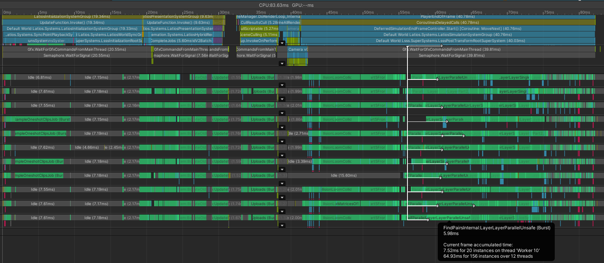

You’ll notice that I forced some sync points at the end of the frame to get
better views of my jobs. But even without those sync points, I still had 30
milliseconds of waiting on worker threads at the beginning of each frame. And
this job was problematic. There are lots of instances, as I run it multiple
times against various separate layers.

Here’s the thing about these tests. I don’t care what the spawner collides with
or how many things collide with it. I just want to know if it collides with
anything. For each spawner, once I detect a single hit, I don’t need to check
another, potentially saving a bunch of checks. So I tried a modified version of
FindPairs with early-outs.

Once again, it didn’t help.

Well… it was weird.

The combined thread time went down by 15 ms, but there was one thread that took
38 ms. I’m also running with 2 threads per CPU core which means comparing total
times between single-threaded and multi-threaded workloads can be deceptive. But
the single-threaded latency was definitely a problem.

Alright. I clearly wasn’t understanding the problems going on. It was time to
get some real numbers. I added a whole bunch of counters that would report
something like this:

>   FindPairs Self Sweep stats for layer Spawn at bucket index 15 and count 1202

>   Hits: 3958, inner loop enters: 1196, inner loop tests: 48092, inner loop run
>   (min, max): (0, 95)

Confession time. These numbers really caught me off guard.

First, the percentage of hits encountered in the inner loop is surprisingly
small, typically ranging between 1% and 10%. For a long time leading up to this
investigation, I thought the inner loop branch was difficult for the branch
predictor to predict. But with such a low hit rate, it actually guesses misses
consistently. That’s why my counter-based solution wasn’t as clever as I
thought. Good thing I did this first!

Second, that is **way too many** iterations in the inner loop.

This is the problem with SAP algorithms. They generate lots of false positives
in the inner loop. We mitigated some of that with multi-boxing, and compensated
by micro-optimizing the loop. But in the end, we still run into scaling issues.
Most people give up on SAP at this point and switch to fully fixed grids or BVH
implementations.

I see this as an opportunity. If we find a way to get that iteration count down,
we can do a lot better than 5X of the naïve implementation we started from!

## Morton…

The reason our inner loop count is so high is that each AABB overlaps with quite
a few others if you only consider the X-axis. What if we could consider Y and Z
as well?

If you were thinking we are going to switch to a full 3-axis sweep and prune,
you don’t understand the problem. A full 3-axis implementation still has to
iterate through all the elements along a single axis at a time. Just instead of
testing the other two axes on the spot using SIMD, it does some random access
write into a table and repeats the algorithm for all three axes. Single axis
pruning is always faster as long as you know what you are doing.

*Disclaimer: I am aware of an approach that uses 3-axis sweep and prune except
it is fully incremental in that it only checks elements which switch orders in
the sorted lists. That approach is very use-case specific and doesn’t really fit
well with what we are doing.*

But what if we could combine all three axes into a single axis?

Enter space-filling curves, which can do just that. I chose Morton curves, which
interleave the bits of the axes into a single value. This curve forms a bunch of
zigzags through 3D space, so it is sometimes referred to as *z-order curves*.
Pierre Terdiman implemented this a long time ago, and then discarded it because
it was slow. Old forum posts show complaints that computing Morton codes
(interleaving the bits) was expensive. We’ve come a long ways since then. We
have much faster algorithms for computing these codes. Perhaps this technique
was ahead of its time…

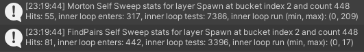

RIP

Turns out space-filling curves are even better at snaking through unwanted
colliders compared to a single axis. This has nothing to do with the CPU
architecture or memory or any of that. For our data, it is objectively worse.
And I tested this on LSSS which I think is pretty representative of a real use
case where this sort of thing matters.

I could investigate this space more, but it doesn’t seem very promising anymore.
Time to move on.

## Batching…

Perhaps we could borrow an idea from our last optimization adventure, where we
had batch bounds to potentially skip work in frustum culling. If we could find
batch bounds along Y and Z that didn’t intersect our `current` bounds, perhaps
we could save a few iterations.

I found the most optimal to be batches of 8 at a time. With higher batch sizes,
barely anything was skipped. And with lower batch sizes, the cost of testing the
batch bounds added up too fast.

Here’s what the cross bucket for the spawners tested against themselves look
like. Note that while cross bucket is one of the least populated buckets for
bullet and ship layers, it is 5 times more populated than any other bucket for
spawners. Everything has to check against this cross bucket, which is why
spawners perform so badly.

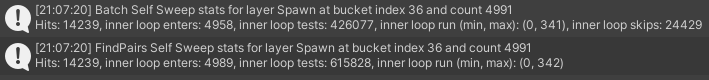

We skipped about 30% of the batches, at the cost of performing one additional
bounds test for each batch of 8, which is a 12.5% overhead. That meant we stood
to gain about 20% performance improvement. And we did…

When safety checks are on.

As soon as we turn safety checks off, this algorithm performs a lot worse. With
a 30% chance of skipping a batch, the branch predictor absolutely struggles.
Plus, the new loop for iterating over the elements inside a batch make it a lot
harder for the CPU to figure out what is going on. Remember, we have already
obtained a 3X speedup over the naïve algorithm just from low-level
optimizations. When we break some of that, we are naturally going to be slower,
even if we do a little less work.

If we want to take FindPairs to the next level, we need something that can cull
at least 50% of the inner loop iterations using an O(n) algorithm.

## Hope

Let’s step back for a bit and refresh ourselves on how our algorithm works. We
have a bunch of AABBs sorted by their `xmin`. For each AABB, there are `i` other
AABBs whose `xmin` are less than the current AABB’s `xmax`. In this case, `i`
represents the number of elements in an interval. When you sum up all the
intervals for all the AABBs, you get the number of inner loop iterations. Our
problem is that we have on average 100 elements per interval, making our
algorithm O(100 \* n).

Technically, there’s a different interval with a different set of AABBs with
each axis. We only concern ourselves with the x-axis interval. The reason we
picked x is because a lot of games like to spread things out along the x-axis,
which in turn increase the interval sizes of y and z. For side-scrollers, a
vertical line (all points on the line have the same x-axis value) is going to
cross way fewer objects than a horizontal line, which means x-axis intervals
will be much smaller. Side-scrollers also don’t typically have enough elements
to tax FindPairs as is. For top-down games and even large open world games,
things still tend to be spread out more along the x and z axis than the y axis.
LSSS is actually one of the few types of games where x, y, and z are all equally
used.

Finding the common AABBs within two intervals along two different axes would
certainly yield a much smaller inner loop count. However, you can’t find the
common AABBs without iterating through each axis interval and performing some
matching algorithm, right? That would involve iterating through each interval of
each axis, which takes us back to our O(100 \* n).

In researching this topic, I found a research paper by Gabriele Capannini and
Thomas Larsson which claimed to compute the intersection of intervals on two
axes in O(n) time. I was intrigued!

So before investigating any further, we can test right now how much this would
reduce our inner loop count by. We do that by counting the number of inner loop
iterations in which the AABBs overlap along the z-axis.

| Count      | Inner loop enters | Inner loop tests | Z overlaps | Full overlaps | Average non-zero interval size | Average z overlaps per non-zero interval  | Possible % Reduction |
|------------|-------------------|------------------|------------|---------------|--------------------------------|-------------------------------------------|----------------------|
| 10         | 3                 | 6                | 0          | 0             | 2.0                            | 0.0                                       | 100.0                |
| 20         | 9                 | 35               | 1          | 1             | 3.9                            | 0.1                                       | 97.1                 |
| 50         | 25                | 232              | 26         | 3             | 9.3                            | 1.0                                       | 88.8                 |
| 100        | 68                | 863              | 164        | 21            | 12.7                           | 2.4                                       | 81.0                 |
| 200        | 160               | 2843             | 404        | 75            | 17.8                           | 2.5                                       | 85.8                 |
| 500        | 435               | 22788            | 3407       | 568           | 52.4                           | 7.8                                       | 85.0                 |
| 1000       | 897               | 77627            | 15327      | 3028          | 86.5                           | 17.1                                      | 80.3                 |
| 2000       | 1870              | 343446           | 61310      | 10435         | 183.7                          | 32.8                                      | 82.1                 |
| 5000       | 4752              | 2077742          | 336307     | 58505         | 437.2                          | 70.8                                      | 83.8                 |
| 10000      | 9626              | 8319476          | 1388963    | 226990        | 864.3                          | 144.3                                     | 83.3                 |
| 20000      | 19522             | 33368891         | 5664376    | 965329        | 1709.3                         | 290.2                                     | 83.0                 |
| 50000      | 49236             | 207242642        | 34476303   | 5682409       | 4209.2                         | 700.2                                     | 83.4                 |
| LSSS Cross | 5138              | 627505           | 65569      | 13961         | 122.1                          | 12.8                                      | 89.6                 |

That’s a minimum 80% reduction, and nearly 90% for our real-world LSSS test
case!

This is promising! Let’s hope this paper delivers!

*A paper read later…*

Well, it delivers. There’s just one problem.

Rars!

I’ve read a lot of research papers. I don’t understand a lot of them as many
tend to use an obtuse language. But I do know that researchers in performance
computing have this weird tunnel vision habit of optimizing for one particular
hardware feature and ignoring the others. This paper is no exception.

The hardware feature they utilize heavily is bitfields, which we explored in our
last adventure. Their trick is similar to what we did with exposed skeleton
bounds.

As for the Rars, well, a lot of them come from the fact that they store metadata
between two sorted axes. But rather than store that metadata in order of one of
the axes, they store it in a third ordering which would map to the input order
of BuildCollisionLayer.

After their first paper, the authors have investigated multi-threaded versions
of the algorithm. But we have our own multi-threading using multi-box which can
also parallelize pair processing, so I am going to ignore those papers.

There’s a lot of gotchas and pitfalls, and we may not see any performance
improvements. But there’s also the chance it could be really good. The only way
to find out is to implement it, with some of our own hardware-aware flavors
mixed in.

## Dual Wielding

If you’ve been following along with this series, and decided to stop and read
the paper for yourself, one of the things that might have seemed weird to you is
that its sweep algorithm is quite different. In our single-axis sweep, for each
AABB, we race ahead along the x axis to find all the other AABBs whose min x
value lies between our current AABB’s min and max x values. For the sake of
simplifying terms, we’ll refer to the min x value as the *start*, the max x
value as the *end*, and the range between *start* and *end* as the *interval*.
Using these new terms, we say that in our single axis algorithm, for each AABB,
we find all other AABBs that start within its interval.

The dual axis algorithm flips this inside out. Each AABB tries to find all other
AABBs whose interval it starts inside of. This means that as we iterate forward
through the array, we are always looking backward. But intervals are of
different sizes, and we sort by starts only, not ends. The AABBs whose interval
the current AABB is inside of may not be all adjacent to each other. To
compensate for this, the dual axis algorithm uses a sorted axis array where the
starts and ends are treated as separate nodes sharing an ID. When the start for
a given ID is encountered, a bit in a bit array is marked. When the end for that
same ID is encountered, the bit is cleared. But before an AABB’s start gets
marked, the algorithm analyzes all the other set bits. Those bits happen to
represent all the other intervals the current AABB starts inside of.

There are ways to search and iterate through set bits in a bit array quickly.
But such methods aren’t as fast as iterating through adjacent elements in an
array. So far, the single axis algorithm’s approach is going to be faster.

The trick to the dual axis approach is how the IDs get assigned. Rather than
assign the IDs based on the order of starts along the x axis, the IDs get
assigned based on the order of the AABBs min z values, or *z starts*. Now let’s
imagine that along the z axis, we had a *range* for each AABB. A *range*
contains the lowest and highest IDs of AABBs that intersect with the given AABB
along that axis. Notice I use the term *intersect* here. That’s because rather
than only looking forward or backwards, we have to look in both directions. But,
we only need the extreme values in each direction, and that opens the door for a
few tricks.

To get the extreme forward value or max of our range, we simply need to know how
many z min values in our ordered array came before our z max value. If our min
and max z values are separate nodes in a sorted array, then we can calculate all
range max values in a single O(n) pass through the array. For the extreme
backward value, we can use the bit array trick of marking IDs when we find their
z min and clearing them when we find their z max. Then all we have to do is keep
track of the lowest set bit while processing any given z min. If we use IDs
sorted by z min, then the lowest set bit will either increase or stay the same
after every z max clear. So once again this is a single O(n) pass for assigning
the range min values for all AABBs as well as a combined O(n) total for whenever
the lowest set bit gets cleared and we need to search for the next one.

But there’s one more trick. In our last adventure, I introduced a special CPU
instruction which could count the number of bits in a 64 bit integer. This time,
I’m going to introduce an instruction which reports the first bit index in a 64
bit integer that has a ‘1’. That instruction is called *trailing zero count*
often abbreviated in assembly as `tzcnt`. We can actually iterate through all
indices of set bits in a bit array by copying 64 bits as an integer, invoking
trailing zero count, processing the returned index, and then clearing the bit at
that index. Repeat that until all the bits are cleared, in which case trailing
zero count will return 64 (remember the max index is 63 because it is zero-based
indexing). We’ll need this technique in full along our x axis later, but for now
we only need to invoke trailing zero count whenever we are searching for the
next lowest set bit and stop once we find something.

*Side Note: If you read the paper, you might have seen them use a bit tree which
they called a “succinct tree”. But due to the way the bits get distributed, the
parent nodes end up being nearly all set with ‘1’s and it is faster to just
brute force through all ‘0’ leaves. Therefore, we forego the tree concept and
use a bit array instead.*

And with that, it is time I introduce the range generation logic.

```csharp
// This array stores the sorted orders of z mins and z maxes.
// The integer at each index represents either of the following:
// For a z min, it is the index of the AABB sorted by x mins.
// For a z max, it is the index + AABB_count of the AABB sorted by x mins.
// Therefore, a z max can be differentiated from a z min by comparing it to
// the AABB count.
[ReadOnly] public NativeArray<uint> zToXMinsMaxes;
// This array stores the sorted orders of x mins and x maxes,
// using the same convention as the previous array.
// Integers still correlate to indices of AABBs sorted by x mins.
[ReadOnly] public NativeArray<uint> xs;

// This is the array we are used to, sorted by x mins.
[ReadOnly] public NativeArray<float4> minYZmaxYZs;
// Same for this.
[ReadOnly] public NativeArray<Entity> entities;
// This is our result.
public NativeList<EntityPair> overlaps;

struct ZRange
{
    // This is the index sorted by z mins, not x mins.
    public int index;
    // This is the extreme backwards value using z axis indexing
    public int min;
    // This is the extreme forwards value using z axis indexing
    public int max;
}

public void Execute()
{
    Hint.Assume(zToXMinsMaxes.Length == xs.Length);
    Hint.Assume(minYZmaxYZs.Length == entities.Length);
    Hint.Assume(minYZmaxYZs.Length * 2 == xs.Length);

    var zRanges = new NativeList<ZRange>(minYZmaxYZs.Length, Allocator.Temp);
    zRanges.ResizeUninitialized(minYZmaxYZs.Length);

    var zBits = new NativeList<BitField64>(minYZmaxYZs.Length / 64 + 2, Allocator.Temp);
    zBits.Resize(minYZmaxYZs.Length / 64 + 2, NativeArrayOptions.ClearMemory);

    {
        int minBit           = 0;
        int zminRunningCount = 0;
        for (int i = 0; i < zToXMinsMaxes.Length; i++)
        {
            if (zToXMinsMaxes[i] < minYZmaxYZs.Length)
            {
                ref var range    = ref zRanges.ElementAt((int)zToXMinsMaxes[i]);
                range.index      = zminRunningCount;
                range.min        = minBit;
                ref var bitField = ref zBits.ElementAt(zminRunningCount >> 6);
                bitField.SetBits(zminRunningCount & 0x3f, true);
                zminRunningCount++;
            }
            else
            {
                ref var range    = ref zRanges.ElementAt((int)(zToXMinsMaxes[i] - (uint)minYZmaxYZs.Length));
                range.max        = zminRunningCount;
                ref var bitField = ref zBits.ElementAt(range.index >> 6);
                bitField.SetBits(range.index & 0x3f, false);
                if (range.index == minBit)
                {
                    while (minBit <= zminRunningCount)
                    {
                        var scanBits = zBits.ElementAt(minBit >> 6);
                        var tzcnt    = scanBits.CountTrailingZeros();
                        if (tzcnt < 64)
                        {
                            minBit = (minBit & ~0x3f) + tzcnt;
                            break;
                        }
                        minBit = (minBit & ~0x3f) + 64;
                    }
                    minBit = math.min(minBit, zminRunningCount + 1);
                }
            }
        }

        //if (minBit >= minYZmaxYZs.Length)
        //    return;
    }
```

In this implementation, I combined a bunch of the loops into a single pass
through all the elements, branching between z mins and z maxes, and randomly
writing the range extremes ordered by the x axis. That all sounds expensive, but
there are relatively few iterations of these compared to the inner loop
iterations of our single axis algorithm. This part of the algorithm won’t be the
focus of any more optimization in this adventure. It is fast enough.

However, before I move on, I should at least explain some of the bit tricks
happening, as they will be important later. First, there’s the type `BitField64`
which wraps `ulong` and provides some convenience functions for treating all 64
bits in the `ulong` as individual boolean bits. Second, because our bit array is
actually an array of `BitField64`, for any given index in the bit array, the
lowest 6 bits represent the bit in a selected `BitField64` element, while the
rest of the bits index the array of `BitField64` elements. This is why to index
the array we shift right by 6, and to index the `BitField64` we mask by `0x3f`
which sets all but the lowest 6 bits to 0s. And lastly, there’s a couple of
places where I mask by `~0x3f` to clear out the lowest 6 bits and replace them
with the `tzcnt`.

So now given an x min ordered index, we can look up the z start, and the z
extreme intersects. But what do we do with that?

Remember, our x axis algorithm also used bit arrays, and we were marking the
bits based on z start order, even though the set bits themselves represented x
intervals. Well, now when we encounter an x start, not only do we have the set
start bits ordered along the z axis, we also have a range along the z axis where
we know the current AABB intersected along the z axis. Therefore, we know that
any set bits outside of that range did not intersect along the z axis, so we can
skip them. That’s where the potential speedup comes from.

When we encounter an x start, we look up the range and then perform trailing
zero count iteration over the set bits within that range and then perform our
normal inner loop logic on each element corresponding to the set bit.

Here’s what one of my early attempts at that looked like:

```csharp
var zToXs = new NativeArray<int>(minYZmaxYZs.Length, Allocator.Temp, NativeArrayOptions.UninitializedMemory);

for (int i = 0; i < xs.Length; i++)
{
    if (xs[i] < minYZmaxYZs.Length)
    {
        var range       = zRanges[(int)xs[i]];
        int minBitfield = range.min >> 6;
        int maxBitfield = range.max >> 6;

        for (int k = minBitfield; k <= maxBitfield; k++)
        {
            var bitField = zBits[k];
            if (k == minBitfield)
            {
                int minBit = range.min & 0x3f;
                if (Hint.Likely(minBit > 0))
                    bitField.SetBits(0, false, minBit);
            }
            int maxBit = math.select(63, range.max & 0x3f, k == maxBitfield);

            for (var j = bitField.CountTrailingZeros(); j <= maxBit; )
            {
                var currentIndex = (int)xs[i];
                var otherIndex   = zToXs[j + 64 * k];

                bitField.SetBits(j, false);
                j = bitField.CountTrailingZeros();

                float4 less = math.shuffle(minYZmaxYZs[currentIndex],
                                            minYZmaxYZs[otherIndex],
                                            math.ShuffleComponent.RightZ,
                                            math.ShuffleComponent.RightW,
                                            math.ShuffleComponent.LeftZ,
                                            math.ShuffleComponent.LeftW
                                            );
                float4 more = math.shuffle(minYZmaxYZs[currentIndex],
                                            minYZmaxYZs[otherIndex],
                                            math.ShuffleComponent.LeftX,
                                            math.ShuffleComponent.LeftY,
                                            math.ShuffleComponent.RightX,
                                            math.ShuffleComponent.RightY
                                            );

                if (Hint.Unlikely(math.bitmask(less < more) == 0))
                {
                    overlaps.Add(new EntityPair(entities[currentIndex], entities[otherIndex]));
                }
            }
        }

        ref var currentBitfield = ref zBits.ElementAt(range.index >> 6);
        currentBitfield.SetBits(range.index & 0x3f, true);
        zToXs[range.index] = (int)xs[i];
    }
    else
    {
        var     range           = zRanges[(int)(xs[i] - minYZmaxYZs.Length)];
        ref var currentBitfield = ref zBits.ElementAt(range.index >> 6);
        currentBitfield.SetBits(range.index & 0x3f, false);
    }
}
```

The outer loop iterates through each AABB. In the case we have a start, we
explore a middle loop which iterates `BitField64` elements, and inside that is
an inner loop which does `tzcnt` iteration. One thing that might look dangerous
to the studious is how the `zToXs` array is being handled. We have a mapping
from x ordering to z ordering via the `zRanges` array which we use to set the
bits using z ordering. But when we find a set bit to then perform the full AABB
test, we need a mapping back from z ordering to x ordering. We populate a single
index in the `zToXs` array whenever we set a bit in z ordering, effectively
building this mapping as we go and only ever reading already mapped values.

Anyways, that’s our algorithm. How does it perform for 5000 test AABBs?

```
Optimal Order Sweep: 3.477 milliseconds
Dual Sweep: 6.055 milliseconds
```

NOOOOOOOO!

## The Good, The Bad, and The Ugly

What could possibly be going wrong?

Well, the first thing I did was gather Intel.

```
Optimal Order Inner Loop Tests: 2077742
Dual Sweep Inner Loop Tests: 1133472
```

Wait, what happened to our 80 – 90% inner loop reduction?

The answer to that lies in the max zRange:

| Count | Min Z-Range | Z Order Index | Max Z-Range |
|-------|-------------|---------------|-------------|
| 1000  | 12          | 578           | 890         |
| 2000  | 1           | 442           | 1949        |
| 5000  | 0           | 3433          | 4988        |

Any AABB between the Z Order Index and Max Z-Range starts in the Z interval of
the current AABB. All those AABBs are for sure overlapping with the current AABB
along the Z axis.

However, the Min Z-Range is just the lowest indexed AABB the current AABB starts
inside along the Z axis. Subsequent AABBs may not stretch out as far, but still
get included in our Z-Range. All it takes is one wide AABB along the Z axis and
a bunch of false positives get wrapped up in the Z-Range.

However, objects in LSSS are roughly evenly sized. So how many false positives
get wrapped up there?

8

Yes 8

That’s all. The Min Z-Range and Z Order Index were always single digits apart.
Crazy, right? LSSS seems to be the best-case scenario for this algorithm. And
our simplified tests might be close to the worst case scenario.

What this all means is that there is still hope for this algorithm. We haven’t
spent much time optimizing it. So if we can get performance of this test on par
with Optimal Order, than LSSS could still see a 5X performance improvement!

But what even is the bottleneck? We have some Rars stuff. We also have a hot
inner loop. We have bitwise operations and SIMD operations. It isn’t obvious
looking at the C\# how we could reduce anything, which means we need a new tool.

For this adventure, that tool is VTune.

## A New Tune

VTune is a tool built by Intel for deep performance analysis. I happen to test
on an old Intel processor. It does not work on AMD processors (you can use AMD’s
uProf instead, but the counters are trickier to reason about). It also is not
free if you use it professionally at a profitable studio. But if you are a
hobbyist like me and have an Intel CPU, it is totally worth the download.

Most tutorials for VTune introduce its Hotspot Analysis tools, which helps
people find out *which* code is slow. However, we already know that. It is our
inner loop of our algorithm. Instead, we can jump straight into the
Micro-Architecture Analysis. Start VTune with elevated privileges so it can get
low-level access to special counters. Make a new project, start a
Micro-Architecture Analaysis, and point VTune to the Unity process. I also like
to set the CPU sampling interval to 0.1 milliseconds. Then what I do is start
capturing paused, then start a performance test in Unity of just the algorithm
variant in question using 5000 AABBs for 5000 iterations. As soon as Unity
starts processing, I switch back to VTune and start capturing, then stop it as
soon as Unity finishes. Once VTune is done processing, I immediately switch to
the Bottom-Up view and select Unity as the process again.

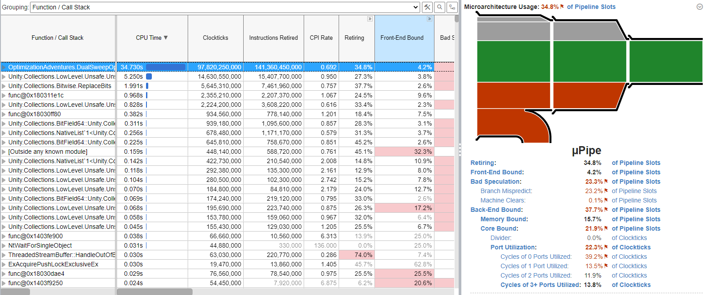

There are two key aspects we care about.

First is the Instructions Retired count. “Retiring” is VTune’s term for
finishing an instruction. The less instructions retired, the less work is being
done. We want this count to be lower.

Second, is the diagram and stats on the right. The height of the green section
relative to the height of the diagram is our efficiency. We aren’t doing very
well here. The gray sections show where we are losing efficiency, but shouldn’t
be our biggest priority to fix. The red sections are where we are losing lots of
efficiency, suggesting major issues.

Good news! Rars is gray.

It seems our biggest culprits are port utilization and bad speculation. Port
utilization suggests that we have some weird data dependency issue in our code
that is causing the CPU to stall. Bad speculation is work that is being thrown
away due to branch mispredictions, and corresponds to the red pipe that detours
to the bottom of the diagram.

But of course, this means nothing without any concept of a norm. So here’s what
Optimal Order looks like:

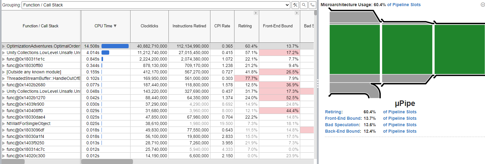

Whoa! Look at that fat green bar! And look at the instructions retired!

Alright. Now we know what we are up against. If we want to match Optimal Order,
we need to match these stats!

The first thing I investigated was the branch mispredictions. After some
experimentation, I figured out that the mispredictions were actually coming from
the innermost loop control. The CPU was having a hard time figuring out how many
iterations happened for a single BitField64. There’s usually only about 4 or 5
bits set out of 64 bits, meaning the CPU was guessing wrong about 20 – 25% of
the time. I tried making it branchless by using a bitfield hierarchy like the
original paper did (except this was only 2-level). But looking at the Burst
inspector, that doubled the instructions in the inner loop. It wasn’t worth it,
so I gave up on solving branching.

Then I looked into what could cause the data dependency issue. I looked up Intel
spec sheets looking for instructions that could have latency issues. And I found
one: `tzcnt`.

Apparently on some Intel processors, `tzcnt` takes three times more cycles than
most other instructions. Of course, the way our code is written, pretty much
everything in the inner loop immediately depends on the result of `tzcnt`. But
we’re smart. We can fix that. Let’s just make `tzcnt` compute the next
iteration’s value before the SIMD AABB comparison block. That way, by the time
the CPU gets to the next iteration, the result will be ready.

Oh yeah. I forgot to mention, modern CPUs have their own parallelism within a
single core handling a single thread. It is called “superscalar architecture”.
And combined with out-of-order execution, a CPU can schedule different types of
operations at the same time at optimal times. But it still needs to respect data
dependencies. So by increasing the gap between when we calculate something and
when we need it, we can let the CPU do latency hiding. Remember that term from
back in Adventure 3?

After correcting the issue and further trying to improve instruction count of
the inner loop in the Burst Inspector, I came up with this loop:

```csharp
if (xs[i] < minYZmaxYZs.Length)
{
    var zBitArray = zBits.AsArray();

    int currentIndex = (int)xs[i];
    var currentYZ    = minYZmaxYZs[currentIndex];
    var range        = zRanges[currentIndex];
    int minBitfield  = range.min >> 6;

    int bitfieldIndex  = minBitfield;
    var bitfield       = zBits[bitfieldIndex];
    int bitIndex       = range.min & 0x3f;
    bitfield.Value    &= ~((1ul << bitIndex) - 1);
    bool advance;

    bitIndex = bitfield.CountTrailingZeros();
    while ((bitfieldIndex << 6) + bitIndex <= range.max)
    {
        advance         = bitIndex > 63;
        bitIndex       &= 0x3f;
        bitfield.Value &= ~(1ul << bitIndex);

        if (Hint.Unlikely(advance))
        {
            bitfieldIndex++;
            bitfield = zBitArray[bitfieldIndex];
            bitIndex = bitfield.CountTrailingZeros();
            continue;
        }

        var otherIndex = zToXs[(bitfieldIndex << 6) + bitIndex];

        // High latency here, so move it in front of simd
        bitIndex = bitfield.CountTrailingZeros();

        float4 less = math.shuffle(currentYZ,
                                    minYZmaxYZs[otherIndex],
                                    math.ShuffleComponent.RightZ,
                                    math.ShuffleComponent.RightW,
                                    math.ShuffleComponent.LeftZ,
                                    math.ShuffleComponent.LeftW
                                    );
        float4 more = math.shuffle(currentYZ,
                                    minYZmaxYZs[otherIndex],
                                    math.ShuffleComponent.LeftX,
                                    math.ShuffleComponent.LeftY,
                                    math.ShuffleComponent.RightX,
                                    math.ShuffleComponent.RightY
                                    );

        if (Hint.Unlikely(math.bitmask(less < more) == 0))
        {
            overlaps.Add(new EntityPair(entities[currentIndex], entities[otherIndex]));
        }
    }

    ref var currentBitfield = ref zBits.ElementAt(range.index >> 6);
    currentBitfield.SetBits(range.index & 0x3f, true);
    zToXs[range.index] = (int)xs[i];
}
```

And here’s what Burst generates for the inner loop. Sorry for the screenshot,
but having the branch arrows and inline code makes it much easier to understand
what is going on, and I don’t have the tools to replicate it.

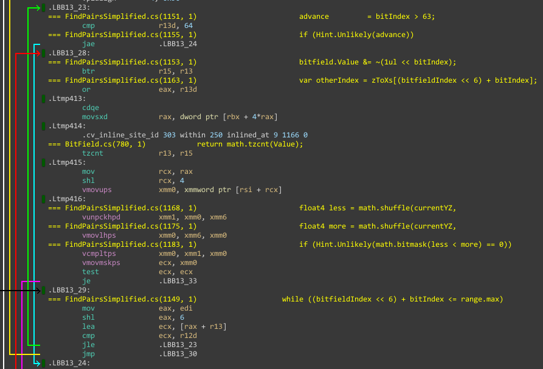

From this, we can see `r15` holds the `BitField64`, and `r13` holds the `tzcnt`
result. There’s a new instruction called `btr` which clears out the bit in `r15`
with the index specified by `r13`. You probably wouldn’t guess that would happen
from the associated C\# code, but Burst knows what is going on here with the
bitwise operations. In fact, we can even see it use a bitwise OR operation to
combine `r13` with our `bitfieldIndex` in `eax`, even though the C\# code
specified an ADD operation. But Burst has even more tricks up its sleeve here
when we explore how it handles jumping from one `BitField64` to the next.


Burst generated a whole new mini loop for iterating empty `BitField64`
instances. As bizarre as it may seem, this reduces the number of instructions
processed overall. And it would be quite challenging to represent in C\#, so
this intelligence from Burst is quite welcome.

Here’s the VTune report for this new version:

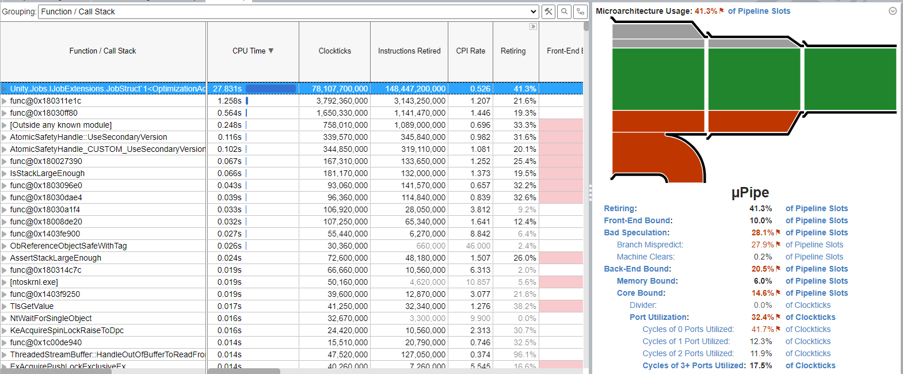

We’re only 10 billion instructions more than Optimal Order (`UnsafeList` and
other functions got wrapped up in this version). We also cut off a third of our
backend core problems. And somehow our memory access improved too. But our
branch prediction got worse. Actually, I think we mispredicted the same amount
of times. But given we are running less instructions total, the ratio increased.

Optimal Order takes about 3.5 milliseconds to complete, sometimes 3.3 on a good
run. And now our Dual Sweep Optimized takes 4.5 milliseconds. It is still
slower, but not by as much. With a potential 5X boost in the ideal case, this
could still be 3X faster.

At this point, I considered accepting it. I could add some logic in the z
ordered pass to detect the size of intervals, and if after that pass the
intervals were too large, I would fall back to Optimal Order.

Instead, I took a vacation. I did some patch releases for Kinemation. I did an
annual game jam with some friends.

## The Comeback

A month had passed. Between that time, I had performed Windows Updates and
upgraded Burst version to the 1.8 preview. I started thinking about this problem
again. I was thinking about how I could further reduce the instructions
executed. Was there a way I could use SIMD? Could unrolling work? What would
happen if I tried to mimic Pierre Terdiman’s solution exactly? With that last
question in mind, I went back to CoderCorner and reread the parts about
unrolling. In the past, I was hesitant to try it because it felt like it was
really dependent on lots of iterations in the inner loop. But now I know that is
exactly what we have, even when there are only 1000 AABBs.

Unrolling, like the sign flip trick and sentinels, was supposed to reduce the
number of instructions executed. I knew from Dual Sweep that less instructions
overall could make a big difference. But for the single axis, no single
optimization could pose a dent. But maybe just one optimization caused the CPU
to get hung up on some dependency issue? Maybe we just have to throw all the
optimizations at it all at once?

However, there’s some weird indexing gotchas when combining unrolling and
sentinels, so I only implemented a combo of sign flipping and sentinels and a
combo of sign flipping and unrolling. Then I ran the benchmark across all the
algorithms. Here’s what happened:

-   Sign Flipping was consistently faster than Optimal Order
-   Sign Flipping + Sentinels was consistently faster than just Sign Flipping
-   Sign Flipping + Unrolling was consistently slower than Optimal Order

Well, that was a plot twist! I don’t know if it was the Windows Update, the new
Burst, both, or neither. But somehow the very first optimizations I tried at the
beginning of this adventure started doing things as I would have expected. I
don’t think I will ever figure out why, but I guess now is the time to explain
how they work.

Optimal Order does a comparison like this:

```
a.max.y < b.min.y ||
a.max.z < b.min.z ||
b.max.y < a.min.y ||
b.max.z < a.min.z ||
```

If we ignore the y and z components and just focus on the min and max
relationships, we get this:

```
a.max < b.min ||
b.max < a.min
```

Now watch what happens with this sequence of algebra:

```
a.max < b.min ||
b.max < a.min

a.max < b.min ||
a.min > b.max

 a.max <  b.min ||
-a.min < -b.max

-(-a.max) <   b.min ||
  -a.min  < (-b.max)
```

That final form might look strange, but if you give it some thought, it has some
useful properties.

1.  All the `a` values are on the left, and all the `b` values are on the right.
2.  The comparison operator is identical for all cases. `a` and `b` do not have
    to be blended together.
3.  The `max` values of all AABBs are negated, which can be done in advance.
4.  The values of `a` are additionally negated. This can be done in the outer
    loop.

With this setup, all the rearranging in SIMD registers is no longer necessary.
We can just load up the values from `b`, and compare them directly to a negated
`a` sitting in a register with its min and max swapped.

Here’s the code that does that:

```csharp
[BurstCompile(OptimizeFor = OptimizeFor.Performance)]
public struct FlippedSweep : IJob
{
    [ReadOnly] public NativeArray<float>  xmins;
    [ReadOnly] public NativeArray<float>  xmaxs;
    [ReadOnly] public NativeArray<float4> minYZmaxYZsFlipped;
    [ReadOnly] public NativeArray<Entity> entities;
    public NativeList<EntityPair>         overlaps;

    public void Execute()
    {
        Hint.Assume(xmins.Length == xmaxs.Length);
        Hint.Assume(xmins.Length == minYZmaxYZsFlipped.Length);

        for (int i = 0; i < xmins.Length - 1; i++)
        {
            float4 current = -minYZmaxYZsFlipped[i].zwxy;

            for (int j = i + 1; Hint.Likely(j < xmaxs.Length && xmins[j] <= xmaxs[i]); j++)
            {
                if (Hint.Unlikely(math.bitmask(current < minYZmaxYZsFlipped[j]) == 0))
                {
                    overlaps.Add(new EntityPair(entities[i], entities[j]));
                }
            }
        }
    }
}
```

And here’s Burst:

```asm
=== FindPairsSimplified.cs(380, 1)                    if (Hint.Unlikely(math.bitmask(current < minYZmaxYZsFlipped[j]) == 0))
        vcmpltps          xmm0, xmm7, xmmword ptr [rdi + 8*rbx]
        vmovmskps         eax, xmm0
        test              eax, eax
        je                .LBB6_2
```

4 instructions!

Gone are the two rearrangement instructions. And the load got merged into the
comparison. At this point, we need to look at the more complete inner loop with
loop control to see where else we can improve.

```asm
.LBB6_6: ...
.Ltmp70:
        vmovss            xmm0, dword ptr [r13 + 4*r14]
.Ltmp71:
        vucomiss          xmm0, dword ptr [r12 + 2*rbx]
        jb                .LBB6_9
=== FindPairsSimplified.cs(380, 1)                    if (Hint.Unlikely(math.bitmask(current < minYZmaxYZsFlipped[j]) == 0))
        vcmpltps          xmm0, xmm7, xmmword ptr [rdi + 8*rbx]
        vmovmskps         eax, xmm0
        test              eax, eax
        je                .LBB6_2
=== FindPairsSimplified.cs(377, 1)                for (int j = i + 1; Hint.Likely(j < xmaxs.Length && xmins[j] <= xmaxs[i]); j++)
        add               rbx, 2
        dec               rsi
        jne               .LBB6_6
```

The first three instructions are the `xmins[j] <= xmaxs[i]`. Burst has decided
to count `j` by 2 for some reason. It also decided that instead of comparing `j`
to the array length, it would store the array length in `rsi` and count down
instead. Once again, it is clever, but imagine if we didn’t have to count down?
If the first three instructions were guaranteed to break us out of the loop,
then we would save two more instructions in our loop, effectively removing a
fifth of all our instructions in the inner loop.

That’s what a sentinel does. It acts as an extra AABB that can never be
overlapped along the x axis because its `min.x` is at positive infinity. This
would mean that we would have to filter for AABBs with a `max.x` of positive
infinity. Plus, we have to account for it in our multi-box indexing. But the
performance may be worth these tradeoffs.

```csharp
[BurstCompile(OptimizeFor = OptimizeFor.Performance)]
public struct SentinelSweep : IJob
{
    [ReadOnly] public NativeArray<float>  xmins;
    [ReadOnly] public NativeArray<float>  xmaxs;
    [ReadOnly] public NativeArray<float4> minYZmaxYZsFlipped;
    [ReadOnly] public NativeArray<Entity> entities;
    public NativeList<EntityPair>         overlaps;

    public void Execute()
    {
        Hint.Assume(xmins.Length == xmaxs.Length);
        Hint.Assume(xmins.Length == minYZmaxYZsFlipped.Length);

        for (int i = 0; i < xmins.Length - 2; i++)
        {
            float4 current = -minYZmaxYZsFlipped[i];

            for (int j = i + 1; Hint.Likely(xmins[j] <= xmaxs[i]); j++)
            {
                Hint.Assume(j < xmins.Length);

                if (Hint.Unlikely(math.bitmask(current < minYZmaxYZsFlipped[j]) == 0))
                {
                    overlaps.Add(new EntityPair(entities[i], entities[j]));
                }
            }
        }
    }
}

.LBB6_4:
=== FindPairsSimplified.cs(427, 1)                    if (Hint.Unlikely(math.bitmask(current < minYZmaxYZsFlipped[j]) == 0))
        vcmpltps          xmm1, xmm7, xmmword ptr [rsi]
        vmovmskps         eax, xmm1
        test              eax, eax
        je                .LBB6_8
=== FindPairsSimplified.cs(423, 1)                for (int j = i + 1; Hint.Likely(xmins[j] <= xmaxs[i]); j++)
        add               rsi, 16
        vucomiss          xmm0, dword ptr [rbx + 4*r14 + 4]
        lea               r14, [r14 + 1]
        jae               .LBB6_4
```

Sure enough. 8 instructions.

Now we have 4 instructions for comparing AABBs, 1 instruction to advance to the
next AABB, and 3 instructions for loop control. A good chunk of that is loop
control, so perhaps we could do that less often.

The idea behind unrolling is to shove multiple elements within a single
iteration of an inner loop. Let’s say we look at 4 elements at once. Instead of
4 \* 8 = 32 instructions, if we unrolled 4 elements at a time, we would have 4
\* 5 + 3 = 23 instructions.

I could have implemented that, and maybe I will explore that in a future
adventure. But at this point, I wanted to throw everything I had at the problem.
And so when I was looking at the VTune for Optimal Order, I noticed that
combined, bad speculation and frontend bottlenecks accounted for two thirds of
my lost efficiency. I knew where those came from.

When the CPU gets into our inner loop, it wants to spin in there as fast as
possible and fly through non-intersecting AABBs at mach speed. However, as soon
as the CPU discovers an actual intersection, it is as if the CPU slammed into a
wall. It has to completely stop what it is doing, load up the code for handling
the intersection, load up new memory addresses associated with the intersection,
and process it. Then once it is done, it has to go back to the inner loop, load
everything back up again, and then rev back up to mach speed.

You can make an analogy to a train, a subway, a bus, or even your own commute on
a street with stoplights. The greater the distance between stops, the more
efficient the commute becomes, and the less of an impact the stops have on the
overall time.

On modern CPUs, there is usually some trick to conditionally increment or
decrement a register without branching as far as the CPU is concerned. On x86,
one way to do this is via `adc` pronounced “add with carry”. Doing this add with
0 will cause the CPU to add 0 or 1 based on if the carry flag is set. And that
carry flag can be set by comparison tests.

So here’s the idea. What if we held a buffer of intersecting pairs and a running
index into that buffer? For every possible pair we test, we always write it to
the buffer, but only when the pair is actually intersecting will we increment
the running index, “locking in” the pair from being overwritten by the next
pair. Eventually, the buffer will fill up, and then we should process all the
pairs in the buffer. But that is infrequent, and we only have to check if the
buffer is close to full every iteration, which because of unrolling isn’t for
every AABB.

Here's what that looks like in code:

```csharp
[BurstCompile(OptimizeFor = OptimizeFor.Performance)]
public struct UnrolledSweepPoor : IJob
{
    [ReadOnly] public NativeArray<float>  xmins;
    [ReadOnly] public NativeArray<float>  xmaxs;
    [ReadOnly] public NativeArray<float4> minYZmaxYZsFlipped;
    [ReadOnly] public NativeArray<Entity> entities;
    public NativeList<EntityPair>         overlaps;

    public void Execute()
    {
        Hint.Assume(xmins.Length == xmaxs.Length);
        Hint.Assume(xmins.Length == minYZmaxYZsFlipped.Length);

        var hitCache     = new NativeArray<ulong>(1024, Allocator.Temp, NativeArrayOptions.UninitializedMemory);
        int nextHitIndex = 0;

        for (int i = 0; i < xmins.Length - 1; i++)
        {
            float4 current = -minYZmaxYZsFlipped[i].zwxy;

            float4 currentX = xmaxs[i];

            int j = i + 1;

            ulong pair  = (((ulong)i) << 32) | (uint)j;
            ulong final = (((ulong)i) << 32) | ((uint)xmins.Length);

            while (pair + 3 < final)
            {
                Hint.Assume(j + 3 < xmins.Length && j > 0);
                Hint.Assume(nextHitIndex >= 0 && nextHitIndex <= 1024);

                var nextMins = xmins.ReinterpretLoad<float4>((int)j);
                if (Hint.Unlikely(math.any(nextMins >= currentX)))
                    break;

                hitCache[nextHitIndex] = pair;
                if (math.bitmask(current < minYZmaxYZsFlipped[j]) == 0)
                    nextHitIndex++;
                pair++;

                hitCache[nextHitIndex] = pair;
                if (math.bitmask(current < minYZmaxYZsFlipped[j + 1]) == 0)
                    nextHitIndex++;
                pair++;

                hitCache[nextHitIndex] = pair;
                if (math.bitmask(current < minYZmaxYZsFlipped[j + 2]) == 0)
                    nextHitIndex++;
                pair++;

                hitCache[nextHitIndex] = pair;
                if (math.bitmask(current < minYZmaxYZsFlipped[j + 3]) == 0)
                    nextHitIndex++;
                pair++;
                j += 4;

                if (Hint.Unlikely(nextHitIndex >= 1020))
                {
                    Drain(hitCache, nextHitIndex);
                    nextHitIndex = 0;
                }
            }

            while (pair < final && xmins[(int)j] < currentX.x)
            {
                hitCache[nextHitIndex] = pair;
                if (math.bitmask(current < minYZmaxYZsFlipped[j]) == 0)
                    nextHitIndex++;
                pair++;
                j++;
            }

            if (nextHitIndex >= 1020)
            {
                Drain(hitCache, nextHitIndex);
                nextHitIndex = 0;
            }
        }

        Drain(hitCache, nextHitIndex);
    }

    [System.Runtime.CompilerServices.MethodImpl(System.Runtime.CompilerServices.MethodImplOptions.NoInlining)]
    void Drain(NativeArray<ulong> cache, int cacheCount)
    {
        for (int i = 0; i < cacheCount; i++)
        {
            ulong pair   = cache[i];
            int   first  = (int)(pair >> 32);
            int   second = (int)(pair & 0xffffffff);

            overlaps.Add(new EntityPair(entities[first], entities[second]));
        }
    }
}
```

There’s one trick to call out in this code, and that is that I am storing pairs
packed as a `ulong` so that I can write them in a single operation. I can also
update to the next pair just by incrementing the `ulong`, which increments the
second element index in the pair.

Obviously, something went wrong that caused this to be slower than Optimal
Order, but we haven’t had a performance table in a while. So here’s where we are
at:

|   |   |   |   |   |   |   |   |   |
|---|---|---|---|---|---|---|---|---|
|   |   |   |   |   |   |   |   |   |
|   |   |   |   |   |   |   |   |   |
|   |   |   |   |   |   |   |   |   |
|   |   |   |   |   |   |   |   |   |
|   |   |   |   |   |   |   |   |   |
|   |   |   |   |   |   |   |   |   |
|   |   |   |   |   |   |   |   |   |
|   |   |   |   |   |   |   |   |   |
|   |   |   |   |   |   |   |   |   |
|   |   |   |   |   |   |   |   |   |
|   |   |   |   |   |   |   |   |   |
|   |   |   |   |   |   |   |   |   |

## 

```

```

s

```

```

```

```

## 

I

```

```

```

```

## 

```

```

## The Battle of Bipartite

When integrating into LSSS, I wanted to have a side-by-side comparison. So I
built a mechanism that swapped the technique used every 5 frames. Then when
profiling, I saw a pattern where 5 frames would be faster, then 5 would be
slower, then 5 would be faster, and so on. Success, right?

Nope. It was the new algorithm that was causing the spikes.

The spikes showed up as jobs which seemed to be generating a lot more “hits”
than usual. It would always be the first bucket, so it would make one thread
take way longer than the others and cause most of the worker threads to idle.
I’ll spare you the pain, but this took a ton of time debugging, profiling, and
learning to use custom profile markers in Burst. Turns out, there were NaN
AABBs.

Where did they come from? I don’t know. That’s something I’ll investigate later.
But what I learned is that somehow the old algorithm was mostly immune to them,
but the new one wasn’t. You see, every time a NaN is involved in a comparison,
the comparison returns false. But I’ve seen Burst switch up the comparison
ordering enough times to not trust it to handle results properly with NaNs. Or
even if it does, it might stick in extra instructions to do so that I would have
to hunt down. Rather than deal with that, I decided to make an extra bucket
inside Collision Layers specifically for NaNs and then hide that bucket. The
performance regression subsided.

Now at this point, I had a new mystery. There was no perceivable performance
difference whatsoever. The frame-to-frame noise was too great. So I threw VTune
at it, and I got these results at the top:

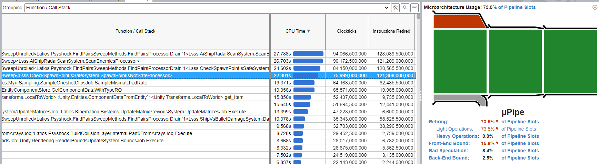

1.  With multiple threads and hyper-threading available, Optimal Order has
    better throughput according to VTune.
2.  All jobs have significantly more front-end bottlenecks with hyper-threading.
3.  Unrolled had nearly as bad of branch mispredictions as Optimal Order, and
    sometimes this came with a worse front-end leading to equivalent throughput.
4.  Unrolled requires more instructions for each job.

That last one confused me. The whole point of unrolling was to reduce
instructions. And we saw that in the tests that it really did do that. Where are
these new instructions coming from?

I checked the Burst Inspector, and didn’t see anything suspicious. The tight 6
instruction patterns showed up in the inner loop where I expected them.

Then I scrolled down through the list of functions in VTune until I stumbled
across the single-layer FindPairs for spawners. But I had to scroll through a
lot of other functions to find the Unrolled version. So for a single layer,
Unrolled was over twice as fast. Check out this throughput!

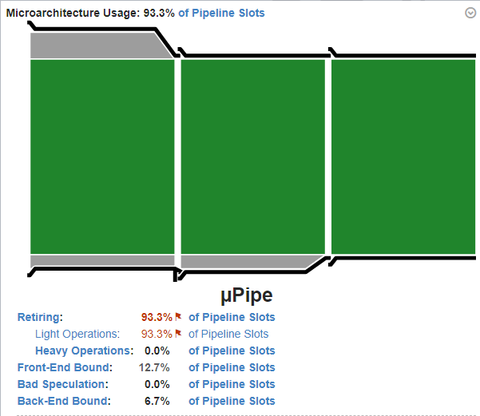

It is also less instructions, and with the increased branching efficiency and
thread sharing, it is no surprise the algorithm only got better in a
mult-threaded environment. So again, what is wrong with Bipartite?

One thing I do know, is that Unrolled and Optimal Order have different Collision
Layer input requirements, because Unrolled requires sign flipping. That’s not a
good place to be, which meant my next test was to replace Bipartite Unrolling
with Bipartite Sign Flipping. I didn’t change the name of the function in this
next VTune capture, but fortunately, VTune shows that Bipartite Sign Flipping is
a win!

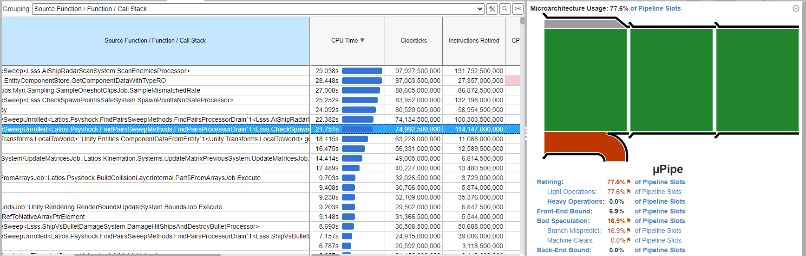

The functions are ranked by time consumed. Optimal Order radar scanning is the
top function. Then Optimal Order spawn point checks (mostly against bullets) is
the 4th. Then at 6th and 7th are the Sign Flipped equivalents.

From this point, I made Sign Flipping my reference implementation to compare
against while I continued to hunt down problems with the Unrolled.

I did learn a few things. The main one being that the tail loop was hot. Not
only that, but some of the jobs were inflating it to 15 instructions due to
register spilling. I was able to mostly fix this by using pointers for `xmins`,
which sometimes brought it down to the expected 11 instructions, but sometimes
still had a spill reload bringing the count to 12. Regardless, this improvement
closed the performance gap significantly, sometimes in favor of Unrolled. But
overall, Sign Flipping was still the champ.

While branch prediction of the Unrolled variant was always better than Sign
Flipping, sometimes VTune would show it as 0%, and sometimes as high as 22%. The
0% had nearly 100% throughput, yet it performed double the instructions as Sign
Flipping making it a loss.

At the time of writing this, I still do not understand why single layer sweeps
see such an instruction count reduction from unrolling while bipartite does not.
But while looking for clues using the assembly view of VTune, I learned
something else.

## Speed Dialing

There was a time in my life where I was smart enough to design things but not
smart enough to consider the practicalities of such designs. That time period
happened to intersect with a narrow range of our technological history where one
of the coolest things you could do when building a Rube Goldberg machine was to
have one phone speed dial another, causing it to vibrate and set off a new chain
reaction in a completely different location. Fun times!

Anyways, VTune showed that there was a significant amount of time in the `Drain`
methods for Unrolled. Yet all that method did was loop over the `Drain` and
invoke the actual processor, which showed up as a separate method in VTune. That
meant there was a not-insignificant cost to invoking the processor. And sure
enough, when I looked at Sign Flipping, it had a similar hotspot. Yet unlike
Unrolled, that cost was included in Sign Flipping’s instruction count. This
whole time I may have been comparing apples to oranges (at least for bipartite,
I verified this difference did not matter for single layer sweeps).

For each pair result, I was copying the entire `ColliderBody` of each element
into a new `FindPairsResult` along with body indices and some internal metadata.
Then I was passing that data by value into the processor. Burst was smart enough
to build the `FindPairsResult` directly into the stack, but this copying still
seemed unnecessary. And I had wanted to expose more information such as the
layers and AABBs in a result.

Instead of copying all the values, we could copy the buckets (structs with a
bunch of subarrays) as well as the pair indices and then expose the values as
properties. But despite the fact that buckets mostly consist of pointers, they
are still just as heavy as the data we’d be copying. We don’t gain anything from
constructing a new `FindPairsResult` every time.

So let’s not do that.

Instead, at the beginning of each sweep, we can create a `FindPairsResult` that
contains the buckets and extra metadata. Then, whenever we dispatch a pair, we
simply have to set the pair indices, and then pass the `FindPairsResult` as an
`in` parameter.

To give you an idea, here’s the diff:

```csharp
     public interface IFindPairsProcessor
     {
-        void Execute(FindPairsResult result);
+        void Execute(in FindPairsResult result);
     }

     [NativeContainer]
     public struct FindPairsResult
     {
-        public ColliderBody bodyA;
-        public ColliderBody bodyB;
-        public int          bodyAIndex;
-        public int          bodyBIndex;
-        public int          jobIndex;
+        public ColliderBody bodyA => m_bucketA.bodies[m_bodyAIndexRelative];
+        public ColliderBody bodyB => m_bucketB.bodies[m_bodyBIndexRelative];
+        public int bodyAIndex => m_bodyAIndexRelative + m_bucketA.count;
+        public int bodyBIndex => m_bodyBIndexRelative + m_bucketB.count;
+        public int jobIndex => m_jobIndex;

-        internal bool isThreadSafe;
+        private BucketSlices m_bucketA;
+        private BucketSlices m_bucketB;
+        private int          m_bodyAIndexRelative;
+        private int          m_bodyBIndexRelative;
+        private int          m_jobIndex;
+        private bool         m_isThreadSafe;
+
+        internal FindPairsResult(BucketSlices bucketA, BucketSlices bucketB, int jobIndex, bool isThreadSafe)
+        {
+            m_bucketA            = bucketA;
+            m_bucketB            = bucketB;
+            m_jobIndex           = jobIndex;
+            m_isThreadSafe       = isThreadSafe;
+            m_bodyAIndexRelative = 0;
+            m_bodyBIndexRelative = 0;
+        }
+
+        internal void SetBucketRelativePairIndices(int aIndex, int bIndex)
+        {
+            m_bodyAIndexRelative = aIndex;
+            m_bodyBIndexRelative = bIndex;
+        }
```

Admittedly, this is a breaking API change. But I was able to fix it with this
simple project-wide search and replace:

Search: `Execute(FindPairsResult `

Replace: `Execute(in FindPairsResult`

If you have a processor that tinkers with the result, this will still break
because the properties are read-only now. But I don’t know if anyone has ever
actually done that. I haven’t.

Up until this point (and after I resolved the NaN issue), none of the
optimizations I made outweighed the frame-to-frame variance in the Unity
profiler when testing Sector 03 Mission 5 of LSSS. But with the change to
`FindPairsResult`…

That had an impact!

Scroll back up where I shared a screenshot of an LSSS profiler capture. At that
time, the capture used Optimal Order, `LayerLayerParallelUnsafe` (spawn point
safety checks) used on average 65 ms across all threads, and the typical frame
time was 85 ms at the 200th frame. Sign Flipping brought those times down to 58
ms and 80 ms respectively, but check out what the `FindPairsResult` changes did:

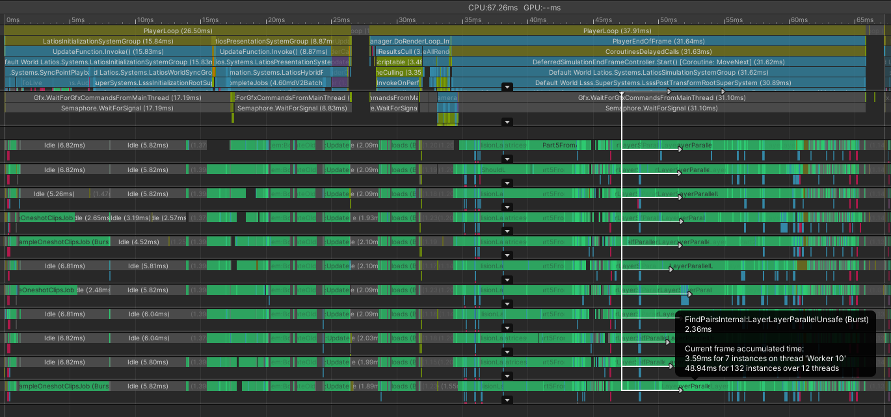

49 ms and 65 ms respectively!

I then removed forced job completion so that jobs can roll over to next frame:

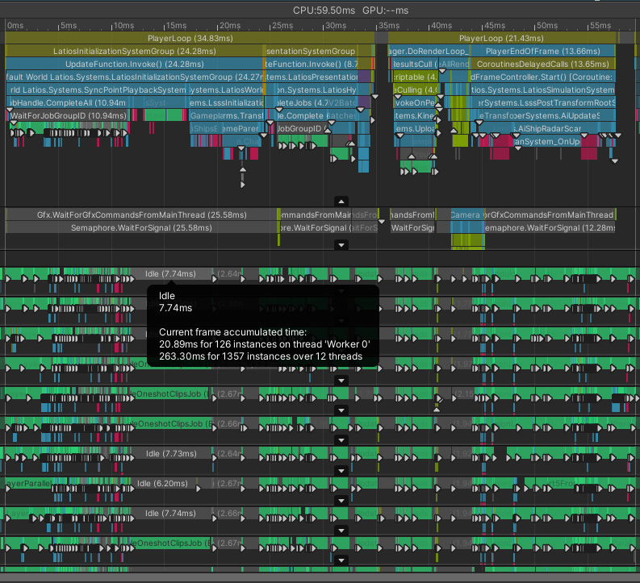

Idling during the sync point takes longer than the forced job completion, which
means this is a good enough place to stop.

## Conclusions and the Future

There’s lots of takeaways from this adventure. We learned the importance of
using data to identify ways to focus our optimization efforts on the right
areas. But at the same time, we also learned that focusing on just one benchmark
is not always a good idea, especially when a single CPU core can handle multiple
threads at once. We also learned that the same algorithm in different use cases
doesn’t always perform the same.

I still don’t know why the single layer sweep benefits so much from unrolling,
yet bipartite suffers with more instructions. My current theory is that tracking
two buckets instead of one causes register pressure and more uops to be
generated, even if the generated assembly looks extremely similar between the
two. Here’s the difference by the way (highlighted is Unrolled radar scan and
below it is Unrolled spawner safety checks):

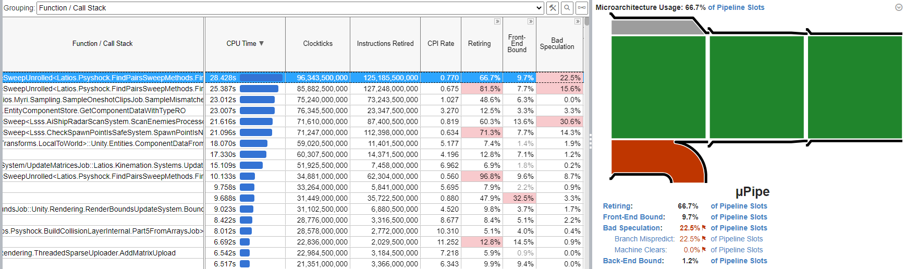

If I was developing for a fixed CPU target, I might start counting fused uops.
But micro-architectures are evolving fast, especially with 12 gen Intel and AMD
Zen architectures. I was always skeptical of unrolling as it can be quite
hardware-dependent. I got hope that I found a more hardware-agnostic workaround,
but it didn’t transfer to the real use case of bipartite checks.

Ultimately, I decided to stick with Sign Flipping for all use cases. The
performance advantage Unrolled had for single layer queries decreased a lot with
the `FindPairsResult` changes. Having a small tight loop allows the compiler and
the CPU hardware to allocate resources more efficiently, even if it means more
loop control instructions. The performance is more consistent across a wider
variety of inputs, and the code is much smaller too.

That’s not to say I have fully given up on unrolling, drains, or dual axis
approaches. If register pressure is really the problem, it can be mitigated with
array concatenation. If the issue is instead the tail loop, we could try
something like a Duff’s Device and test the efficiency of *branch target
prediction*, which is different from branch prediction and is heavily relied
upon for interpretated languages. If we ever get better allocation alignment
tools from Unity, we could also explore going full SoA, though I would need to
come up with something clever for hit reporting potentially multiple pairs at
once. And I would definitely like to further explore Dual Axis using linked
lists.

Of course, if you are a micro-architecture enthusiast and have your own insight
into the problem, share your suggestions and I’ll be sure to try them out!

But for now, I think this is where we will end this adventure. We had high hopes
for major gains, and also encountered many failures. In the end, we got a modest
improvement. Certainly nothing spectacular, but measurably impactful. But this
battle is far from over. One day, there will be a fourth part focusing on
FindPairs. As they say:

To be continued…

## Try It Yourself

All the new FindPairs performance tests are included in the Optimization
Adventures package sample included with the Latios Framework.
