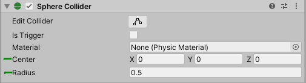
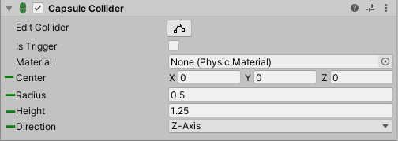
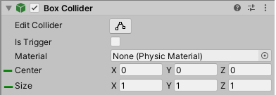
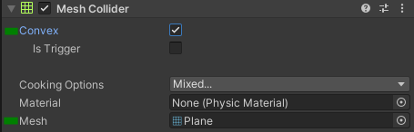
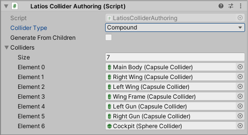

# Colliders

In version 0.5.0 of Psyshock, only a small subset of colliders are supported,
and authoring for these are not complete.

-   Sphere Collider
    -   center and radius
-   Capsule Collider
    -   pointA, pointB, and radius
-   Box Collider
    -   center and halfwidth
-   Convex Collider
    -   local-space blob and non-uniform scale factor
-   Compound Collider
    -   local-space blob and uniform scale factor

## Authoring

Custom authoring components for all Psyshock colliders are still a
work-in-progress. Use the following components for each collider type:

### Sphere Collider

Use the PhysX (legacy) *Sphere Collider*.



### Capsule Collider

Use the PhysX (legacy) *Capsule Collider*.



### Box Collider

Use the PhysX (legacy) *Box Collider*.



### Convex Collider

Use the PhysX (legacy) *Mesh Collider* and ensure *Convex* is checked.



### Compound Collider

For the compound collider, use a *Collider Authoring* and set the *Collider
Type* to *Compound*.

A compound collider constructs itself from children sphere and capsule
colliders. If you would like to use all children sphere and capsule colliders,
check the *Generate From Children* box. Otherwise, populate the Colliders list
with the subset of children colliders you wish to add.



## Collider Types in Code

Colliders in code are all struct types which may live in any type of memory,
including stack memory. All of them may be constructed directly at any time and
in any context. However, some of these colliders may have a more complex object
such as a `BlobAssetReference` as a field.

### Collider : IComponentData

`Collider` is a union of all other collider types and serves the purpose of
representing any type of collider in an abstract matter. Its size is 64 bytes
(same as `LocalToWorld`). It is the only collider type that is also an
`IComponentData`.

A default-constructed `Collider` is interpreted as a `SphereCollider` with a
`center` of (0, 0, 0) and a `radius` of 0.

`Collider`s cannot be modified directly. Instead, their values are obtained
through implicit assignment of one of the other collider types.

```csharp
Collider collider = new SphereCollider(float3.zero, 1f);
```

A `Collider` can be implicitly casted to its specialized collider type. However,
implicitly casting to the wrong type will throw an exception when safety checks
are enabled and otherwise produce undefined behavior.

To avoid this, you can check the type of a `Collider` using its `type` property.

```csharp
void TranslateColliderInColliderSpace(ref Collider collider, float3 translation)
{
    if (collider.type == ColliderType.Sphere)
    {
        SphereCollider sphere = collider;
        sphere.center += translation;
        collider = sphere;
    }
    else if (collider.type == ColliderType.Capsule)
    {
        CapsuleCollider capsule = collider;
        capsule.pointA += translation;
        capsule.pointB += translation;
        collider = capsule;
    }
}
```

### Sphere Collider

A `SphereCollider` is a struct which contains a `float3 center` and a `float
radius`, both of which are public fields.

### Capsule Collider

A `CapsuleCollider` is a struct which defines the shape of a capsule using an
inner segment and a radius around that segment. The segment points are specified
by the public `float3` fields `pointA` and `pointB`. The `radius` is a public
`float` field.

By this definition, a capsule collider may be oriented along any arbitrary axis
and is not limited to the X, Y, or Z axes. Its full height can be calculated by
the following expression:

```csharp
float height = math.distance(capsule.pointA, capsule.pointB) + 2f * capsule.radius;
```

### Box Collider

A `BoxCollider` is a struct which defines an axis-aligned box in local space. It
contains a `float3 center`, and a `float3 halfWidth`, which is the distances
from the center to either face along each axis.

### Convex Collider

A ConvexCollider is a struct which defines an immutable convex hull of up to 255
vertices.

The core of a `ConvexCollider` is its `public
BlobAssetReference<ConvexColliderBlob> convexColliderBlob `field. It is
constructed using the Unity.Physics convex hull algorithm, but with the bevel
radius disabled such that corners and edges are sharp. It can be created via
converting a *Mesh Collider* component or via a Smart Blobber using
`conversionSystem.CreateBlob()` and passing in a `ConvexColliderBakeData`.

A `ConvexCollider` exposes a `public float3 scale` which can apply a non-uniform
scale to the collider.

### Compound Collider

A `CompoundCollider` is a struct which defines a rigid immutable collection of
sphere, capsule, and box colliders and their relative transforms. Its purpose is
to allow multiple colliders to be treated as a single collider for simplicity.

The core of a `CompoundCollider` is its `public
BlobAssetReference<CompoundColliderBlob> compoundColliderBlob` field. A
`CompoundColliderBlob` contains a `BlobArray` of `Collider`s, a `BlobArray` of
`RigidTransform`s with indices corresponding to those of the `Collider`s, and an
`Aabb` which encompasses the full set of colliders in local space. In most
cases, you will never need to read this data directly.

Currently, a `CompoundColliderBlob` can only be created using the *Collider
Authoring* component in the editor.

A `CompoundCollider` also exposes a `public float scale` which is a uniform
scale factor to be applied to the collider. This scale factor not only scales
the collider sizes but also their relative offsets to each other.

### Triangle Collider (Experimental)

There is a `TriangleCollider` type in code which has a complete API but is
currently mostly untested. It does not have a dedicated authoring workflow.
Though it is trivial to construct in code as it is basically three vertices. If
you choose to use it and discover any issues, please report a bug.
